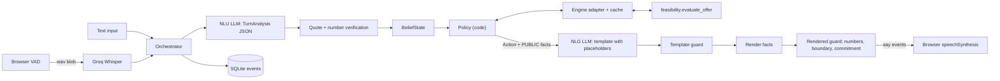

# Debt Settlement Agent

A conversational agent that negotiates debt settlements. Same policy and engine whether you type or talk.

**Live demo:** [debt-settlement-agent-ggor.onrender.com](https://debt-settlement-agent-ggor.onrender.com/)


**Text chat** — CLI or the browser compose box. **Voice** — mic → STT, agent replies through browser TTS, with barge-in. Both modes hit the same orchestrator; voice is speech I/O on top of the text turn loop.

The hard part is not sounding natural. It is keeping the math honest. An LLM that invents a payment amount mid-sentence is worse than a clumsy script. So this system treats the model as untrusted for arithmetic: code picks every move and every number; the model only extracts terms and wraps them in words.

All data here is synthetic.

## Negotiation strategy

Policy lives in `app/agent/policy.py`. It is pure code. The LLM never chooses whether to counter, confirm, escalate, or walk away.

Phases, in order of a normal call: `OPENING` → `DISCOVERY` → `NEGOTIATE` → `CONFIRM` → `WRAP` → `END`. Side paths: `ESCALATE`, or `NO_DEAL_WRAP` into `END`.

### What the agent is optimizing for

Settle as high as the client can actually fund, without saying that ceiling out loud. The private max (`max_bp`) comes from the feasibility engine. Counters snap to the 100-point grid of feasible settlement percentages. The walk-away number never enters speech.

Defaults (env / `.env`):

| Knob | Default | Role |
|---|---|---|
| `ANCHOR_RATIO` | `0.7` | First counter anchors near 70% of `min(ask, max)` |
| `CONCESSION_FACTOR` | `0.5` | Each later step closes half the remaining gap |
| `MAX_COUNTERS` | `4` | Cap on stalls / ceiling rejects |
| `CLOSE_GAP_BP` | `200` | If the next counter is within 2 points of the ask, just confirm |
| `MAX_TURNS` | `24` | Hard call length |

### Decision order (every turn)

`decide()` runs fixed rules, top to bottom:

1. **Turn cap** → no-deal
2. **Hostility** → escalate
3. **Private-info ask** → refuse once, then escalate
4. **Commitment demand** → refuse once ("we can propose this to the client"), then escalate
5. **Contradiction** (discovery) → clarify
6. **Tentative extraction** → read back
7. **Missing creditor rule** → ask for it
8. **No settlement % yet** → ask for the ask
9. **Affordability / price / terms** (below)
10. **In CONFIRM**, accept stance → wrap; new terms reopen negotiation

### Price negotiation (the ladder)

Early versions confirmed any affordable ask on the spot. That left surplus on the table. The live policy counters first.

When the ask is feasible and at or under `max_bp`:

1. Ask already at or below something we offered → confirm
2. Rep sounds firm after we have countered → confirm their ask
3. Counter budget used up → confirm (affordable path never no-deals just to be stubborn)
4. No legal counter below the ask → confirm
5. Ladder stalled on the grid → jump once toward the ask, else confirm
6. Next step within `CLOSE_GAP_BP` of the ask → confirm
7. Otherwise → `COUNTER` at `next_counter()`

`next_counter()`:

- Target = `min(ask_bp, max_bp)`
- First offer = largest feasible bp ≤ `ANCHOR_RATIO * target` (else the smallest legal bp)
- Later offers move halfway toward the target, then snap **down** onto a feasible point
- Stay strictly below the ask and at or under `max_bp`. And keep that private ceiling out of speech.

If the ask sits **above** the ceiling, the agent does not loop the same low counter forever. It tries non-price recovery first (next section), then either escalates for rescue funds or no-deals.

### Non-price recovery (when the curve is empty or the ask won't fit)

Sometimes the % is fine but the payment rules block every schedule. Or the ask is above today's ceiling, but a later start date / softer minimum / more payments unlocks room.

The orchestrator searches term alternatives in order: **first payment date → min payment → max payments**. Policy emits `COUNTER_TERMS` for the best alt (highest ceiling when the ask fits nowhere; otherwise the least invasive change that makes the ask feasible).

A "yes" on a term alt is **not** a yes on the last price counter. After the curve opens, price negotiation continues under the new rules.

### Confirm → wrap → reopen

`CONFIRM_SCHEDULE` reads back settlement %, payment count, dates, and totals from engine facts. On accept, `PROPOSE_WRAP` drafts an agreement marked `pending_client_approval` — spoken as "sent for client approval," never as a hard commit.

From `WRAP`, the rep can end the call, or reopen with a new ask / reject / counter. That clears the draft and returns to `CONFIRM` or `NEGOTIATE`.

### Escalation vs no-deal

| Situation | Outcome |
|---|---|
| Hostile tone, repeated private ask, repeated commitment demand | Escalation |
| Infeasible, but lump/increment rescue is inside the guardrail | Escalation ("needs client approval for extra funds") — amount never spoken |
| Infeasible, no rescue, no useful term alt | No-deal |
| Ask above ceiling, counters exhausted at the highest legal bp | No-deal |
| Affordable ask, counters exhausted | Confirm the ask |

Every belief change, block, escalation, and LLM call lands in the SQLite audit log.

## Architecture: LLM is untrusted for arithmetic

Policy is code. The LLM does NLU (turn → structured terms) and NLG (intent → template with `{placeholders}`). Fact rendering fills the numbers. Guards catch anything that still looks like a digit, a private figure, or a commitment phrase that was never offered.



One turn: verify the rep's utterance → update belief → policy picks an `Action` → NLG writes a template → guards → speak. Side effects (a counter was offered, wrap commits) stick only after the browser acks the sentences were spoken.

Money is integer cents. Settlement % is integer basis points (4500 = 45%). After speech guards, only rendered `Fact` values reach TTS — the LLM may emit digits in drafts, but guards block them before speak.

## How to run

### Setup

Python 3.12 (system 3.14 is a bad idea for wheels here):

```bash
uv venv --python 3.12
source .venv/bin/activate
uv sync --group dev
cp .env.example .env
```

### Keys

Put provider keys in `.env`. Unset keys are skipped at startup.

| Env var | Used by |
|---|---|
| `GROQ_API_KEY` | demo NLU/NLG, Whisper STT |
| `GEMINI_API_KEY` | eval/demo failover |
| `MISTRAL_API_KEY` | last-resort fallback |
| `OPENROUTER_API_KEY` | eval free-tier failover |
| `CEREBRAS_API_KEY` | optional; not on main routes today |

`LLM_PROFILE` picks the routing table in `config/providers.yaml`.

### Profiles

| Profile | Purpose |
|---|---|
| `demo` | Live UI / CLI. Latency first (Groq, then Gemini). |
| `eval` | Batch eval. Quota first (Gemini lead). |
| `local` | Ollama first; cloud only if local is down. |
| `offline` | CI / FakeLLM. No network. |

```bash
export LLM_PROFILE=demo
```

### Ollama (local profile)

```bash
ollama pull qwen3.5:9b
ollama pull gemma4:e4b
export LLM_PROFILE=local
```

Local NLU works but is slow (p95 on the order of minutes) and the quality run below did not clear thresholds. Fine for plumbing checks; use `eval` for the numbers that matter.

### CLI (type as the creditor rep)

```bash
python -m app.cli fixtures/demo
```

Auto-acks speech. Prints agent lines, belief changes, timings, and the engine verdict.

### Server (voice UI)

```bash
uvicorn app.main:app --reload --host 127.0.0.1 --port 8000
```

Open http://127.0.0.1:8000 (or the [hosted demo](https://debt-settlement-agent-ggor.onrender.com/)). Use headphones so browser TTS does not echo into the mic. Operator view shows PRIVATE max affordable; the rep view does not. Pick a scenario (or paste a custom case), then Start chat.

### Eval

Cheap smoke (template NLG + template sim phrasing, live NLU):

```bash
python -m eval.run_eval --scenarios 12 --seed 7 --nlg template --sim-phrasing template --profile eval
```

Full LLM phrasing:

```bash
python -m eval.run_eval --scenarios 12 --seed 7 --nlg llm --sim-phrasing llm --profile eval
```

Resume a partial run with `--resume RUN_ID`. Results land in `eval/results/<run_id>/` (`summary.md`, `summary.json`, `run.json`). Exit code 1 if `eval/thresholds.yaml` fails.

Offline tests:

```bash
.venv/bin/python -m pytest -q
ruff check .
```

## Demo media

Walkthrough GIF: `docs/assets/demo.gif` (linked at the top).

To replace it: record a short clip (15–40 s), export a GIF at ~800–1200px wide, ideally under ~10 MB so GitHub stays snappy, overwrite `docs/assets/demo.gif`. Tools that work: [LICEcap](https://www.cockos.com/licecap/), Gifox, Kap, or `ffmpeg`.

## Eval results

Run locally and keep artifacts under `eval/results/` (gitignored). Example command:

```bash
.venv/bin/python -m eval.run_eval --scenarios 12 --seed 7 --nlg template --sim-phrasing template
```

Gates live in `eval/thresholds.yaml` (including extraction accuracy, false-known rate, and guard blocks). Cite metrics from a summary JSON you produced — do not treat README tables as checked-in proof.

Cheap template evals after the counter-ladder change still clear thresholds. `surplus_captured` rose (mean ~0.69 vs ~0.41 when the agent confirmed affordable asks immediately) because the agent now climbs before accepting.

## Latency

### Cloud (`eval` profile, template NLG — illustrative local run)

| stage | p50 | p95 | n |
|---|---|---|---|
| nlu_ms | 4815 | 10079 | 70 |
| policy_ms | 0.07 | 0.17 | 70 |
| nlg_ms | 0.20 | 0.53 | 70 |
| server_total_ms | 4818 | 10082 | 70 |

Policy and template NLG are sub-millisecond. Wall time is almost all NLU.

### Local (`local` profile, Ollama `qwen3.5:9b` NLU — illustrative)

| stage | p50 | p95 | n |
|---|---|---|---|
| nlu_ms | 0.12 | 185257 | 312 |
| policy_ms | 0.01 | 0.99 | 312 |
| nlg_ms | 0.04 | 1.09 | 312 |
| server_total_ms | 0.46 | 185261 | 312 |

That local run finished all 12 scenarios but failed quality gates (`escalation_correct=0`, no deals in ZOPA). The p50 near zero is oracle/cache-style turns interleaved with very slow live Ollama calls.

## Guard statistics

Two layers: `template_guard` (no digits / number words / unknown placeholders before fill) and `rendered_guard` (every spoken figure must match a PUBLIC fact or a known creditor number; private values and commitment language are blocked).

| source | result |
|---|---|
| Adversarial regression (`tests/unit/guard_adversarial.jsonl`) | 51 cases — 38 expect block, 13 expect pass |
| Cheap template eval | Expect `guard_blocks=0`, `unverified_figures_spoken=0`, `sensitive_leaks=0` when NLG is template |

Zero blocks on a template-NLG run is expected: template NLG never invents figures. The corpus is there for the failure modes.

## Limitations

- **Structured candidate set, not exhaustive search.** The vendored engine scores a fixed family of schedule shapes. Feasibility is non-monotonic across settlement %. Counters snap to the 100-point grid (`1%…100%`). If a legal schedule exists outside that candidate set, the engine can still say infeasible.
- **Oracle NLU in e2e.** Offline `tests/e2e` and the simulator feed a ground-truth `TurnAnalysis` when `NLU_MODE=oracle`. That proves policy and guards without paying for live extraction. It does not prove live NLU quality — run `eval.run_eval` for that.
- **The sim sees Actions, not only words.** CreditorPolicy gets the agent's intent and PUBLIC facts plus the spoken text. A human rep only hears words. So e2e negotiation can be cleaner than a real call when phrasing is ambiguous.
- **Browser TTS echo.** `speechSynthesis` plus an open mic will re-hear the agent. Headphones help; barge-in helps. It is still a demo hack, not a telephony stack.
- **Free-tier model drift.** Provider free slugs disappear (OpenRouter did). Rate limits flip overnight. Mistral Experiment keys often 429 until workspace setup. Pin models in `providers.yaml` and expect to edit them.
- **Hosted demo cold starts.** The Render free tier can sleep; the first request after idle may take a minute.

## Synthetic data

Every client, creditor, balance, and schedule in this repo is made up for demos and tests. Do not treat fixtures as real accounts. The UI shows a synthetic-data banner for a reason.

## Unaffiliated project

Independent work. Not affiliated with, endorsed by, or derived from any company's take-home materials beyond a vendored feasibility engine kept read-only under `feasibility/`. No third-party assignment text ships in this repository.
