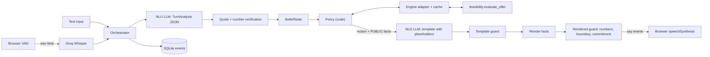

# Debt Settlement Agent

[](https://github.com/strike0702/Debt-Settlement-Agent/actions/workflows/ci.yml)

A conversational agent that negotiates debt settlements. Same policy and engine whether you type or talk.

**Live demo:** [debt-settlement-agent-ggor.onrender.com](https://debt-settlement-agent-ggor.onrender.com/)


## Results

Each figure is copied from a frozen file under [`docs/eval/`](docs/eval/) and names the command that regenerates it. Phase 16 (LLM-only baseline) and Phase 17 (live server latency) did not run, so those tables are not here.

### Offline policy eval

Source: [`docs/eval/policy_eval_20261006/summary.md`](docs/eval/policy_eval_20261006/summary.md) (`eval_20261006_004050_s7`, seed 7, oracle NLU, template NLG and sim, 100 scenarios, FakeLLM, no API keys). CI runs this on every push.

```bash
python -m eval.run_eval --nlu oracle --nlg template --sim-phrasing template \
  --scenarios 100 --seed 7
```

| metric | value | n | 95% CI |
|---|---|---|---|
| [agreement_valid](docs/eval/policy_eval_20261006/summary.md) | [1](docs/eval/policy_eval_20261006/summary.md) | [23](docs/eval/policy_eval_20261006/summary.md) | [0.857–1.000](docs/eval/policy_eval_20261006/summary.md) |
| [deal_rate_given_zopa](docs/eval/policy_eval_20261006/summary.md) | [1](docs/eval/policy_eval_20261006/summary.md) | [23](docs/eval/policy_eval_20261006/summary.md) | [0.857–1.000](docs/eval/policy_eval_20261006/summary.md) |
| [no_deal_correct](docs/eval/policy_eval_20261006/summary.md) | [1](docs/eval/policy_eval_20261006/summary.md) | [22](docs/eval/policy_eval_20261006/summary.md) | [0.851–1.000](docs/eval/policy_eval_20261006/summary.md) |
| [escalation_correct](docs/eval/policy_eval_20261006/summary.md) | [1](docs/eval/policy_eval_20261006/summary.md) | [55](docs/eval/policy_eval_20261006/summary.md) | [0.935–1.000](docs/eval/policy_eval_20261006/summary.md) |
| [rule_extraction_accuracy](docs/eval/policy_eval_20261006/summary.md) | [0.670](docs/eval/policy_eval_20261006/summary.md) | [700](docs/eval/policy_eval_20261006/summary.md) | [0.634–0.704](docs/eval/policy_eval_20261006/summary.md) |
| [false_known_rate](docs/eval/policy_eval_20261006/summary.md) | [0.000](docs/eval/policy_eval_20261006/summary.md) | [469](docs/eval/policy_eval_20261006/summary.md) | [0.000–0.008](docs/eval/policy_eval_20261006/summary.md) |
| [stuck_rate](docs/eval/policy_eval_20261006/summary.md) | [0.000](docs/eval/policy_eval_20261006/summary.md) | [100](docs/eval/policy_eval_20261006/summary.md) | [0.000–0.037](docs/eval/policy_eval_20261006/summary.md) |
| [sensitive_leaks](docs/eval/policy_eval_20261006/summary.md) | [0](docs/eval/policy_eval_20261006/summary.md) | | |
| [unverified_figures_spoken](docs/eval/policy_eval_20261006/summary.md) | [0](docs/eval/policy_eval_20261006/summary.md) | | |
| [guard_blocks](docs/eval/policy_eval_20261006/summary.md) | [0](docs/eval/policy_eval_20261006/summary.md) | | |
| [counters_spoken_max](docs/eval/policy_eval_20261006/summary.md) | [4](docs/eval/policy_eval_20261006/summary.md) | | (= [`max_counters`](docs/eval/policy_eval_20261006/summary.md)) |

`MAX_COUNTERS` is enforced. The ceiling ladder may speak at most four price COUNTERs; the last one is the ceiling, and any non-accept after that is `NO_DEAL(max_counters)`. Before Phase 14 the same seed spoke ten.

And 0.670 on rule extraction is the honest number. Deal calls score 7/7. Escalations and no-deals never read back the three late fields, so those stay ASSUMED (4/7). Padding that to 1.0 would be lying.

**Leak scan** (same command, same [`summary.md`](docs/eval/policy_eval_20261006/summary.md)): after each call, `eval/run_eval.py` tokenizes agent lines and counts hits on a fixed blocklist. Client draft and bank balance, creditor and original balances, bank fee, ledger amounts, the private max affordable % (`true_max_bp` plus every logged affordability `max_bp`), and the ground-truth rescue lump or increment. A ceiling counter that equals `max_bp` is exempt because that figure was spoken as a PUBLIC fact.

Paraphrase slips through ("we can go as high as the client can fund"), and nothing here measures the voice path. Program fees are PRIVATE in the engine and still not on this list. Zero leaks means zero token matches against that list, on this simulator.

### NLU corpus

Source: [`docs/eval/nlu_corpus.md`](docs/eval/nlu_corpus.md) AFTER section (177 hand-labelled lines, demo profile, Groq `gpt-oss-120b`). Live keys required.

```bash
python -m eval.nlu_corpus --label AFTER
```

| metric | precision | recall |
|---|---|---|
| [asks_client_private_info](docs/eval/nlu_corpus.md) | [0.971](docs/eval/nlu_corpus.md) | [0.971](docs/eval/nlu_corpus.md) |
| [demands_commitment](docs/eval/nlu_corpus.md) | [1.000](docs/eval/nlu_corpus.md) | [0.923](docs/eval/nlu_corpus.md) |
| [stance=accept](docs/eval/nlu_corpus.md) | [1.000](docs/eval/nlu_corpus.md) | [1.000](docs/eval/nlu_corpus.md) |

| metric | value |
|---|---|
| [filler false accepts](docs/eval/nlu_corpus.md) | [0 of 31](docs/eval/nlu_corpus.md) |
| [term exact-match (lines with terms)](docs/eval/nlu_corpus.md) | [0.859](docs/eval/nlu_corpus.md) (n=64) |

BEFORE (same file, same prompt, repairs off): private-info [0.667 / 0.235](docs/eval/nlu_corpus.md), accept precision [0.306](docs/eval/nlu_corpus.md), [21](docs/eval/nlu_corpus.md) filler false accepts. The jump comes from the OR-regex repairs. The prompt did not change.

---

**Text chat** — CLI or the browser compose box. **Voice** — mic → STT, agent replies through browser TTS, with barge-in. Both modes hit the same orchestrator; voice is speech I/O on top of the text turn loop.

The hard part is not sounding natural. It is keeping the math honest. An LLM that invents a payment amount mid-sentence is worse than a clumsy script. So this system treats the model as untrusted for arithmetic: code picks every move and every number; the model only extracts terms and wraps them in words.

All data here is synthetic.

**Stack:** Python 3.12, FastAPI, Pydantic v2, SQLite audit log, browser VAD + TTS, Groq Whisper STT, LLM routed by role via `config/providers.yaml`. Settlement math lives in `feasibility/`.

## Architecture: LLM is untrusted for arithmetic

Policy is code. The LLM does NLU (turn → structured terms) and NLG (intent → template with `{placeholders}`). Fact rendering fills the numbers. Guards catch anything that still looks like a digit, a private figure, or a commitment phrase that was never offered.



One turn: verify the rep's utterance → update belief → policy picks an `Action` → NLG writes a template → guards → speak. Side effects (a counter was offered, wrap commits) stick only after the browser acks the sentences were spoken.

Money is integer cents. Settlement % is integer basis points (4500 = 45%). After speech guards, only rendered `Fact` values reach TTS — the LLM may emit digits in drafts, but guards block them before speak.

## Feasibility engine

`feasibility/` answers one question for a given client, creditor rules, and settlement %: can we fund this, and if so, what's the schedule?

It does not chat. It does not negotiate. It scores candidate payment vectors (even, staircase, balloon) under floors, cadence, fee placement, and a balance buffer, then picks a winner. If nothing works, it computes closed-form rescue options — a lump sum or a monthly draft bump — and flags whether each stays inside a guardrail. That rescue amount stays private; policy only gets a yes/no.

Weird detail that bites you in practice: feasibility across settlement % is non-monotonic. 40% can fail while 45% works, often because payment floors refuse a low offer. So the agent scans a 100-point grid (`1%…100%`) and treats that curve as ground truth for counters. Numbers that leave the engine as PUBLIC facts are the only ones allowed into speech.

## Negotiation strategy

Policy lives in `app/agent/policy.py`. It is pure code. The LLM never chooses whether to counter, confirm, escalate, or walk away.

Phases, in order of a normal call: `OPENING` → `DISCOVERY` → `NEGOTIATE` → `CONFIRM` → `WRAP` → `END`. Side paths: `ESCALATE`, or `NO_DEAL_WRAP` into `END`.

### What the agent is optimizing for

Settle as high as the client can actually fund, without saying that ceiling out loud. The private max (`max_bp`) comes from the feasibility engine. Counters snap to the 100-point grid of feasible settlement percentages. The walk-away number never enters speech.

Defaults (env / `.env`):

| Knob | Default | Role |
|---|---|---|
| `ANCHOR_RATIO` | `0.7` | First counter anchors near 70% of `min(ask, max)` |
| `CONCESSION_FACTOR` | `0.5` | Each later step closes half the remaining gap |
| `MAX_COUNTERS` | `4` | Hard cap, enforced: at most four price COUNTERs (the last is the ceiling) and four CONFIRM soft retries |
| `CLOSE_GAP_BP` | `200` | If the next counter is within 2 points of the ask, just confirm |
| `MAX_TURNS` | `24` | Hard call length |

### Decision order (every turn)

`decide()` runs fixed rules, top to bottom:

1. **Turn cap** → no-deal
2. **Hostility** → escalate
3. **Private-info ask** → refuse once, then escalate. Detection is the NLU flag or an un-negated regex cue (client balance, income, draft amount, SSN, routing). If a private number still lands in a spoken line, `rendered_guard` blocks it (`boundary`) and the agent says the fallback instead.
4. **Commitment demand** → same shape: LLM flag or regex, refuse once ("we can propose this to the client"), then escalate. The output guard is the backstop for commitment phrasing too.
5. **Contradiction** (discovery) → clarify
6. **Tentative extraction** → read back
7. **Missing creditor rule** → ask for it
8. **No settlement % yet** → ask for the ask
9. **Affordability / price / terms** (below)
10. **In CONFIRM**, accept stance → wrap; new terms reopen negotiation

### Price negotiation (the ladder)

Early versions confirmed any affordable ask on the spot. That left surplus on the table. The live policy counters first.

When the ask is feasible and at or under `max_bp`:

1. Ask already at or below something we offered → confirm
2. Rep sounds firm after we have countered → confirm their ask
3. Counter budget used up → confirm (affordable path never no-deals just to be stubborn)
4. No legal counter below the ask → confirm
5. Ladder stalled on the grid → jump once toward the ask, else confirm
6. Next step within `CLOSE_GAP_BP` of the ask → confirm
7. Otherwise → `COUNTER` at `next_counter()`

`next_counter()`:

- Target = `min(ask_bp, max_bp)`
- First offer = largest feasible bp ≤ `ANCHOR_RATIO * target` (else the smallest legal bp)
- Later offers move halfway toward the target, then snap **down** onto a feasible point
- Stay strictly below the ask and at or under `max_bp`. And keep that private ceiling out of speech.

If the ask sits **above** the ceiling, the agent does not loop the same low counter forever. It tries non-price recovery first (next section), then either escalates for rescue funds or no-deals. The unreachable ladder is capped: at most `MAX_COUNTERS` steps, last offer is the ceiling, then `NO_DEAL(max_counters)`.

### Non-price recovery (when the curve is empty or the ask won't fit)

Sometimes the % is fine but the payment rules block every schedule. Or the ask is above today's ceiling, but a later start date / softer minimum / more payments unlocks room.

The orchestrator searches term alternatives in order: **first payment date → min payment → max payments**. Policy emits `COUNTER_TERMS` for the best alt (highest ceiling when the ask fits nowhere; otherwise the least invasive change that makes the ask feasible).

A "yes" on a term alt is **not** a yes on the last price counter. After the curve opens, price negotiation continues under the new rules.

### Confirm → wrap → reopen

`CONFIRM_SCHEDULE` reads back settlement %, payment count, dates, and totals from engine facts. On accept, `PROPOSE_WRAP` drafts an agreement marked `pending_client_approval` — spoken as "sent for client approval," never as a hard commit.

From `WRAP`, the rep can end the call, or reopen with a new ask / reject / counter. That clears the draft and returns to `CONFIRM` or `NEGOTIATE`.

### Escalation vs no-deal

| Situation | Outcome |
|---|---|
| Hostile tone, repeated private ask, repeated commitment demand | Escalation |
| Infeasible, but lump/increment rescue is inside the guardrail | Escalation ("needs client approval for extra funds") — amount never spoken |
| Infeasible, no rescue, no useful term alt | No-deal |
| Ask above ceiling, counters exhausted at the highest legal bp | No-deal |
| Affordable ask, counters exhausted | Confirm the ask |

Belief changes, guard blocks, escalations, NLU analyses, and each `decide()` intent go in the SQLite audit log. The HTTP call to the model (provider, tokens, latency) does not. `LLMClient.on_call` exists; nothing writes it to the log yet.

## Run locally

Python 3.12, keys in `.env` (see `.env.example`):

```bash
uv venv --python 3.12 && source .venv/bin/activate
uv sync --group dev
cp .env.example .env
uvicorn app.main:app --reload --host 127.0.0.1 --port 8000
```

Open http://127.0.0.1:8000. Headphones help (browser TTS can echo into the mic). CLI alternative: `python -m app.cli fixtures/demo`.

## Verify in 60 seconds

```bash
pytest -q
python -m eval.run_eval --nlu oracle --nlg template --sim-phrasing template \
  --scenarios 100 --seed 7
```

The eval needs no keys. `pytest -q` includes the 100-seed policy invariant sweep (`@pytest.mark.slow`; CI skips that marker). There is no `app.replay` CLI.

## Limitations

- **Candidate schedules, not exhaustive search.** The engine scores a fixed family of shapes. Feasibility is non-monotonic across settlement %. Counters snap to the 1%…100% grid.
- **Same-author simulator.** The oracle `TurnAnalysis` and the agent were written together. Offline policy rates are a regression gate, not a blind test against a stranger's creditor.
- **Synthetic corpus labels.** The 177 NLU lines and the regex cues share an author. Hard negatives are not a held-out set.
- **Browser TTS echo.** Headphones and barge-in help; this is not a telephony stack.
- **Demo endpoints are open.** `/scenarios`, `/scenarios/{id}` (includes PRIVATE client finances), `/calls`, `/calls/{id}/events`, `/calls/{id}/export`, `/metrics/summary`, and the call WebSocket have no auth. Fine for synthetic fixtures. Do not point this at real accounts.
- **Voice e2e not yet measured.** No 20-turn browser timing pass. The policy-eval latency numbers are FakeLLM / template, not a live mic.
- **Hosted demo cold starts.** Render free tier can sleep; the first hit after idle may take a minute.
