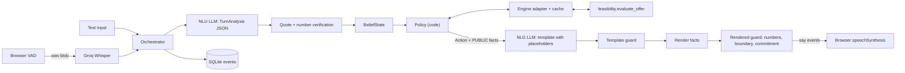

# Debt Settlement Agent

A voice agent that negotiates debt settlements on a call.

The hard part is not sounding natural. It is keeping the math honest. An LLM that invents a payment amount mid-sentence is worse than a clumsy script. So this system treats the model as untrusted for arithmetic: code picks every move and every number; the model only extracts terms and wraps them in words.

All data here is synthetic. Built as a personal project, unaffiliated with any employer or take-home assignment.

## The problem

A settlement call needs two things at once: flexible language, and numbers that must match a feasibility engine. If the model writes the numbers, you spend latency on retries and still miss paraphrases ("twenty-five hundred," "2.5k," "about two-fifty"). If you announce how much the client can afford, you give away your walk-away price.

So the agent asks for creditor rules, proposes schedules the engine already checked, counters only on feasible settlement percentages, and never says the private max.

## Architecture: LLM is untrusted for arithmetic

Policy is code. The LLM does NLU (turn → structured terms) and NLG (intent → template with `{placeholders}`). Fact rendering fills the numbers. Guards catch anything that still looks like a digit, a private figure, or a commitment phrase that was never offered.



One turn: verify the rep's utterance → update belief → policy picks an `Action` → NLG writes a template → guards → speak. Side effects (a counter was offered, wrap commits) stick only after the browser acks the sentences were spoken.

Money is integer cents. Settlement % is integer basis points (4500 = 45%). Spoken numbers come only from `Fact.render()`, never from the model.

## How to run

### Setup

Python 3.12 (system 3.14 is a bad idea for wheels here):

```bash
uv venv --python 3.12
source .venv/bin/activate
uv sync --group dev
cp .env.example .env
```

### Keys

Put provider keys in `.env`. Unset keys are skipped at startup.

| Env var | Used by |
|---|---|
| `GROQ_API_KEY` | demo NLU/NLG, Whisper STT |
| `GEMINI_API_KEY` | eval/demo failover |
| `MISTRAL_API_KEY` | last-resort fallback |
| `OPENROUTER_API_KEY` | eval free-tier failover |
| `CEREBRAS_API_KEY` | optional; not on main routes today |

`LLM_PROFILE` picks the routing table in `config/providers.yaml`.

### Profiles

| Profile | Purpose |
|---|---|
| `demo` | Live UI / CLI. Latency first (Groq, then Gemini). |
| `eval` | Batch eval. Quota first (Gemini lead). |
| `local` | Ollama first; cloud only if local is down. |
| `offline` | CI / FakeLLM. No network. |

```bash
export LLM_PROFILE=demo
```

### Ollama (local profile)

```bash
ollama pull qwen3.5:9b
ollama pull gemma4:e4b
export LLM_PROFILE=local
```

Local NLU works but is slow (p95 on the order of minutes) and the quality run below did not clear thresholds. Fine for plumbing checks; use `eval` for the numbers that matter.

### CLI (type as the creditor rep)

```bash
python -m app.cli fixtures/demo
```

Auto-acks speech. Prints agent lines, belief changes, timings, and the engine verdict.

### Server (voice UI)

```bash
uvicorn app.main:app --reload --host 127.0.0.1 --port 8000
```

Open http://127.0.0.1:8000. Use headphones so browser TTS does not echo into the mic. Operator view shows PRIVATE max affordable; the rep view does not.

### Eval

Cheap smoke (template NLG + template sim phrasing, live NLU):

```bash
python -m eval.run_eval --scenarios 12 --seed 7 --nlg template --sim-phrasing template --profile eval
```

Full LLM phrasing:

```bash
python -m eval.run_eval --scenarios 12 --seed 7 --nlg llm --sim-phrasing llm --profile eval
```

Resume a partial run with `--resume RUN_ID`. Results land in `eval/results/<run_id>/` (`summary.md`, `summary.json`, `run.json`). Exit code 1 if `eval/thresholds.yaml` fails.

Offline tests:

```bash
.venv/bin/python -m pytest -q
ruff check .
```

## Eval results

Latest cheap run (`eval_20261001_134429_s7`): seed **7**, profile `eval`, `nlg=template`, `sim=template`, model share **gemini/gemini-3.1-flash-lite = 100%**. Thresholds: **PASS**.

| metric | value |
|---|---|
| n_completed / n_scenarios | 12/12 |
| skipped_quota | 0 |
| agreement_valid | 1 |
| deal_rate_given_zopa | 1 |
| no_deal_correct | 1 |
| escalation_correct | 1 |
| unverified_figures_spoken | 0 |
| sensitive_leaks | 0 |
| guard_blocks | 0 |
| rule_extraction_accuracy | 1 |
| false_known_rate | 0.000 |
| readback_count (mean) | 0.000 |
| turns_to_proposal (mean) | 2.667 |
| surplus_captured (mean) | 0.412 |

## Latency

### Cloud (`eval` profile, template NLG — same run as above)

| stage | p50 | p95 | n |
|---|---|---|---|
| nlu_ms | 4815 | 10079 | 70 |
| policy_ms | 0.07 | 0.17 | 70 |
| nlg_ms | 0.20 | 0.53 | 70 |
| server_total_ms | 4818 | 10082 | 70 |

Policy and template NLG are sub-millisecond. Wall time is almost all NLU.

### Local (`local` profile, Ollama `qwen3.5:9b` NLU — `eval_20261001_012534_s7`)

| stage | p50 | p95 | n |
|---|---|---|---|
| nlu_ms | 0.12 | 185257 | 312 |
| policy_ms | 0.01 | 0.99 | 312 |
| nlg_ms | 0.04 | 1.09 | 312 |
| server_total_ms | 0.46 | 185261 | 312 |

That local run finished all 12 scenarios but failed quality gates (`escalation_correct=0`, no deals in ZOPA). The p50 near zero is oracle/cache-style turns interleaved with very slow live Ollama calls.

## Guard statistics

Two layers: `template_guard` (no digits / number words / unknown placeholders before fill) and `rendered_guard` (every spoken figure must match a PUBLIC fact or a known creditor number; private values and commitment language are blocked).

| source | result |
|---|---|
| Adversarial regression (`tests/unit/guard_adversarial.jsonl`) | 51 cases — 38 expect block, 13 expect pass |
| Cheap eval above | `guard_blocks=0`, `unverified_figures_spoken=0`, `sensitive_leaks=0` |

Zero blocks on the cheap run is expected: template NLG never invents figures. The corpus is there for the failure modes.

## Limitations

- **Structured candidate set, not exhaustive search.** The vendored engine scores a fixed family of schedule shapes. Feasibility is non-monotonic across settlement %. Counters snap to the 100-point grid (`1%…100%`). If a legal schedule exists outside that candidate set, the engine can still say infeasible.
- **Oracle NLU in e2e.** Offline `tests/e2e` and the simulator feed a ground-truth `TurnAnalysis` when `NLU_MODE=oracle`. That proves policy and guards without paying for live extraction. It does not prove live NLU quality — the eval table above does.
- **The sim sees Actions, not only words.** CreditorPolicy gets the agent's intent and PUBLIC facts plus the spoken text. A human rep only hears words. So e2e negotiation can be cleaner than a real call when phrasing is ambiguous.
- **Browser TTS echo.** `speechSynthesis` plus an open mic will re-hear the agent. Headphones help; barge-in helps. It is still a demo hack, not a telephony stack.
- **Free-tier model drift.** Provider free slugs disappear (OpenRouter did). Rate limits flip overnight. Mistral Experiment keys often 429 until workspace setup. Pin models in `providers.yaml` and expect to edit them.

## Synthetic data

Every client, creditor, balance, and schedule in this repo is made up for demos and tests. Do not treat fixtures as real accounts. The UI shows a synthetic-data banner for a reason.

## Unaffiliated project

Independent work. Not affiliated with, endorsed by, or derived from any company's take-home materials beyond a vendored feasibility engine kept read-only under `feasibility/`. No third-party assignment text ships in this repository.
