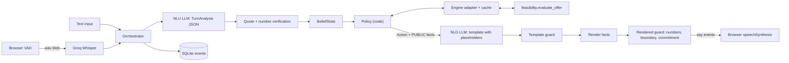

# Debt Settlement Agent

[](https://github.com/strike0702/Debt-Settlement-Agent/actions/workflows/ci.yml)

A voice and text agent that negotiates a debt settlement with a creditor's representative on behalf of a client. A language model understands what the representative says and puts the agent's replies into words. Ordinary Python code decides every offer, every number, and whether the call can end in a deal.

This is a personal project. All data is synthetic, and it is not a live collections product.

[](docs/assets/demo.mp4)

*A simulated "Easy deal" call in the Debt negotiator view, slowed to 2.6 s per step. Each agent reply gets a row in "How the agent decided"; opening a row shows what the representative said, what the agent heard, whether the client can pay, the decision, and what the agent said. The agreement and payment schedule appear at the top of the right column. The clip ends on the Creditor rep view of the same call. [MP4 version](docs/assets/demo.mp4).*

**Live demo:** [debt-settlement-agent-ggor.onrender.com](https://debt-settlement-agent-ggor.onrender.com/). Pick a scenario and press **Watch a call**. A simulated creditor plays the representative, so this works with no API keys and uses no quota. Press **Start call** to play the representative yourself: type, click a suggested reply, or use the mic. That path needs the server's LLM keys. On it, Claude Sonnet 5.5 reads what the representative says, up to a $1 daily budget; after that, and whenever Claude is unavailable, free-tier models take over until midnight UTC ([ADR 6](docs/DESIGN.md#adr-6-claude-reads-the-rep-on-the-demo-under-a-daily-cap)). The demo runs on a free Render instance, so the first load after a quiet spell can take about 30 s.

The console has two views. The **Debt negotiator** view is the firm's side of the call: the client's private finances and savings ledger, "How the agent decided" for every turn, the safety checks, latency, and the audit log. The **Creditor rep** view (`?view=rep`) shows only what the creditor's representative would see: the conversation, their own account, and the agreed terms. The server filters every message sent to that view, and a test scans whole calls for every private value. A call started in either view shows its full decision trail when you switch to the Debt negotiator view. In the code the Debt negotiator view is called the operator view. The operator view is public on the hosted demo by design, because every figure in it is synthetic.

Design decisions, with one voice turn annotated step by step: [`docs/DESIGN.md`](docs/DESIGN.md).

## Why I built this

A settlement call has two sets of constraints that pull in different directions.

The creditor has rules: how many payments it will take, the smallest payment it accepts, whether payments must be equal, and the latest start date. The client has a limited budget. Some settlement percentages can be funded and some cannot, and knowing that 40% fails does not tell you whether 45% works, because the answer does not move in a straight line.

The call still has to sound like a conversation, and a language model is good at that. It is also happy to invent a payment amount, or to mention the client's bank balance because someone asked for it.

I wanted the fluent conversation without letting the model touch the money.

## What the system does

1. The representative types, or speaks. For speech, the browser waits until they stop talking (voice activity detection), and speech-to-text turns the clip into words. The server uses Groq Whisper for this; if it is down, the browser's own recognizer takes over.
2. A language model reads the line and returns structured terms, the representative's stance (for example accept, reject, or a counteroffer), and a few safety flags. Code then checks the result against what was actually said: a quote that is not in the line is dropped, and a hedged number stays tentative.
3. The agent updates its **belief state**: what it thinks the creditor's rules are, and how sure it is about each one (unknown, assumed, tentative, known, or contradicted).
4. A deterministic policy (`decide()` in `app/agent/policy.py`) picks the next move: counter, confirm, ask about a missing rule, refuse a request, hand the call to a person, or walk away. The model has no say in this choice.
5. The feasibility engine answers the money question: can the client fund this percentage under these rules, and what would the payment schedule be? The policy sees only the yes or no, and the public facts it is allowed to say out loud.
6. The model then turns the chosen move into a sentence. It writes a template with `{placeholders}` instead of numbers, and code fills each placeholder from those public facts.
7. Two checks run before anything is spoken. If a sentence contains a raw number, a private figure, or a promise of a deal that nobody approved, it is replaced with a safe fallback line.
8. Most changes to the agent's state wait until the browser confirms the sentence was actually spoken. If the representative talks over the agent, effects of the sentences they did not hear are dropped. Counters and confirmations are recorded as soon as they are sent, so a quick "yes" does not make the agent repeat the same offer. Every turn is written to an append-only SQLite audit log.

Typed and spoken calls go through the same pipeline. Voice is speech input and output on top of that loop.

## The LLM does not control the money

This is the design choice I care about most.

A language model can write a convincing sentence, but a financial negotiation should not let it invent a number or make a commitment nobody approved. So the model sits around the negotiation engine, not inside it.

**What the LLM does**

- It reads the representative's words and turns them into terms and a stance.
- It writes a sentence template for a move the code has already chosen.
- It transcribes audio, through a separate speech-to-text role.

**What the LLM does not do**

- It does not decide the highest percentage the client can afford.
- It does not add or multiply money.
- It does not invent a payment, a date, or a percentage.
- It does not decide whether a payment schedule is valid.
- It cannot close a deal that the policy has not approved.

Money is stored as integer cents and settlement percentages as integer basis points (4500 means 45%), with no floating point anywhere. After the checks, the only figures that reach speech come from `Fact.render()`. The prompt that writes replies never sees the client's private finances.

If the model writes "sixty percent" into a draft, the template check blocks it. If a private balance ever ends up in a finished sentence, the second check blocks that too.

## Architecture

Language goes in and comes out through the model. Decisions and arithmetic stay in Python.



- **Browser console.** A React app (`web/`, served at `/`) shows the conversation, "How the agent decided", and the negotiation state side by side. It has a text box, suggested replies, a mic with barge-in, **Watch a call** (a simulated call that needs no keys), and **Add a test case** for your own scenarios.
- **Speech-to-text.** Server-side Whisper, with the browser's recognizer as the fallback. Voice activity detection runs in the page (`@ricky0123/vad-web`).
- **Orchestrator.** Runs one turn: understanding, belief update, affordability, policy, reply, and the spoken-sentence confirmation. If the representative keeps talking while the model is still reading the previous line, the new words join that turn and the model reads the combined line again. The WebSocket runs each event as its own task, so this, barge-in, and spoken-sentence confirmations all work while a turn is in progress.
- **Understanding and verification.** The model returns JSON. Code then checks quotes, numbers, and ranges, and applies a few rule-based repairs.
- **Belief state.** The agent's working picture of the creditor's rules. A tentative value is read back to the representative before it counts as known.
- **Policy.** Pure functions that take the belief state, the verified reading of the line, and the affordability curve, and return one `Action`.
- **Feasibility engine.** `feasibility/` holds settlement math I built for an earlier project and brought into this one. Given a client, the creditor's rules, and a percentage, it says whether the client can fund it and what the schedule would be. When nothing fits, it also works out private rescue options, such as a one-off lump sum or a higher monthly deposit. The policy only learns whether a rescue stays inside a set limit; the amount is never spoken.
- **Replies and checks.** Pick a template, fill it, check it, then speak it or fall back. By default (`NLG_MODE=bank`) the demo picks from a bank of templates in `config/nlg_bank.json` that was built and checked offline by `scripts/build_template_bank.py`, so no model call sits on the reply path. `NLG_MODE=llm` asks the model live instead.
- **Text-to-speech.** The browser's `speechSynthesis`. This is not a telephony stack.
- **Audit log.** Belief changes, blocked sentences, hand-offs to a person, the model's reading of each line, every policy decision, and every model or speech-to-text call (role, provider, model, latency, tokens, cache hit, failover, and failed attempts with their error). It is append-only SQLite: triggers reject updates and deletes.

Every model call goes through `app/llm/client.py` by role (`nlu`, `nlg`, `sim`, `stt`, plus `agent` and `judge` for evaluation only), never by model name. `config/providers.yaml` maps each role to providers per profile (`demo`, `eval`, `local`, `offline`). Providers without a key are skipped, and a rate-limited call fails over to the next one.

## How negotiation decisions are made

The policy lives in `app/agent/policy.py`. A normal call moves through `OPENING → DISCOVERY → NEGOTIATE → CONFIRM → WRAP → END`. Hostility, a second request for the client's private information, or a second demand for a commitment sends the call to `ESCALATE`, which hands it to a person. A dead end goes to `NO_DEAL_WRAP` and then `END`.

The agent works for the client. The creditor usually opens high. The client's private maximum is a cap, not a talking point: counteroffers stay below the creditor's ask and at or under what the client can fund, and that maximum is never said out loud. The agent also should not give away the whole budget the first time the representative sounds agreeable.

Defaults (set in `.env`):

| Setting | Default | What it does |
|---|---|---|
| `ANCHOR_RATIO` | `0.7` | The first counteroffer is about 70% of the lower of the ask and the client's maximum. |
| `CONCESSION_FACTOR` | `0.5` | Each later counteroffer closes half of the remaining gap. |
| `MAX_COUNTERS` | `4` | At most four price counteroffers; the last one is the client's maximum. |
| `CLOSE_GAP_BP` | `200` | If the next step would land within 2 points of the ask, the agent confirms instead. |
| `MAX_TURNS` | `24` | The hard limit on call length. |

On every turn, `decide()` checks the same list in a fixed order: the turn limit, hostility, requests for private information, demands for a commitment, contradictions, tentative values to read back, missing rules, and only then price.

**When the client can afford the ask.** Early versions accepted any affordable ask on the spot, which left money on the table. The current policy counters first. The first offer is rounded down to a whole percentage the client can fund. Each later offer moves halfway toward the ask, always strictly below it and never above the client's maximum. The agent confirms when the next step would be close enough, when the representative sounds firm after a counteroffer, or when it has used up its counteroffers. It never walks away from an affordable ask just to hold out.

**When the ask is above what the client can pay.** The agent first tries to change a non-price term: a later start date, a lower minimum payment, or more payments. A "yes" to that change is not taken as a "yes" to the earlier price. Then it makes at most four counteroffers, the last at the highest percentage the client can fund. Anything other than acceptance after that ends the call without a deal.

Whether a percentage is affordable does not rise steadily with the percentage. 40% can fail while 45% works, usually because a smaller offer would make each payment fall under the creditor's minimum. So the adapter checks every whole percentage from 1% to 100% and treats that curve as the ground truth.

**Confirming and wrapping up.** `CONFIRM_SCHEDULE` reads back the percentage, the number of payments, the dates, and the totals, all taken from engine facts. When the representative accepts, `PROPOSE_WRAP` drafts an agreement marked `pending_client_approval`. The agent says it has sent the proposal to the client for approval, and never presents it as a binding commitment. From there the representative can end the call or reopen it with a new ask.

**Handing off versus walking away.** A hostile tone, a second request for private information, or a second demand for a commitment hands the call to a person. If nothing is affordable but a rescue option stays inside the limit, the agent also hands off, saying the client needs to approve extra funds, without naming the amount. If nothing is affordable and no term change helps, or the ask stays above the client's maximum after the last counteroffer, the call ends without a deal.

## Safety and correctness

I treated the model's output as untrusted input, the same way you would treat a web form.

**Before the decision.** The model's reading is checked against the actual words. A quote must appear in the line, numbers must parse, and out-of-range values are dropped. A short "yeah", "okay" or "fine" only counts as acceptance when it is most of the line and the line has no number in it. A line that looks like an attempt to give the agent instructions never counts as acceptance. The flags for a private-information request and a commitment demand are set when the model says so **or** when a rule-based phrase match fires without a negation, because the model alone missed many of these.

**During the decision.** The policy and the engine are ordinary Python. The model cannot pick a percentage or mark a schedule as valid.

**Before speaking.** `template_guard` rejects digits, `$`, `%`, number words, and unknown placeholders. `rendered_guard` rejects any figure that is neither a public fact nor a number the representative already said, any private value in any format, and premature commitment phrasing. When either check fails, the agent says `Let me check that figure and come back to it.` instead.

**After speaking.** A wrap-up is drafted only after an independent validator (`app/adapter/validator.py`) accepts the schedule. That validator does not import the engine's internals. Most effects only take hold once the browser confirms the sentence was spoken, so a sentence the representative talked over does not lock anything in.

The audit log exists so you can see why a turn went the way it did. It records belief changes, blocked sentences, hand-offs, the model's reading of each line, each policy decision, and one row per model call attempt (metadata only, not the prompt or reply text).

## Results

Every number below links to the committed file it comes from, and each block names the command that produced it.

### Policy, offline (no keys, runs in CI)

This run uses perfect understanding (an oracle stands in for the model), fixed reply templates, and the code-based creditor simulator across 100 seeded scenarios. The simulated representatives are flexible, contradictory, or pressuring, and the scenarios are split into calls where a deal is possible, calls that need extra client funds, and calls with no possible deal. This isolates the negotiation logic from language errors.

```bash
python -m eval.run_eval --nlu oracle --nlg template --sim-phrasing template --scenarios 100 --seed 7
```

| What I measured | Result | n | 95% CI | Why it matters |
|---|---|---|---|---|
| [Valid agreements](docs/eval/policy_eval_20261006/summary.md) | 1.0 | 23 | 0.857–1.000 | Every drafted schedule passed the independent validator under the agreed rules. A wrap-up with no agreement counts as a failure. |
| [Deals when a deal is possible](docs/eval/policy_eval_20261006/summary.md) | 1.0 | 23 | 0.857–1.000 | When the creditor's ask and the client's budget overlap, and the call should not be handed off, the agent reached a deal. |
| [Correct no-deal](docs/eval/policy_eval_20261006/summary.md) | 1.0 | 22 | 0.851–1.000 | On calls with no possible deal that should not be handed off, the agent walked away. |
| [Correct hand-off to a person](docs/eval/policy_eval_20261006/summary.md) | 1.0 | 55 | 0.935–1.000 | Pressure and extra-funds calls that should be handed off were. |
| [Creditor rules learned](docs/eval/policy_eval_20261006/summary.md) | 0.670 | 700 | 0.634–0.704 | 7 rules × 100 calls. Hand-offs and no-deal calls end before the late read-back of rules, so those rules stay assumed. That is why this is well below 1.0. |
| [Rules wrongly marked as known](docs/eval/policy_eval_20261006/summary.md) | 0.000 | 469 | 0.000–0.008 | Whenever the agent marked a rule as known, it matched the creditor's real rule. |
| [Stuck calls](docs/eval/policy_eval_20261006/summary.md) | 0.000 | 100 | 0.000–0.037 | No call hit the turn limit without ending. |
| [Private figures spoken](docs/eval/policy_eval_20261006/summary.md) | 0 | | | An exact match against a list of private values (balances, fees, the client's maximum, rescue amounts). It does not catch a paraphrase. |
| [Unverified figures spoken](docs/eval/policy_eval_20261006/summary.md) | 0 | | | No agent line contained a number that was neither a public fact nor a number the representative said. |
| [Most price counteroffers in one call](docs/eval/policy_eval_20261006/summary.md) | 4 | | | This equals `MAX_COUNTERS`. An earlier bug made 10. |

On deals, the agent kept a [mean of 0.689 of the available surplus](docs/eval/policy_eval_20261006/summary.md): the share of the gap between the creditor's walk-away point and the client's maximum that it saved by not accepting the first ask. Calls took a [mean of 5.12 turns](docs/eval/policy_eval_20261006/summary.md) to reach an outcome. Five example transcripts sit next to the summary; [a note](docs/eval/policy_eval_20261006/NOTE.md) explains that they predate the current opening line.

### Latency, before and after (live, demo settings)

Each run sends 20 scripted representative turns on the Easy deal scenario, with Groq `gpt-oss-120b` reading each line and Groq Whisper for speech-to-text. Phase 21 moved replies to the checked template bank and fixed the rate limiter, and Phase 27 spread calls across a pool of keys from three Groq organisations. Source: [`docs/eval/latency_20261007.md`](docs/eval/latency_20261007.md), with raw samples in [`latency_20261007/`](docs/eval/latency_20261007/).

```bash
LLM_CACHE=false NLG_MODE=bank uv run uvicorn app.main:app --port 8021
uv run python scripts/latency_probe.py --url ws://127.0.0.1:8021 --turns 20 [--wav] --out after.json
```

| Stage, p50 / p95 (ms) | Before | After Phase 21 | After the key pool (Phase 27) |
|---|---|---|---|
| [Typed turn, message sent → first reply](docs/eval/latency_20261007.md#text-turns-n20-each) | 4129 / 10582 | 2372 / 8780 | [1420 / 2242](docs/eval/latency_20261007.md#after-key-pool-phase-27-2026-10-07) |
| [Writing the reply](docs/eval/latency_20261007.md#text-turns-n20-each) | 1440 / 2073 | 0 / 1 | [0 / 1](docs/eval/latency_20261007.md#after-key-pool-phase-27-2026-10-07) |
| [Reading the line, typed turns](docs/eval/latency_20261007.md#text-turns-n20-each) | 2745 / 9329 | 2367 / 8773 | [1415 / 2215](docs/eval/latency_20261007.md#after-key-pool-phase-27-2026-10-07) |
| [Spoken turn, audio sent → first reply](docs/eval/latency_20261007.md#voice-turns-say-wav--server-stt-n20-each) | 5512 / 6633 | 3704 / 8210 | not run |
| [Speech-to-text](docs/eval/latency_20261007.md#voice-turns-say-wav--server-stt-n20-each) | 681 / 1075 | 207 / 315 | not run |

Almost all of the remaining time is the model reading the line (about 1.4 s p50). From the end of speech to the first audio is about [4.7 s p50, down from about 7.2 s](docs/eval/latency_20261007.md#reading-it). That figure is an **estimate**: it adds the voice-detection wait and a typical speech start-up time to what the probe measured, and no browser-measured voice run has been done yet. The stage-by-stage breakdown of one voice turn is in [`docs/DESIGN.md`](docs/DESIGN.md#one-voice-turn-annotated).

These runs predate the move of the demo's line reading to Claude Sonnet 5.5. On the shipped route, Sonnet took [2068 / 2701 ms p50 / p95 per request](docs/eval/claude_nlu_demo_20261008/summary.md) (n=20), against 1415 / 2215 ms for Groq above, at about $0.0046 per line.

### A/B: code policy against conversational replies and a ReAct agent

Four versions of the agent ran on the same 48 seeded scenarios, under harder conditions than CI: a live model read every line and a live model phrased the simulated creditor's lines. Source: [`docs/eval/ab_20261007/summary.md`](docs/eval/ab_20261007/summary.md), with the conditions in its [notes](docs/eval/ab_20261007/notes.md) and the reasoning in [`decision.md`](docs/eval/ab_20261007/decision.md).

- **A** is the shipped agent: code policy and fixed reply templates.
- **B** keeps the same policy but adds conversational replies (H3): it acknowledges terms the representative just stated and answers their questions.
- **C** is a ReAct agent: a language model that chooses its own moves through tool calls and is shown the client's private maximum. It exists only for evaluation.
- **D** is a language model on its own, with no policy. It was stopped after 13 of 48 scenarios and is [reported separately](docs/eval/ab_20261007/partial_D/summary.md).

I wrote down the adoption rule before the run: a new version replaces A only if it speaks no private or unverified figures, every drafted agreement is valid, its outcome rates stay within A's confidence intervals, its median response time is within 0.5 s of A's, and a model judge prefers its wording in at least 60% of the pairs where it picks a side. I did not change the rule after seeing the results.

| | A (shipped) | B (H3 replies) | C (ReAct) |
|---|---|---|---|
| [Private figures spoken](docs/eval/ab_20261007/summary.md#results-common-scenarios-only) | 0 | 1 | 2 |
| [Unverified figures spoken](docs/eval/ab_20261007/summary.md#results-common-scenarios-only) | 0 | 0 | 8 |
| [Valid agreements](docs/eval/ab_20261007/summary.md#results-common-scenarios-only) | 0.75 (n=8) | 0.71 (n=7) | 0.73 (n=11) |
| [Correct hand-off to a person](docs/eval/ab_20261007/summary.md#results-common-scenarios-only) (n=27) | 1.00 | 1.00 | 0.22 |
| [Median server time per turn](docs/eval/ab_20261007/summary.md#results-common-scenarios-only) | 2.0 s | 1.8 s | 10.2 s |
| [Judged more natural than A](docs/eval/ab_20261007/summary.md#results-common-scenarios-only) (decisive pairs, 95% CI) | | 0.80 [0.61, 0.91] | 0.74 [0.58, 0.85] |
| [Passes the rule](docs/eval/ab_20261007/summary.md#pre-registered-adoption-rule-each-arm-vs-a) | baseline | no | no |

**A stays the default.** B's replies were judged more natural, winning 0.80 of the pairs where the judge picked a side. It still fails the rule on two checks. Its one private figure came from the unchanged policy, not from the new replies: the simulated creditor invented a "100%" ask, the live model read it as the creditor's real ask, and the policy accepted it aloud. Its valid-agreement rate is 0.71. A misses that check too (0.75), because the live model sometimes misread a creditor rule and the deal was then built on the wrong rule; every version shares those reading errors, and the offline policy eval above stays at 1.0. C fails on safety, on handing off to a person, and on speed. D, stopped early, was behind A on every check it was measured on. Details are in the [decision](docs/eval/ab_20261007/summary.md#decision).

The judge was Claude Sonnet 5.5, shown each pair blind and in both orders; a pair only counts as a win when both orders agree. A human check of the judge is **pending**: 20 pairs are set aside for rating and have not been rated yet.

### Understanding messy lines (live, needs keys)

This scores the live model plus the rule-based repairs against 177 synthetic representative lines that I labelled by hand. Source, with every run's rows: [`docs/eval/nlu_corpus.md`](docs/eval/nlu_corpus.md).

```bash
python -m eval.nlu_corpus --label AFTER
```

| What the model flags (AFTER run) | Precision | Recall | Before the repairs (P / R) | Why I care |
|---|---|---|---|---|
| [Asks for the client's private information](docs/eval/nlu_corpus.md#after) | 0.971 | 0.971 | [0.667 / 0.235](docs/eval/nlu_corpus.md#before) | If this is missed, the policy never refuses the request. |
| [Demands a commitment](docs/eval/nlu_corpus.md#after) | 1.000 | 0.923 | [0.667 / 0.462](docs/eval/nlu_corpus.md#before) | The same risk as above. |
| [Accepts the offer](docs/eval/nlu_corpus.md#after) | 1.000 | 1.000 | [0.306 / 1.000](docs/eval/nlu_corpus.md#before) | Filler such as "uh yeah" used to count as a yes. |

[Filler counted as acceptance](docs/eval/nlu_corpus.md#after): 0 of 31 lines, down from 21. The prompt was the same in both runs, so the gain comes from the repair code. Later rows in the same file cover a newer prompt and a failed attempt with `reasoning_effort: low`. Three flags are still weak and are reported as measured: the "wants to end the call" flag has precision 0.5, the "representative is firm" flag has precision 0.6, and hostility recall is 0.4. I wrote both the lines and the rules, so this is not a blind test set.

A separate measurement ran the same lines on Claude Sonnet 5.5 with the rule-based stance checks on and off ([summary](docs/eval/nlu_guard_20261008/summary.md)). The checks changed 1 of 183 lines, and that change was correct. On 10 extra lines written to probe known weak spots (questions, conditions and negations that contain an accept or reject phrase), the checks overrode a correct Claude reading on 8. Since Phase 41 the hosted demo uses Claude Sonnet 5.5 for this step under a daily budget, with the checks still on; the table above is the free-tier model.

### What is not measured yet

- A human check of the A/B judge (20 pairs are ready).
- Voice end to end in a real browser; the figure above is an estimate.
- The hosted demo under load.
- A simulator written by someone else. The simulator and the agent share an author.

## Verify in 60 s

None of these need API keys.

```bash
uv sync --group dev
uv run pytest -q -m "not slow"     # what CI runs; drop -m to add the 100-seed invariant sweep
uv run python -m eval.run_eval --nlu oracle --nlg template --sim-phrasing template --scenarios 100 --seed 7
(cd web && npm ci && npm run build) && uv run uvicorn app.main:app --port 8000
# open http://127.0.0.1:8000, pick "Easy deal", press "Watch a call"
```

The eval prints a summary whose metrics table should match [`summary.md`](docs/eval/policy_eval_20261006/summary.md), and it exits with an error if any threshold is missed. "Watch a call" runs the server's code simulator with fixed phrasing, so it makes no model call.

## Running locally

You need Python 3.12, [`uv`](https://docs.astral.sh/uv/) for the virtual environment, and Node 24 (or 22.22 or later) to build the web console.

**The tests and the offline policy eval need no API keys.** The live browser demo and the command-line client need at least one of `GROQ_API_KEY` or `GEMINI_API_KEY` in `.env`. Server-side speech-to-text needs Groq. `ANTHROPIC_API_KEY` is optional and paid: with it, the `demo` profile reads the representative with Claude Sonnet 5.5 until the day's spend reaches `CLAUDE_DAILY_BUDGET_USD` (default 1.00, per UTC day, counted in the app DB), then falls back to the free models. Without it, everything runs on the free tier as before. `python -m eval.nlu_corpus` defaults to the `demo` profile, so with the key set it calls Claude too.

```bash
uv venv --python 3.12 && source .venv/bin/activate
uv sync --group dev
cp .env.example .env
# fill in keys only if you want the live demo
(cd web && npm ci && npm run build)   # FastAPI serves web/dist at /
uvicorn app.main:app --reload --host 127.0.0.1 --port 8000
```

Open http://127.0.0.1:8000 and pick a scenario card. **Watch a call** lets the simulated representative play the call and needs no keys. **Start call** lets you play the representative: type, click a suggested reply, or use the mic. The **Creditor rep** view shows only what the representative's side receives, without "How the agent decided". **Add a test case**, next to the scenario cards, opens a JSON editor filled in from a template so you can write your own scenario; you play the representative on it. For UI work, run `npm run dev` in `web/` for hot reload on port 5173 (it forwards API calls to port 8000); see [`web/README.md`](web/README.md).

To run a typed call through the same pipeline from the terminal (every sentence is treated as spoken right away):

```bash
python -m app.cli fixtures/demo
```

```bash
pytest -q
python -m eval.run_eval --nlu oracle --nlg template --sim-phrasing template \
  --scenarios 100 --seed 7
```

CI also runs `ruff check .` and `pytest -q -m "not slow"`. The 100-seed invariant sweep carries the `slow` marker; set `DSA_INVARIANT_SEEDS` for a longer local run.

The live NLU corpus needs keys: `python -m eval.nlu_corpus --label AFTER`.

**Free-tier daily limits and long live evals.** Live evals that run several agent versions (such as the A/B above) can stall partway through on free-tier daily caps. Gemini's requests-per-day limit resets at midnight Pacific time (about 12:30 IST), and Groq's tokens-per-day limit is a rolling 24-hour window. Start such runs just after the Gemini reset, and use `--resume RUN_ID` to re-run only the scenarios that were skipped for quota. More in [`docs/eval/README.md`](docs/eval/README.md#live-runs-and-free-tier-daily-limits).

`LLM_PROFILE=offline` forces a fake model and stays off the network. `local` uses Ollama (`qwen3.5:9b` / `gemma4:e4b`). I tried it, and its language understanding was too slow and too weak to pass the quality checks.

## Tech stack

Python 3.12, FastAPI, Pydantic v2, and SQLite (for the audit log and an optional model-response cache), with pytest and ruff. Model providers are configured in YAML: Groq, Gemini, Cerebras, OpenRouter, Mistral, optional Ollama, and Anthropic (Claude Sonnet 5.5 for the demo's language understanding under a daily budget, and for the evaluation judge). Groq Whisper handles speech-to-text. Voice in the browser uses `@ricky0123/vad-web` and `speechSynthesis`. The web console is React with Vite and TypeScript. `uv` manages the Python environment.

## Project structure

```text
app/          Orchestrator, policy, NLU/NLG, guards, voice WebSocket, autoplay
web/          React call console (Vite, TypeScript), served by FastAPI at /
feasibility/  Settlement math (from an earlier project of mine; part of this repo)
eval/         Offline eval runner, metrics, NLU corpus scorer, A/B arms and report
sim/          Creditor simulator (must not import app.agent)
tests/        Unit, e2e, engine, NLU corpus
fixtures/     Synthetic clients, offers, demo scenarios
docs/         Design ADRs, progress log, frozen eval reports; history/ holds the original build plans
config/       Provider routes and profiles, NLG template bank
```

More detail: [`docs/DESIGN.md`](docs/DESIGN.md), [`docs/PROGRESS.md`](docs/PROGRESS.md), and [`docs/eval/`](docs/eval/). The original build plans are in [`docs/history/`](docs/history/).

## What I would take from this

Keep financial rules in code you can test without a model. Treat a model's output like a submitted web form: parse it, check it, and drop whatever does not verify.

Separate what the agent does from how it says it. Once the two are mixed, you cannot tell a policy bug from a wording bug.

Write the adoption rule down before you run the comparison. The conversational replies were judged clearly more natural, and it would have been easy to argue them in. The rule said no, and the reason it gave (a deal accepted on a figure the simulator invented) was a real bug worth fixing first.

Evaluate the failures you actually worry about: invalid schedules, spoken private figures, a counteroffer loop that ignores its own limit, filler that looks like a "yes". A perfect score on a three-call happy path would have hidden the bug that made ten counteroffers.

And record every decision. If you cannot say afterwards why the agent offered 58%, you do not have a negotiation system. You have a chat window with extra steps.

Still open: a human check of the A/B judge, a re-run of the conversational replies once the misread-rule and invented-figure problems are fixed, a browser-measured voice timing, and test labels written by someone other than me.
