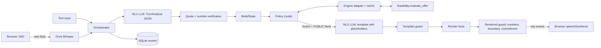

# Debt Settlement Agent

[](https://github.com/strike0702/Debt-Settlement-Agent/actions/workflows/ci.yml)

A voice and text agent that negotiates a debt settlement with a creditor representative. An LLM handles the language. Python code decides every offer, every number, and whether the call can close.

Personal project. Synthetic data. Not a live collections product.

[](docs/assets/demo.mp4)

*An autoplayed `counter_ladder` call in the Debt negotiator view (slowed to 3.8 s per step). Each agent move has a decision trace: what the NLU heard, the belief change, the affordability curve, the policy's reason, and the guard checks. [MP4 version](docs/assets/demo.mp4).*

**Live demo:** [debt-settlement-agent-ggor.onrender.com](https://debt-settlement-agent-ggor.onrender.com/). Pick a scenario and press **Watch a call**: a simulated creditor plays the rep, so it works with **no API keys** and no quota. **Start call** lets you play the rep yourself (type, click a suggested reply, or use the mic); that path needs the server's LLM keys. The host is a free Render instance, so a cold first load can take about 30 s.

The **Debt negotiator** view shows the firm's side: the client's private finances and ledger, the decision trace with the affordability curve, guard verdicts, latency and the audit log. The **Creditor rep** view (`?view=rep`) shows what the creditor's representative sees (the conversation, their own account, the agreed terms) and is the privacy-scoped stream: the server filters every frame, and a test scans whole calls for every private value. A call started in either view shows its full decision trace when you switch to the Debt negotiator view. The operator view is public on the hosted demo by design, because every figure in it is synthetic.

Design decisions, with an annotated voice turn: [`docs/DESIGN.md`](docs/DESIGN.md).

## Results

Every number below links to the committed file it comes from, and each block names the command that regenerates it.

### Policy, offline (no keys, runs in CI)

Oracle NLU, template NLG, code simulator, 100 seeded scenarios (personas flexible / contradictory / pressuring; strata deal / rescue / no fix). This isolates the negotiation logic from language errors.

```bash
python -m eval.run_eval --nlu oracle --nlg template --sim-phrasing template --scenarios 100 --seed 7
```

| What I measured | Result | n | 95% CI | Why it matters |
|---|---|---|---|---|
| [Valid agreements](docs/eval/policy_eval_20261006/summary.md) | 1.0 | 23 | 0.857–1.000 | Every drafted schedule passed the independent validator under the agreed rules. A wrap with no agreement counts as a fail. |
| [Deals when a deal exists](docs/eval/policy_eval_20261006/summary.md) | 1.0 | 23 | 0.857–1.000 | When the ask and the client's budget overlap, and the call should not escalate, we got a deal. |
| [Correct no-deal](docs/eval/policy_eval_20261006/summary.md) | 1.0 | 22 | 0.851–1.000 | On `no_fix` calls that should not escalate, we walked away. |
| [Correct escalation](docs/eval/policy_eval_20261006/summary.md) | 1.0 | 55 | 0.935–1.000 | Pressure / rescue cases that should escalate, did. |
| [Rule fields extracted](docs/eval/policy_eval_20261006/summary.md) | 0.670 | 700 | 0.634–0.704 | 7 fields × 100 calls. Escalations and no-deals end before the late-field read-back, so those fields stay assumed. That is why this is not about 1.0. |
| [False "known"](docs/eval/policy_eval_20261006/summary.md) | 0.000 | 469 | 0.000–0.008 | When the agent marked a field known, it matched the creditor. |
| [Stuck calls](docs/eval/policy_eval_20261006/summary.md) | 0.000 | 100 | 0.000–0.037 | Nothing hit the turn cap without ending. |
| [Private figures spoken](docs/eval/policy_eval_20261006/summary.md) | 0 | | | Token match on a blocklist (balances, fees, private max %, rescue amounts). Does not catch paraphrase. |
| [Unverified figures spoken](docs/eval/policy_eval_20261006/summary.md) | 0 | | | No number in an agent line that was not a public fact or a number the creditor said. |
| [Price counters (max)](docs/eval/policy_eval_20261006/summary.md) | 4 | | | Equals `MAX_COUNTERS`. An earlier bug spoke 10. |

[Mean surplus captured on deals](docs/eval/policy_eval_20261006/summary.md) is 0.689: the share of the gap between the creditor's walk-away floor and the client's max that the agent kept by not confirming the first ask. [Mean turns to an outcome](docs/eval/policy_eval_20261006/summary.md): 5.12. Five example transcripts sit next to the summary ([note](docs/eval/policy_eval_20261006/NOTE.md): they predate the current opening line).

### Latency, before and after (live, demo profile)

20 scripted rep turns per run on `easy_deal`, Groq `gpt-oss-120b` NLU and Groq Whisper STT. Phase 21 moved NLG to a guard-checked template bank and fixed the rate limiter; Phase 27 added a key pool across three Groq orgs. Source: [`docs/eval/latency_20261007.md`](docs/eval/latency_20261007.md) (raw samples in [`latency_20261007/`](docs/eval/latency_20261007/)).

```bash
LLM_CACHE=false NLG_MODE=bank uv run uvicorn app.main:app --port 8021
uv run python scripts/latency_probe.py --url ws://127.0.0.1:8021 --turns 20 [--wav] --out after.json
```

| Stage, p50 / p95 (ms) | Before | After (P21) | After + key pool (P27) |
|---|---|---|---|
| [Text turn, client send → first reply](docs/eval/latency_20261007.md#text-turns-n20-each) | 4129 / 10582 | 2372 / 8780 | [1420 / 2242](docs/eval/latency_20261007.md#after-key-pool-phase-27-2026-10-07) |
| [NLG](docs/eval/latency_20261007.md#text-turns-n20-each) | 1440 / 2073 | 0 / 1 | [0 / 1](docs/eval/latency_20261007.md#after-key-pool-phase-27-2026-10-07) |
| [NLU, text turns](docs/eval/latency_20261007.md#text-turns-n20-each) | 2745 / 9329 | 2367 / 8773 | [1415 / 2215](docs/eval/latency_20261007.md#after-key-pool-phase-27-2026-10-07) |
| [Voice, WAV sent → first reply](docs/eval/latency_20261007.md#voice-turns-say-wav--server-stt-n20-each) | 5512 / 6633 | 3704 / 8210 | not run |
| [STT](docs/eval/latency_20261007.md#voice-turns-say-wav--server-stt-n20-each) | 681 / 1075 | 207 / 315 | not run |

The remaining time is the NLU request itself (about 1.4 s p50). Voice end of speech → first audio is about [4.7 s p50, down from about 7.2 s](docs/eval/latency_20261007.md#reading-it), but that is an **estimate** (VAD hangover + probe time + typical TTS onset); a browser-measured voice run has not been done. The per-stage breakdown of one voice turn is in [`docs/DESIGN.md`](docs/DESIGN.md#one-voice-turn-annotated).

### A/B: code policy vs conversational NLG vs a ReAct agent

<!-- AB-PENDING -->
**A/B in progress.** Same 48 seeds, live NLU and LLM creditor phrasing; arms: policy + template NLG, policy + conversational acts (H3), and a ReAct tool-calling agent (eval-only). The run has not finished, so no numbers are reported yet. The summary will be [`docs/eval/ab_20261007/`](docs/eval/ab_20261007/); conditions are in its [notes](docs/eval/ab_20261007/notes.md).
<!-- /AB-PENDING -->

### NLU on messy lines (live, needs keys)

Live model plus the post-verify repair code, scored against 177 hand-labelled synthetic rep lines. Source and every run's rows: [`docs/eval/nlu_corpus.md`](docs/eval/nlu_corpus.md).

```bash
python -m eval.nlu_corpus --label AFTER
```

| Flag (AFTER run) | Precision | Recall | Before repairs (P / R) | Why I care |
|---|---|---|---|---|
| [Asks for client-private info](docs/eval/nlu_corpus.md#after) | 0.971 | 0.971 | [0.667 / 0.235](docs/eval/nlu_corpus.md#before) | Miss this and the policy never refuses. |
| [Demands a commitment](docs/eval/nlu_corpus.md#after) | 1.000 | 0.923 | [0.667 / 0.462](docs/eval/nlu_corpus.md#before) | Same shape. |
| [Stance = accept](docs/eval/nlu_corpus.md#after) | 1.000 | 1.000 | [0.306 / 1.000](docs/eval/nlu_corpus.md#before) | Filler ("uh yeah") used to count as yes. |

[Filler false accepts](docs/eval/nlu_corpus.md#after): 0 of 31 (was 21). The prompt did not change between BEFORE and AFTER; the gain is the repair code. Later rows (a newer prompt, and the `reasoning_effort: low` gate, which failed) are in the same file. Still weak, and left as measured: `wants_to_end` precision 0.5, `firm` precision 0.6, hostility recall 0.4. I wrote the corpus and the regexes, so this is not a blind test set.

### What is not measured yet

- The A/B above (in progress).
- Voice end to end in a real browser (the figure above is an estimate).
- The hosted demo under load.
- A simulator written by someone else: the simulator and the agent share an author.

## Verify in 60 s

No API keys needed for any of these.

```bash
uv sync --group dev
uv run pytest -q -m "not slow"     # what CI runs; drop -m to add the 100-seed invariant sweep
uv run python -m eval.run_eval --nlu oracle --nlg template --sim-phrasing template --scenarios 100 --seed 7
(cd web && npm ci && npm run build) && uv run uvicorn app.main:app --port 8000
# open http://127.0.0.1:8000, pick easy_deal, press "Watch a call"
```

The eval prints a summary whose metrics table should match [`summary.md`](docs/eval/policy_eval_20261006/summary.md) and exits non-zero on any threshold miss. Autoplay runs the server's code simulator with template phrasing, so it makes no LLM call.

## Why I built this

A settlement call has two constraints that pull in different directions.

The creditor has rules: max payments, a minimum, even vs balloon, a start date. The client has a budget. Some percentages can be funded. Some cannot. And "can we fund 40%" does not tell you whether 45% works. The curve is not a straight line.

You still need the conversation to sound like a conversation. An LLM is good at that. It is also happy to invent a payment, or mention the client's bank balance because someone asked.

I wanted the fluent part. I did not want the model touching the money.

## What the system does

1. You type, or the browser records a clip after voice activity detection (VAD: it waits until you stop talking). Speech-to-text (STT) turns that into text. Server STT is Groq Whisper. If that is down, the browser's own recognizer is the fallback.
2. A language model does natural language understanding (NLU): the line becomes structured terms, a stance (accept / reject / other), and a few safety flags. Code then checks quotes and numbers against what you said. Hallucinated quotes get dropped. Hedged numbers stay tentative.
3. The agent updates its **belief state**: what it thinks it knows about the creditor's rules, and how sure it is (unknown, assumed, tentative, known, contradicted).
4. Deterministic policy (`decide()` in `app/agent/policy.py`) picks the next move. Counter, confirm, ask a missing rule, refuse, escalate, walk away. The model does not vote.
5. The feasibility engine answers the money question: can the client fund this percentage under these rules, and what is the schedule? Policy only sees the yes/no and the public facts it is allowed to say out loud.
6. Natural language generation (NLG) turns that approved action into a sentence. The model writes a template with `{placeholders}`, not digits. Code fills the placeholders from those public facts.
7. Two guards run before anything is spoken. A raw number, a private figure, or an unauthorized "we have a deal" swaps the line for a fallback.
8. Most state changes wait until the browser acks that the sentence was spoken. You can barge in (talk over the agent); unheard pending effects are dropped. Counters and confirms are recorded as soon as they are sent, so a fast "yes" does not re-offer the same deal. The turn lands in an append-only SQLite audit log.

Text and voice hit the same orchestrator. Voice is speech I/O on top of that loop.

## The LLM does not control the money

That is the design I care about most.

An LLM can write a convincing sentence. A financial negotiation should not let it invent a number or make a commitment nobody approved. The model sits around the negotiation engine.

**What the LLM does**

- Parse the representative's language into terms and stance
- Write a template for an action the code already chose
- Transcribe audio, via a separate STT role

**What the LLM does not do**

- Decide the highest percentage the client can afford
- Add or multiply money
- Invent a payment, a date, or a percentage
- Decide whether a schedule is valid
- Close a deal the policy engine has not approved

Money is integer cents. Settlement percentages are integer basis points (4500 = 45%). No floats. After the guards, the only figures that reach speech come from `Fact.render()`. The NLG prompt never sees private client finances.

If the model writes "sixty percent" into a draft, the template guard blocks it. If a private balance slips into a rendered sentence, the second guard blocks that too.

## Architecture

Language in, language out. Decisions and arithmetic stay in Python.



- **Browser / text.** A React call console (`web/`, served at `/`): conversation, decision trace, and negotiation state side by side. Compose box, suggested replies, mic, barge-in, and **Watch a call** (keyless autoplay against the code simulator).
- **STT.** Server Whisper, or the browser fallback. VAD is `@ricky0123/vad-web` in the page.
- **Orchestrator.** One turn: NLU, belief, affordability, policy, NLG, speech ack. Cancel-and-merge if you talk while NLU is still running: the new text joins that turn and NLU reruns on the combined line. The WebSocket runs each event as its own task, so this, barge-in, and speech acks all work while a turn is in flight.
- **NLU + verification.** LLM JSON, then quote / number / range checks and a few regex repairs.
- **Belief.** The working picture of the creditor's rules. Tentative values get read back before they count as known.
- **Policy.** Pure functions. Belief + verified analysis + affordability curve → an `Action`.
- **Feasibility engine.** `feasibility/` — settlement math I built for an earlier project and brought into this one. For a client, rules, and a percentage: can we fund it, and what is the schedule? When nothing fits it also computes private rescue options (a lump or a draft bump). Policy gets a yes/no on whether rescue stays inside a guardrail. The amount is never spoken.
- **NLG + guards.** Template, fill, check, speak or fall back. The demo default (`NLG_MODE=bank`) picks a template from `config/nlg_bank.json`, built offline by `scripts/build_template_bank.py` and guard-checked, so no LLM call sits on the reply path; `NLG_MODE=llm` asks the LLM live.
- **TTS.** `speechSynthesis` in the browser. Not a telephony stack.
- **Audit log.** Belief changes, guard blocks, escalations, NLU analyses, each `decide()` intent, and every LLM / STT call (role, provider, model, latency, tokens, cache hit, failover, and failed attempts with their error). Append-only SQLite (WAL; triggers reject UPDATE/DELETE).

LLM calls go through `app/llm/client.py` by role (`nlu`, `nlg`, `sim`, `stt`), never by model name. Routing is `config/providers.yaml` (`demo`, `eval`, `local`, `offline`). Missing keys are skipped. 429s fail over.

## How negotiation decisions are made

Policy lives in `app/agent/policy.py`. A normal call walks `OPENING → DISCOVERY → NEGOTIATE → CONFIRM → WRAP → END`. Hostility, a repeated private-info ask, or a repeated commitment demand jumps to `ESCALATE`. A dead end goes `NO_DEAL_WRAP` then `END`.

The agent represents the client. The creditor usually asks high. The private max is a cap, not a talking point: counters stay below the ask and at or under what the client can fund, and that cap never gets said out loud. It also should not hand over the whole ceiling on the first "sure."

Defaults (`.env`):

| Knob | Default | Role |
|---|---|---|
| `ANCHOR_RATIO` | `0.7` | First counter near 70% of `min(ask, max affordable)` |
| `CONCESSION_FACTOR` | `0.5` | Later steps close half the remaining gap |
| `MAX_COUNTERS` | `4` | At most four price counters. The last one is the ceiling. |
| `CLOSE_GAP_BP` | `200` | Next step within 2 points of the ask → confirm |
| `MAX_TURNS` | `24` | Hard call length |

Every turn, `decide()` runs a fixed cascade: turn cap, hostility, private-info, commitment demand, contradictions, tentative read-backs, missing rules, then price.

**Price ladder (ask is affordable).** Early versions confirmed any affordable ask on the spot. That left money on the table. The live policy counters first. First offer snaps down onto the 100-point feasibility grid. Later offers walk halfway toward the ask, still strictly below it and at or under the private max. If the next step is close enough, the representative sounds firm after a counter, or the counter budget is gone on an affordable ask, it confirms. The affordable path does not walk away just to be stubborn.

**Ask above the ceiling.** Try a non-price change first: later start date, lower minimum, more payments. A "yes" on that change is not a yes on the last price. Then at most four counters, last one at the highest legal percentage. Any non-accept after that is no-deal.

Feasibility across percentages is non-monotonic. 40% can fail while 45% works, usually because a payment floor rejects the smaller offer. So the adapter scans `1%…100%` and treats that curve as ground truth.

**Confirm and wrap.** `CONFIRM_SCHEDULE` reads back percentage, payment count, dates, and totals from engine facts. On accept, `PROPOSE_WRAP` drafts an agreement marked `pending_client_approval`. Spoken as "sent for client approval," never as a hard commit. From wrap the rep can end the call or reopen with a new ask.

**Escalate vs no-deal.** Hostile tone, a second private-info ask, or a second commitment demand: escalate. Infeasible, but a rescue lump/increment is inside the guardrail: escalate ("needs client approval for extra funds") without saying the amount. Infeasible and no useful term change: no-deal. Ask above the ceiling and counters exhausted: no-deal.

## Safety and correctness

I treated the model as untrusted input, the same way you treat a form field.

**Before the decision.** NLU output is checked against the utterance. Quotes must appear in the line. Numbers must parse. Out-of-range values are dropped. Short "yeah / okay / fine" only counts as accept when it dominates the line and there is no number in it. Lines that look like prompt injection never accept. Private-info and commitment flags are the LLM flag **or** an un-negated regex cue, because the model alone missed a lot of those.

**During the decision.** Policy and the engine are ordinary Python. The model cannot pick a percentage or mark a schedule valid.

**Before speaking.** `template_guard` rejects digits, `$`, `%`, number-words, and unknown placeholders. `rendered_guard` rejects a figure that is not a public fact or a number the creditor already said, a private value in any rendering, and premature commitment phrasing. Fail closed: `Let me check that figure and come back to it.`

**After speaking.** Wrap drafts only after the independent validator (`app/adapter/validator.py`) accepts the schedule. That validator does not import the engine's internals. Most effects commit on the speech ack, so a barge-in does not lock in a sentence nobody heard.

The audit log is there so you can see why a turn went the way it did. Belief, blocks, escalations, NLU, `decide()`, and one row per LLM call attempt (metadata, not the prompt or reply text).

## Tech stack

Python 3.12, FastAPI, Pydantic v2, SQLite (audit + optional LLM cache). pytest, ruff. LLM providers from YAML (Groq, Gemini, Cerebras, OpenRouter, Mistral, optional Ollama). Groq Whisper for STT. Browser VAD + `speechSynthesis` for voice. `uv` for the environment.

## Project structure

```text
app/          Orchestrator, policy, NLU/NLG, guards, voice WebSocket, autoplay
web/          React call console (Vite, TypeScript), served by FastAPI at /
feasibility/  Settlement math (from an earlier project of mine; part of this repo)
eval/         Offline eval runner, metrics, NLU corpus scorer
sim/          Creditor simulator (must not import app.agent)
tests/        Unit, e2e, engine, NLU corpus
fixtures/     Synthetic clients, offers, demo scenarios
docs/         Design ADRs, progress log, frozen eval reports; history/ holds the original build plans
config/       Provider routes and profiles
```

More detail: [`docs/DESIGN.md`](docs/DESIGN.md), [`docs/PROGRESS.md`](docs/PROGRESS.md), [`docs/eval/`](docs/eval/). The original build plans are in [`docs/history/`](docs/history/).

## Running locally

Python 3.12. [`uv`](https://docs.astral.sh/uv/) for the venv. Node 24 (or ≥ 22.22) to build the web UI.

**Tests and the offline policy eval need no API keys.** The live browser demo and the CLI need at least one of `GROQ_API_KEY` or `GEMINI_API_KEY` in `.env`. Server STT needs Groq.

```bash
uv venv --python 3.12 && source .venv/bin/activate
uv sync --group dev
cp .env.example .env
# fill keys only if you want the live demo
(cd web && npm ci && npm run build)   # FastAPI serves web/dist at /
uvicorn app.main:app --reload --host 127.0.0.1 --port 8000
```

Open http://127.0.0.1:8000. Pick a scenario card, then **Watch a call** (the simulated rep plays it; no keys needed) or **Start call** (you play the rep: type, click a suggested reply, or use the mic). The **Creditor rep** view shows only what the rep's stream carries (no decision trace). **Add a test case** next to the cards opens a JSON editor (pre-filled from the template) for your own scenario; you play the rep on it. For UI work, `npm run dev` in `web/` serves on :5173 with hot reload and proxies the API to :8000; see [`web/README.md`](web/README.md).

Text-only, same pipeline, auto-acks every sentence:

```bash
python -m app.cli fixtures/demo
```

```bash
pytest -q
python -m eval.run_eval --nlu oracle --nlg template --sim-phrasing template \
  --scenarios 100 --seed 7
```

CI also runs `ruff check .` and `pytest -q -m "not slow"`. The 100-seed invariant sweep is the `slow` marker; set `DSA_INVARIANT_SEEDS` for a longer local run.

Live NLU corpus (keys required): `python -m eval.nlu_corpus --label AFTER`

`LLM_PROFILE=offline` forces `FakeLLM` and stays off the network. `local` is Ollama (`qwen3.5:9b` / `gemma4:e4b`). I tried it. NLU was too slow and too weak for the quality gates.

## What I would take from this

Keep financial rules in code you can test without a model. Treat LLM output like a form post: parse it, check it, drop what does not verify.

Separate "what do we do" from "how do we say it." Once those are mixed, you cannot tell a policy bug from a wording bug.

Evaluate the failure modes you actually worry about. Invalid schedules. Spoken private figures. A counter loop that ignores its own cap. Filler that looks like "yes." A 1.0 on a 3-call happy path would have hidden the 10-counter bug.

And write the decision down. If you cannot say why the agent offered 58% after the fact, you do not have a negotiation system. You have a chat window with extra steps.

Still open: the A/B against the ReAct and LLM-only arms (running), a browser-measured voice timing, and labels I did not write myself.
