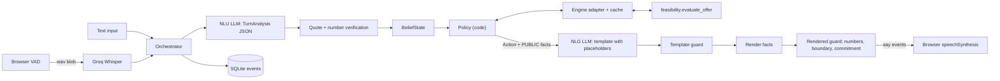

# Debt Settlement Agent

A conversational agent that negotiates debt settlements. Same policy and engine whether you type or talk.

**Live demo:** [debt-settlement-agent-ggor.onrender.com](https://debt-settlement-agent-ggor.onrender.com/)


**Text chat** — CLI or the browser compose box. **Voice** — mic → STT, agent replies through browser TTS, with barge-in. Both modes hit the same orchestrator; voice is speech I/O on top of the text turn loop.

The hard part is not sounding natural. It is keeping the math honest. An LLM that invents a payment amount mid-sentence is worse than a clumsy script. So this system treats the model as untrusted for arithmetic: code picks every move and every number; the model only extracts terms and wraps them in words.

All data here is synthetic.

**Stack:** Python 3.12, FastAPI, Pydantic v2, SQLite audit log, browser VAD + TTS, Groq Whisper STT, LLM routed by role via `config/providers.yaml`. Settlement math lives in `feasibility/`.

## Architecture: LLM is untrusted for arithmetic

Policy is code. The LLM does NLU (turn → structured terms) and NLG (intent → template with `{placeholders}`). Fact rendering fills the numbers. Guards catch anything that still looks like a digit, a private figure, or a commitment phrase that was never offered.



One turn: verify the rep's utterance → update belief → policy picks an `Action` → NLG writes a template → guards → speak. Side effects (a counter was offered, wrap commits) stick only after the browser acks the sentences were spoken.

Money is integer cents. Settlement % is integer basis points (4500 = 45%). After speech guards, only rendered `Fact` values reach TTS — the LLM may emit digits in drafts, but guards block them before speak.

## Feasibility engine

`feasibility/` answers one question for a given client, creditor rules, and settlement %: can we fund this, and if so, what's the schedule?

It does not chat. It does not negotiate. It scores candidate payment vectors (even, staircase, balloon) under floors, cadence, fee placement, and a balance buffer, then picks a winner. If nothing works, it computes closed-form rescue options — a lump sum or a monthly draft bump — and flags whether each stays inside a guardrail. That rescue amount stays private; policy only gets a yes/no.

Weird detail that bites you in practice: feasibility across settlement % is non-monotonic. 40% can fail while 45% works, often because payment floors refuse a low offer. So the agent scans a 100-point grid (`1%…100%`) and treats that curve as ground truth for counters. Numbers that leave the engine as PUBLIC facts are the only ones allowed into speech.

## Negotiation strategy

Policy lives in `app/agent/policy.py`. It is pure code. The LLM never chooses whether to counter, confirm, escalate, or walk away.

Phases, in order of a normal call: `OPENING` → `DISCOVERY` → `NEGOTIATE` → `CONFIRM` → `WRAP` → `END`. Side paths: `ESCALATE`, or `NO_DEAL_WRAP` into `END`.

### What the agent is optimizing for

Settle as high as the client can actually fund, without saying that ceiling out loud. The private max (`max_bp`) comes from the feasibility engine. Counters snap to the 100-point grid of feasible settlement percentages. The walk-away number never enters speech.

Defaults (env / `.env`):

| Knob | Default | Role |
|---|---|---|
| `ANCHOR_RATIO` | `0.7` | First counter anchors near 70% of `min(ask, max)` |
| `CONCESSION_FACTOR` | `0.5` | Each later step closes half the remaining gap |
| `MAX_COUNTERS` | `4` | Cap on stalls / ceiling rejects |
| `CLOSE_GAP_BP` | `200` | If the next counter is within 2 points of the ask, just confirm |
| `MAX_TURNS` | `24` | Hard call length |

### Decision order (every turn)

`decide()` runs fixed rules, top to bottom:

1. **Turn cap** → no-deal
2. **Hostility** → escalate
3. **Private-info ask** → refuse once, then escalate
4. **Commitment demand** → refuse once ("we can propose this to the client"), then escalate
5. **Contradiction** (discovery) → clarify
6. **Tentative extraction** → read back
7. **Missing creditor rule** → ask for it
8. **No settlement % yet** → ask for the ask
9. **Affordability / price / terms** (below)
10. **In CONFIRM**, accept stance → wrap; new terms reopen negotiation

### Price negotiation (the ladder)

Early versions confirmed any affordable ask on the spot. That left surplus on the table. The live policy counters first.

When the ask is feasible and at or under `max_bp`:

1. Ask already at or below something we offered → confirm
2. Rep sounds firm after we have countered → confirm their ask
3. Counter budget used up → confirm (affordable path never no-deals just to be stubborn)
4. No legal counter below the ask → confirm
5. Ladder stalled on the grid → jump once toward the ask, else confirm
6. Next step within `CLOSE_GAP_BP` of the ask → confirm
7. Otherwise → `COUNTER` at `next_counter()`

`next_counter()`:

- Target = `min(ask_bp, max_bp)`
- First offer = largest feasible bp ≤ `ANCHOR_RATIO * target` (else the smallest legal bp)
- Later offers move halfway toward the target, then snap **down** onto a feasible point
- Stay strictly below the ask and at or under `max_bp`. And keep that private ceiling out of speech.

If the ask sits **above** the ceiling, the agent does not loop the same low counter forever. It tries non-price recovery first (next section), then either escalates for rescue funds or no-deals.

### Non-price recovery (when the curve is empty or the ask won't fit)

Sometimes the % is fine but the payment rules block every schedule. Or the ask is above today's ceiling, but a later start date / softer minimum / more payments unlocks room.

The orchestrator searches term alternatives in order: **first payment date → min payment → max payments**. Policy emits `COUNTER_TERMS` for the best alt (highest ceiling when the ask fits nowhere; otherwise the least invasive change that makes the ask feasible).

A "yes" on a term alt is **not** a yes on the last price counter. After the curve opens, price negotiation continues under the new rules.

### Confirm → wrap → reopen

`CONFIRM_SCHEDULE` reads back settlement %, payment count, dates, and totals from engine facts. On accept, `PROPOSE_WRAP` drafts an agreement marked `pending_client_approval` — spoken as "sent for client approval," never as a hard commit.

From `WRAP`, the rep can end the call, or reopen with a new ask / reject / counter. That clears the draft and returns to `CONFIRM` or `NEGOTIATE`.

### Escalation vs no-deal

| Situation | Outcome |
|---|---|
| Hostile tone, repeated private ask, repeated commitment demand | Escalation |
| Infeasible, but lump/increment rescue is inside the guardrail | Escalation ("needs client approval for extra funds") — amount never spoken |
| Infeasible, no rescue, no useful term alt | No-deal |
| Ask above ceiling, counters exhausted at the highest legal bp | No-deal |
| Affordable ask, counters exhausted | Confirm the ask |

Every belief change, block, escalation, and LLM call lands in the SQLite audit log.

## Run locally

Python 3.12, keys in `.env` (see `.env.example`):

```bash
uv venv --python 3.12 && source .venv/bin/activate
uv sync --group dev
cp .env.example .env
uvicorn app.main:app --reload --host 127.0.0.1 --port 8000
```

Open http://127.0.0.1:8000. Headphones help (browser TTS can echo into the mic). CLI alternative: `python -m app.cli fixtures/demo`.

## Limitations

- **Candidate schedules, not exhaustive search.** The engine scores a fixed family of shapes. Feasibility is non-monotonic across settlement %. Counters snap to the 1%…100% grid.
- **Browser TTS echo.** Headphones and barge-in help; this is not a telephony stack.
- **Hosted demo cold starts.** Render free tier can sleep; the first hit after idle may take a minute.
