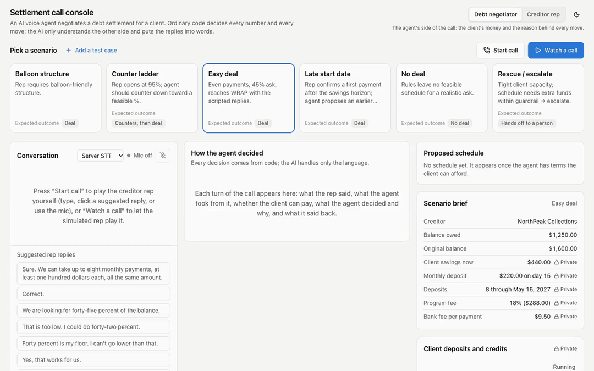
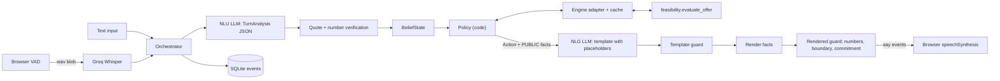

# Debt Settlement Agent

[](https://github.com/strike0702/Debt-Settlement-Agent/actions/workflows/ci.yml)

A voice and text agent that negotiates a debt settlement with a creditor representative. An LLM handles the language. Python code decides every offer, every number, and whether the call can close.

Personal project. Synthetic data. Not a live collections product.

## Demo

**Live demo:** [debt-settlement-agent-ggor.onrender.com](https://debt-settlement-agent-ggor.onrender.com/)



You play the creditor. Type, or speak into the mic. The agent replies in the same chat, and through the browser's text-to-speech if you used voice.

Two views:

- **Creditor rep.** Chat, a scripted playbook, extracted terms, proposed schedule.
- **Operator (firm).** Same call, plus the client's private finances, engine verdict, guard blocks, latency, and the audit log. The representative never sees this panel.

Pick a scenario from the operator dropdown (`fixtures/scenarios/`: `easy_deal`, `counter_ladder`, `balloon_structure`, and a few harder ones). Every number is made up.

The hosted app is a free Render instance, so the first load can sit. No login. Endpoints are open on purpose.

## Why I built this

A settlement call has two constraints that pull in different directions.

The creditor has rules: max payments, a minimum, even vs balloon, a start date. The client has a budget. Some percentages can be funded. Some cannot. And "can we fund 40%" does not tell you whether 45% works. The curve is not a straight line.

You still need the conversation to sound like a conversation. An LLM is good at that. It is also happy to invent a payment, or mention the client's bank balance because someone asked.

I wanted the fluent part. I did not want the model touching the money.

## What the system does

1. You type, or the browser records a clip after voice activity detection (VAD: it waits until you stop talking). Speech-to-text (STT) turns that into text. Server STT is Groq Whisper. If that is down, the browser's own recognizer is the fallback.
2. A language model does natural language understanding (NLU): the line becomes structured terms, a stance (accept / reject / other), and a few safety flags. Code then checks quotes and numbers against what you said. Hallucinated quotes get dropped. Hedged numbers stay tentative.
3. The agent updates its **belief state**: what it thinks it knows about the creditor's rules, and how sure it is (unknown, assumed, tentative, known, contradicted).
4. Deterministic policy (`decide()` in `app/agent/policy.py`) picks the next move. Counter, confirm, ask a missing rule, refuse, escalate, walk away. The model does not vote.
5. The feasibility engine answers the money question: can the client fund this percentage under these rules, and what is the schedule? Policy only sees the yes/no and the public facts it is allowed to say out loud.
6. Natural language generation (NLG) turns that approved action into a sentence. The model writes a template with `{placeholders}`, not digits. Code fills the placeholders from those public facts.
7. Two guards run before anything is spoken. A raw number, a private figure, or an unauthorized "we have a deal" swaps the line for a fallback.
8. Most state changes wait until the browser acks that the sentence was spoken. You can barge in (talk over the agent); unheard pending effects are dropped. Counters and confirms are recorded as soon as they are sent, so a fast "yes" does not re-offer the same deal. The turn lands in an append-only SQLite audit log.

Text and voice hit the same orchestrator. Voice is speech I/O on top of that loop.

## The LLM does not control the money

That is the design I care about most.

An LLM can write a convincing sentence. A financial negotiation should not let it invent a number or make a commitment nobody approved. The model sits around the negotiation engine.

**What the LLM does**

- Parse the representative's language into terms and stance
- Write a template for an action the code already chose
- Transcribe audio, via a separate STT role

**What the LLM does not do**

- Decide the highest percentage the client can afford
- Add or multiply money
- Invent a payment, a date, or a percentage
- Decide whether a schedule is valid
- Close a deal the policy engine has not approved

Money is integer cents. Settlement percentages are integer basis points (4500 = 45%). No floats. After the guards, the only figures that reach speech come from `Fact.render()`. The NLG prompt never sees private client finances.

If the model writes "sixty percent" into a draft, the template guard blocks it. If a private balance slips into a rendered sentence, the second guard blocks that too.

## Architecture

Language in, language out. Decisions and arithmetic stay in Python.



- **Browser / text.** Vanilla JS at `/`. Compose box, mic, barge-in.
- **STT.** Server Whisper, or the browser fallback. VAD is `@ricky0123/vad-web` in the page.
- **Orchestrator.** One turn: NLU, belief, affordability, policy, NLG, speech ack. Cancel-and-merge if you talk while NLU is still running.
- **NLU + verification.** LLM JSON, then quote / number / range checks and a few regex repairs.
- **Belief.** The working picture of the creditor's rules. Tentative values get read back before they count as known.
- **Policy.** Pure functions. Belief + verified analysis + affordability curve → an `Action`.
- **Feasibility engine.** `feasibility/` — settlement math I built for an earlier project and brought into this one. For a client, rules, and a percentage: can we fund it, and what is the schedule? When nothing fits it also computes private rescue options (a lump or a draft bump). Policy gets a yes/no on whether rescue stays inside a guardrail. The amount is never spoken.
- **NLG + guards.** Template, fill, check, speak or fall back.
- **TTS.** `speechSynthesis` in the browser. Not a telephony stack.
- **Audit log.** Belief changes, guard blocks, escalations, NLU analyses, each `decide()` intent. Append-only SQLite (WAL; triggers reject UPDATE/DELETE). Successful LLM HTTP calls are not written today.

LLM calls go through `app/llm/client.py` by role (`nlu`, `nlg`, `sim`, `stt`), never by model name. Routing is `config/providers.yaml` (`demo`, `eval`, `local`, `offline`). Missing keys are skipped. 429s fail over.

## How negotiation decisions are made

Policy lives in `app/agent/policy.py`. A normal call walks `OPENING → DISCOVERY → NEGOTIATE → CONFIRM → WRAP → END`. Hostility, a repeated private-info ask, or a repeated commitment demand jumps to `ESCALATE`. A dead end goes `NO_DEAL_WRAP` then `END`.

The agent represents the client. The creditor usually asks high. The private max is a cap, not a talking point: counters stay below the ask and at or under what the client can fund, and that cap never gets said out loud. It also should not hand over the whole ceiling on the first "sure."

Defaults (`.env`):

| Knob | Default | Role |
|---|---|---|
| `ANCHOR_RATIO` | `0.7` | First counter near 70% of `min(ask, max affordable)` |
| `CONCESSION_FACTOR` | `0.5` | Later steps close half the remaining gap |
| `MAX_COUNTERS` | `4` | At most four price counters. The last one is the ceiling. |
| `CLOSE_GAP_BP` | `200` | Next step within 2 points of the ask → confirm |
| `MAX_TURNS` | `24` | Hard call length |

Every turn, `decide()` runs a fixed cascade: turn cap, hostility, private-info, commitment demand, contradictions, tentative read-backs, missing rules, then price.

**Price ladder (ask is affordable).** Early versions confirmed any affordable ask on the spot. That left money on the table. The live policy counters first. First offer snaps down onto the 100-point feasibility grid. Later offers walk halfway toward the ask, still strictly below it and at or under the private max. If the next step is close enough, the representative sounds firm after a counter, or the counter budget is gone on an affordable ask, it confirms. The affordable path does not walk away just to be stubborn.

**Ask above the ceiling.** Try a non-price change first: later start date, lower minimum, more payments. A "yes" on that change is not a yes on the last price. Then at most four counters, last one at the highest legal percentage. Any non-accept after that is no-deal.

Feasibility across percentages is non-monotonic. 40% can fail while 45% works, usually because a payment floor rejects the smaller offer. So the adapter scans `1%…100%` and treats that curve as ground truth.

**Confirm and wrap.** `CONFIRM_SCHEDULE` reads back percentage, payment count, dates, and totals from engine facts. On accept, `PROPOSE_WRAP` drafts an agreement marked `pending_client_approval`. Spoken as "sent for client approval," never as a hard commit. From wrap the rep can end the call or reopen with a new ask.

**Escalate vs no-deal.** Hostile tone, a second private-info ask, or a second commitment demand: escalate. Infeasible, but a rescue lump/increment is inside the guardrail: escalate ("needs client approval for extra funds") without saying the amount. Infeasible and no useful term change: no-deal. Ask above the ceiling and counters exhausted: no-deal.

## Safety and correctness

I treated the model as untrusted input, the same way you treat a form field.

**Before the decision.** NLU output is checked against the utterance. Quotes must appear in the line. Numbers must parse. Out-of-range values are dropped. Short "yeah / okay / fine" only counts as accept when it dominates the line and there is no number in it. Lines that look like prompt injection never accept. Private-info and commitment flags are the LLM flag **or** an un-negated regex cue, because the model alone missed a lot of those.

**During the decision.** Policy and the engine are ordinary Python. The model cannot pick a percentage or mark a schedule valid.

**Before speaking.** `template_guard` rejects digits, `$`, `%`, number-words, and unknown placeholders. `rendered_guard` rejects a figure that is not a public fact or a number the creditor already said, a private value in any rendering, and premature commitment phrasing. Fail closed: `Let me check that figure and come back to it.`

**After speaking.** Wrap drafts only after the independent validator (`app/adapter/validator.py`) accepts the schedule. That validator does not import the engine's internals. Most effects commit on the speech ack, so a barge-in does not lock in a sentence nobody heard.

The audit log is there so you can see why a turn went the way it did. Belief, blocks, escalations, NLU, `decide()`. It does not yet record the raw LLM HTTP call.

## Evaluation

I split the eval on purpose. One blended "accuracy" number would hide the thing I care about: policy when language is taken out of the way, and language understanding on messy lines.

There is no LLM-only baseline in this repo yet, and no published voice end-to-end timing. I am not going to pretend those runs exist.

### Offline policy eval

Oracle NLU, template NLG. This run is about whether the negotiation logic closes the right calls and stays inside the money rules.

100 seeded scenarios. Personas: flexible, contradictory, pressuring. Strata: deal possible, needs rescue, no fix. The simulator is code, not an LLM. No API keys. CI runs this on every push.

Source: [`docs/eval/policy_eval_20261006/summary.md`](docs/eval/policy_eval_20261006/summary.md)

```bash
python -m eval.run_eval --nlu oracle --nlg template --sim-phrasing template \
  --scenarios 100 --seed 7
```

| What I measured | Result | n | 95% CI | Why it matters |
|---|---|---|---|---|
| [Valid agreements](docs/eval/policy_eval_20261006/summary.md) | 1.0 | 23 | 0.857–1.000 | Every drafted schedule passed the validator under the agreed rules. A wrap with no agreement counts as a fail. |
| [Deals when a deal exists](docs/eval/policy_eval_20261006/summary.md) | 1.0 | 23 | 0.857–1.000 | When the ask and the client's budget overlap, and the call should not escalate, we got a deal. |
| [Correct no-deal](docs/eval/policy_eval_20261006/summary.md) | 1.0 | 22 | 0.851–1.000 | On `no_fix` calls that should not escalate, we walked away. |
| [Correct escalation](docs/eval/policy_eval_20261006/summary.md) | 1.0 | 55 | 0.935–1.000 | Pressure / rescue cases that should escalate, did. |
| [Rule fields extracted](docs/eval/policy_eval_20261006/summary.md) | 0.670 | 700 | 0.634–0.704 | 7 fields × 100 calls. Deal calls get all 7. Escalations and no-deals end before the late-field read-back, so those three stay assumed. That is why this is not ~1.0. |
| [False "known"](docs/eval/policy_eval_20261006/summary.md) | 0.000 | 469 | 0.000–0.008 | When the agent marked a field known, it matched the creditor. |
| [Stuck calls](docs/eval/policy_eval_20261006/summary.md) | 0.000 | 100 | 0.000–0.037 | Nothing hit the 24-turn cap without ending. |
| [Private figures spoken](docs/eval/policy_eval_20261006/summary.md) | 0 | | | Token match on a blocklist (balances, fees, private max %, rescue amounts). A ceiling counter that equals the max is exempt: that figure was spoken as a public fact. Does not catch paraphrase. |
| [Unverified figures spoken](docs/eval/policy_eval_20261006/summary.md) | 0 | | | No number in an agent line that was not a public fact or a number the creditor said. |
| [Price counters (max)](docs/eval/policy_eval_20261006/summary.md) | 4 | | | Equals `MAX_COUNTERS`. An earlier bug spoke 10. |

Mean surplus captured on deals is 0.689: the fraction of the gap between the walk-away floor and the client's max that the agent kept by not immediately confirming the ask. Higher means a cheaper settlement for the client. Mean turns to an outcome: 5.12.

The leak scan tokenizes agent lines. It will miss "your client has enough in the account" with no number, and it does not run on audio.

The simulator and the agent share an author. A different creditor would be a harder test. I have not done that yet.

### NLU corpus

Live model plus repair code, scored against 177 hand-labeled synthetic lines. Demo profile, Groq `gpt-oss-120b`. Needs API keys.

Source: [`docs/eval/nlu_corpus.md`](docs/eval/nlu_corpus.md)

```bash
python -m eval.nlu_corpus --label AFTER
```

| Flag | Precision | Recall | Why I care |
|---|---|---|---|
| [Asks for client-private info](docs/eval/nlu_corpus.md) | 0.971 | 0.971 | Miss this and policy never refuses. Before repairs: 0.667 / 0.235. |
| [Demands a commitment](docs/eval/nlu_corpus.md) | 1.000 | 0.923 | Same shape. Before: 0.667 / 0.462. |
| [Stance = accept](docs/eval/nlu_corpus.md) | 1.000 | 1.000 | Before: precision 0.306. Filler ("uh yeah") was treated as yes. |

Filler false accepts: 0 of 31 (was 21). Term exact-match on lines that have terms: 0.859 (n=64). The prompt did not change between BEFORE and AFTER. The gain is the post-verify repairs.

Still weak, and I am leaving the numbers as they are: `wants_to_end` precision 0.5 ("thanks" mid-call), `firm` precision 0.6, hostility recall 0.4. Homophones and STT typos fail number verification. I wrote the corpus and the regexes, so this is not a blind test set.

### What I did not evaluate

- Full calls with live NLU + live NLG on the current policy. An older 12-scenario run is in [`docs/PROGRESS.md`](docs/PROGRESS.md). I am not treating it as current.
- An LLM-only agent on the same seeds (roadmap, not built).
- Voice: VAD → STT → full turn → TTS latency. Browser TTS echo is a real annoyance with the laptop mic open.
- The hosted demo under load.

`tests/e2e/test_policy_invariants.py` also sweeps seeded calls: counters stay below the ask and at or under the private max, at most `MAX_COUNTERS`, no identical consecutive counters, termination, validator-clean wraps. Default 100 seeds. I ran 500 locally.

## Tech stack

Python 3.12, FastAPI, Pydantic v2, SQLite (audit + optional LLM cache). pytest, ruff. LLM providers from YAML (Groq, Gemini, Cerebras, OpenRouter, Mistral, optional Ollama). Groq Whisper for STT. Browser VAD + `speechSynthesis` for voice. `uv` for the environment.

## Project structure

```text
app/          Orchestrator, policy, NLU/NLG, guards, voice WebSocket, UI
feasibility/  Settlement math (from an earlier project of mine; part of this repo)
eval/         Offline eval runner, metrics, NLU corpus scorer
sim/          Creditor simulator (must not import app.agent)
tests/        Unit, e2e, engine, NLU corpus
fixtures/     Synthetic clients, offers, demo scenarios
docs/         Progress log and frozen eval reports
config/       Provider routes and profiles
```

More detail: [`docs/PROGRESS.md`](docs/PROGRESS.md), [`docs/eval/`](docs/eval/).

## Running locally

Python 3.12. [`uv`](https://docs.astral.sh/uv/) for the venv.

**Tests and the offline policy eval need no API keys.** The live browser demo and the CLI need at least one of `GROQ_API_KEY` or `GEMINI_API_KEY` in `.env`. Server STT needs Groq.

```bash
uv venv --python 3.12 && source .venv/bin/activate
uv sync --group dev
cp .env.example .env
# fill keys only if you want the live demo
uvicorn app.main:app --reload --host 127.0.0.1 --port 8000
```

Open http://127.0.0.1:8000. Switch to Operator, pick a scenario, start the chat.

Text-only, same pipeline, auto-acks every sentence:

```bash
python -m app.cli fixtures/demo
```

```bash
pytest -q
python -m eval.run_eval --nlu oracle --nlg template --sim-phrasing template \
  --scenarios 100 --seed 7
```

CI also runs `ruff check .` and `pytest -q -m "not slow"`. The 100-seed invariant sweep is the `slow` marker; set `DSA_INVARIANT_SEEDS` for a longer local run.

Live NLU corpus (keys required): `python -m eval.nlu_corpus --label AFTER`

`LLM_PROFILE=offline` forces `FakeLLM` and stays off the network. `local` is Ollama (`qwen3.5:9b` / `gemma4:e4b`). I tried it. NLU was too slow and too weak for the quality gates.

## What I would take from this

Keep financial rules in code you can test without a model. Treat LLM output like a form post: parse it, check it, drop what does not verify.

Separate "what do we do" from "how do we say it." Once those are mixed, you cannot tell a policy bug from a wording bug.

Evaluate the failure modes you actually worry about. Invalid schedules. Spoken private figures. A counter loop that ignores its own cap. Filler that looks like "yes." A 1.0 on a 3-call happy path would have hidden the 10-counter bug.

And write the decision down. If you cannot say why the agent offered 58% after the fact, you do not have a negotiation system. You have a chat window with extra steps.

Still open: a true LLM-only baseline on the same seeds, voice timing, LLM calls in the audit log, labels I did not write myself.
