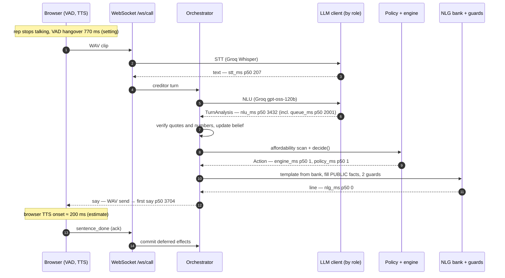

# Design decisions

Seven short architecture decision records (ADRs) and one annotated voice turn.
Each ADR is context, decision, consequences. Numbers link to the committed
evidence in [`docs/eval/`](eval/); nothing here is measured anywhere else.

## ADR 1. Code owns the policy; no ReAct agent in the product

**Context.** A tool-calling (ReAct) agent is the obvious way to build this: give
an LLM `counter`, `confirm`, `escalate` tools and let it reason. But every move
here moves money, and the model would need the client's private ceiling to
choose a counter.

**Decision.** `decide()` in `app/agent/policy.py` is plain Python: belief state,
verified NLU and the affordability curve in, one `Action` out. The LLM only
reads (NLU) and phrases (NLG). The ReAct and LLM-only agents exist, but only as
eval arms in `eval/agents/` (Phase 24a); nothing in `app/` imports them.

**Consequences.** Policy is unit-testable without a model, and the offline eval
gates it on every push ([policy eval](eval/policy_eval_20261009/summary.md):
valid agreements 1.0, n=23). The eval arms must be given private figures to
work at all, which is the risk this decision avoids. The cost is rigidity: a
new move needs code and tests, not a prompt edit.

**A/B result.** The decision was tested against the alternatives on the same 48
seeds, with live NLU and live creditor phrasing
([summary](eval/ab_20261007/summary.md), [decision](eval/ab_20261007/decision.md)).
The adoption rule was written down before the run and was not moved afterwards.
The policy with template NLG (A) stays the default. The policy with
conversational acts (B, H3) was judged more natural, winning 0.80 [0.61, 0.91]
of decisive pairs against A, but it fails the rule: it spoke 1 private figure,
from a policy accept of a figure the simulated creditor invented, and its
`agreement_valid` was 0.71 against A's 0.75. Both of those agreement failures
come from live-NLU extraction errors that every arm shares. The ReAct agent (C)
fails on safety (2 private and 8 unverified figures spoken in its own text),
escalation (0.22 against 1.00) and latency (10.2 s p50 against 2.0 s). The
LLM-only arm (D) was stopped at 13 of 48 scenarios and was behind A on every
check it reached. A human check of the judge is pending (20 pairs).

## ADR 2. The LLM writes placeholders, never digits

**Context.** LLMs paraphrase numbers: "about sixty", "$1.2k", a rounded total.
On a settlement call a wrong figure is a misquote the firm may be held to.

**Decision.** NLG writes a template such as "We can offer {offer_pct}, that is
{offer_total} over {num_payments} payments." `template_guard` rejects any digit,
`$`, `%`, number word or unknown placeholder. Code fills placeholders from
`Fact.render()`. `rendered_guard` then rejects any figure that is neither a
PUBLIC fact nor a number the creditor said, plus commitment phrasing. A blocked
line falls back to a fixed safe sentence.

**Consequences.** Every spoken number traces to an engine or creditor fact; the
policy eval reports 0 unverified figures spoken. Templates can be built offline
and reused: the demo's `NLG_MODE=bank` serves guard-checked templates with no
LLM call, which took NLG off the reply path ([latency](eval/latency_20261007.md):
`nlg_ms` p50 1440 → 0). The price is stiffer wording, and number words like
"first" must be avoided in copy. The short acknowledgement the agent speaks
before its move ("Understood, up to 5 payments.", Phase 46b) needs no LLM at
all: code picks the wording from a few fixed variants and fills only terms the
creditor said, never a private figure, through the same two guards.

## ADR 3. PUBLIC / PRIVATE facts and role-scoped streams

**Context.** The agent needs the client's balances, fees and maximum affordable
percentage to negotiate. None of it may reach the creditor, in speech or on the
wire.

**Decision.** Every `Fact` carries `visibility`. The NLG prompt receives PUBLIC
facts only. Private values form a blocklist that `rendered_guard` checks. On the
socket, `app/voice/views.py` filters every frame: `?view=rep` drops the
affordability curve, `max_bp`, fees, balances, rescue amounts and any audit row
not on an allow-list; `?view=operator` gets everything.

**Consequences.** Privacy is testable: whole calls run on the rep view and every
frame is scanned for every private value (`tests/unit/test_ws_views.py`). A new
audit event is operator-only until someone allow-lists it. The operator view is
public on the hosted demo by design, because all data is synthetic; the rep view
is the privacy-scoped stream. A real deployment would put the operator view
behind auth.

## ADR 4. Effects commit on the speech ack

**Context.** In voice, the agent may say "we can do forty percent" and be
interrupted before the creditor hears it. If state updated when the line was
generated, the agent would believe it had offered something nobody heard.

**Decision.** `Action.effects` are deferred. The browser acks each sentence
after it plays (`sentence_done`); only then does `apply_effects` commit agreed
terms, phases and drafts. On barge-in, effects of unheard sentences are dropped.
A small set of bookkeeping effects (`offer_counter`, `record_confirm`,
`set_phase`, …) applies on emit, so a fast "yes" during TTS wraps instead of
re-confirming.

**Consequences.** Belief and the audit log match what was actually said. Text
mode uses the same path and auto-acks. The ordering is subtle, so it is pinned
by orchestrator and WebSocket tests (barge-in during NLU, merged turns).

## ADR 5. Feasibility is non-monotonic, so scan the curve

**Context.** It is tempting to binary-search the highest affordable
percentage. But a lower offer can fail where a higher one passes, because each
payment must clear the creditor's minimum: a pattern like `0000111100001111`.

**Decision.** The adapter evaluates the whole grid, `1%…100%` in 100 steps,
and caches it (`affordability()`, `lru_cache` on scenario, rules and start
date). Policy reads `max_bp` and the feasible set; counters snap onto feasible
grid points.

**Consequences.** Correct by construction for any curve shape, at a cost of
a median 8.3 ms per uncached scan on the demo fixture and under 1 ms on a
cache hit (`docs/PROGRESS.md`, Environment facts). The policy eval's 0 stuck calls
and the invariant sweep (counters never above the private max) rely on it. The
grid is 1-point granular; finer offers would need a denser scan.

## ADR 6. Claude reads the rep on the demo, under a daily cap

**Context.** The NLU step decides what the representative meant, and the
free-tier models were weakest there. On the same 183 corpus lines and the same
prompt, Claude Sonnet 5.5 scored stance accuracy 0.820, private-info recall
1.000 and term exact-match 0.984
([`AFTER_P39_CLAUDE`](eval/nlu_corpus.md#after_p39_claude)), and it got all 14
amount lines right where Groq got 0.857 of them
([`AMOUNTS_P39`](eval/nlu_corpus.md#amounts_p39)). Phase 41 put Sonnet on the
demo. Claude Haiku 5.5 costs about 1/19 as much, but on that prompt it scored
stance accuracy 0.601 and private-info recall 0.941: it heard rule statements
as offers ([Phase 40 summary](eval/nlu_haiku_20261008/summary.md)). Phase 42
rewrote the prompt's stance and private-info guidance for Haiku (0.896 on the
corpus, 0.906 on a new held-out set;
[Phase 42 summary](eval/nlu_prompt_p42/summary.md)). Phase 43 added one line
(stance never changes which terms are extracted) and confirmed it. Claude is
paid, and the hosted demo is public.

**Decision.** Haiku 5.5 reads the rep first. The `demo` profile's NLU route
is Haiku 5.5 (effort `low`, the 6 s NLU timeout), then the old free chain
unchanged. The Haiku target is `budgeted`: spend is summed per UTC day from
each live reply's token counts at the prices in `config/providers.yaml`
($0.10 / $0.50 per million tokens), as integer micro-dollars in the app DB.
Once the day reaches `CLAUDE_DAILY_BUDGET_USD` (default $1.00), the target is
skipped and the call goes to Groq until 00:00 UTC. Each call first reserves
an upper-bound estimate atomically and settles it to the real usage after, so
concurrent calls overshoot the cap by at most one estimate; a timed-out call
is charged its prompt estimate, since it may still be billed (Phase 47). A
budget never blocks a call. Phrasing (NLG), speech-to-text and "Watch a call" are unchanged. Sonnet
5.5 remains the eval `judge`, which is never budgeted. Without
`ANTHROPIC_API_KEY` the route behaves exactly as before.

Why Haiku over Sonnet, on the final prompt (Phase 43 runs, one each):

| | Haiku 5.5, P43 prompt | Sonnet 5.5, P39 prompt (Phase 41 demo) |
|---|---|---|
| stance accuracy, corpus (183) | **0.869** ([`HAIKU_P43_FIX`](eval/nlu_corpus.md#haiku_p43_fix)) | 0.820 |
| stance accuracy, held-out (32) | 0.969 | not run |
| private-info recall, corpus / held-out | 1.000 / 1.000 | 1.000 / not run |
| term exact-match, 66 lines with terms | 62 | 63 |
| amounts (14 lines) terms correct | 14 / 14 | 14 / 14 |
| filler false accepts (31) | 0 | 1 |
| NLU request p50 / p95, shipped route (n=20) | **1.17 s / 1.81 s** | 2.07 s / 2.70 s |
| cost per NLU call | **$0.00029** | $0.0046 |

Sonnet was not rerun on the new prompt (cost cap, Phase 42).

**Consequences.** $1 buys about 3,400 rep turns a day on Haiku, against about
215 on Sonnet ([live probe](eval/haiku_nlu_demo_20261008/summary.md)), and the
line is read about 0.9 s faster at p50, slightly faster than Groq. Haiku still
over-flags commitment demands (5 false positives on the corpus vs 2 for Sonnet)
and drops a few terms, which makes the agent ask again; `post_verify` never
lets a wrong number through. After the cap the demo reads the rep with the free
models, so quality can change mid-call; Groq has not been measured on the new
prompt. The audit shows which model answered each turn (`llm` rows, operator
view). The rule-based stance guards still run on Claude's output, and Phase 37
showed they override some correct Claude labels. Since Phase 45 an accept,
reject or firm phrase inside a question, after a conditional ("if", "whether")
or after a negator no longer forces a label (Haiku probes 2/12 → 10/12, corpus
unchanged; [ADR 7](#adr-7-how-negotiation-decisions-are-made)). Render's disk is ephemeral, so a restart starts the day's count at
zero; a monthly limit in the Anthropic console is the backstop.

## ADR 7. How negotiation decisions are made

**Context.** Up to Phase 44 the policy accepted any affordable ask: the rep's
first number could be confirmed without a counter (`gap_small`,
`no_lower_counter`), and an "accept" stance carrying a new percentage was taken
as agreement. In the A/B run (pair 17, `s0007_006`) the agent answered "Great,
100% is acceptable" to a line that only mentioned "the 100% balance". Calls
could also end with a plain "no deal", leaving nobody to follow up, and a rep
who kept repeating themselves could keep the agent asking the same question.

**Decision (user decisions of 2026-10-09).** The rules live in
`_negotiate` in `app/agent/policy.py`; the engine is unchanged.

- *Accept line.* We accept only at or below 75% of the client's ceiling
  (`accept_line_pct_of_max_bp = 7500`, rounded down to a whole basis point), and
  we never offer more than that. Any accept still needs a schedule the engine
  can build.
- *First number.* We always counter the rep's first number, at 70% of the lower
  of their ask and the line. Only if no lower percentage can be scheduled may we
  accept it straight away. A "yes" that names a percentage we never offered is
  their ask, not an agreement.
- *They come down.* We move up by half as much as they moved, and the pause
  count below starts over.
- *They do not move.* We hold once (repeat our offer and ask them to come down),
  then take two small steps of a quarter of the remaining gap. After that we
  accept if their number is at or below the line; otherwise a person takes over.
- *They say it is final.* Above the line: a person takes over at once. At or
  below the line: one last offer halfway between our last offer and their
  number, and if they repeat their number we accept it.
- *Cap.* After `max_counters` (4) spoken counteroffers, holds included, we
  accept if their number is at or below the line, else hand off.
- *Endings.* A call ends only as a confirmed deal or a handoff. Every former
  no-deal ending is now a handoff with a short spoken reason and a reason code
  for the person taking over (`infeasible`, `no_legal_counter`, `max_counters`,
  `above_accept_line`, `confirm_unacked`, `confirm_rejected`, `max_turns`,
  `wants_to_end`, `rep_ended`). When the rep wants to end, the agent says a
  specialist from our side will follow up.
- *Loop guard.* The agent hands off instead of asking the same question a third
  time (`repeated_question`), or after four rep turns in a row that add nothing
  new (`no_progress`). The 24-turn cap stays as a backstop.

**Consequences.** On the offline eval (seed 7, 100 calls) the deal calls are
unchanged (23 deals, surplus 0.689) and the 22 no-fix calls now hand off instead
of ending; no-fix calls are shorter (138 rep turns against 189) and speak fewer
counters (44 against 95 over the run)
([policy eval](eval/policy_eval_20261009/summary.md)). The simulated rep accepts
any counter at or above its floor and drops 5 points per counter, so the hold,
step and final-counter moves are covered by unit and end-to-end tests rather
than by the eval. Deals above 75% of the ceiling, which the old policy could
reach, are now handed to a person. The scenario labels follow the same line:
a deal is "possible" only when the rep's floor is at or below it.

## One voice turn, annotated

Per-stage p50s are the Phase 21 AFTER voice run (n=20, `easy_deal`, demo
profile, before the demo NLU moved to Claude in ADR 6) in
[`docs/eval/latency_20261007.md`](eval/latency_20261007.md). Stages nest:
`queue_ms` (rate-limit wait) sits inside NLU. The VAD hangover and TTS onset
are not measured by the probe; the end-to-end figure is an estimate until a
browser-measured voice run exists.

End of speech to first audio is therefore about 4.7 s p50 (estimate). The NLU
request alone is about 1.4 s p50; the rest of NLU's 3.4 s in this run was Groq
tokens-per-minute waiting. With the Phase 27 key pool, text-turn NLU fell to
1415 ms p50 / 2215 ms p95 with `queue_ms` 0
([key pool table](eval/latency_20261007.md#after-key-pool-phase-27-2026-10-07)).
