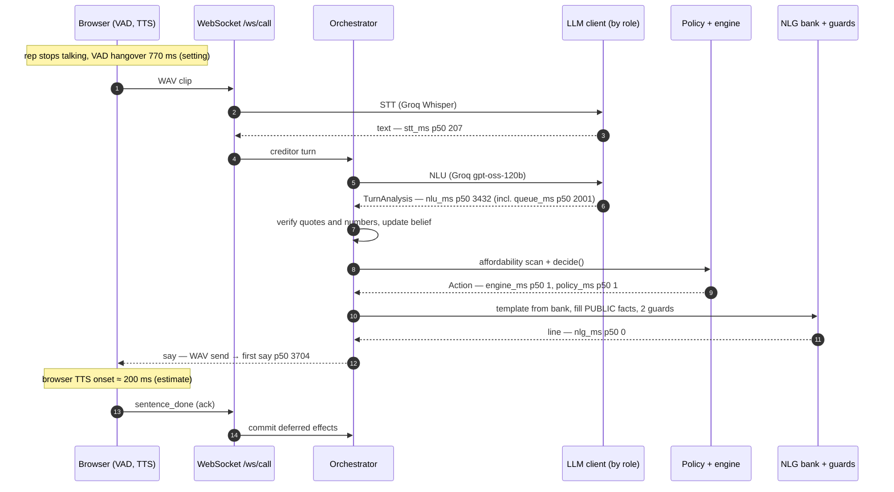

# Design decisions

Five short architecture decision records (ADRs) and one annotated voice turn.
Each ADR is context, decision, consequences. Numbers link to the committed
evidence in [`docs/eval/`](eval/); nothing here is measured anywhere else.

## ADR 1. Code owns the policy; no ReAct agent in the product

**Context.** A tool-calling (ReAct) agent is the obvious way to build this: give
an LLM `counter`, `confirm`, `escalate` tools and let it reason. But every move
here moves money, and the model would need the client's private ceiling to
choose a counter.

**Decision.** `decide()` in `app/agent/policy.py` is plain Python: belief state,
verified NLU and the affordability curve in, one `Action` out. The LLM only
reads (NLU) and phrases (NLG). The ReAct and LLM-only agents exist, but only as
eval arms in `eval/agents/` (Phase 24a); nothing in `app/` imports them.

**Consequences.** Policy is unit-testable without a model, and the offline eval
gates it on every push ([policy eval](eval/policy_eval_20261006/summary.md):
valid agreements 1.0, n=23). The eval arms must be given private figures to
work at all, which is the risk this decision avoids. The cost is rigidity: a
new move needs code and tests, not a prompt edit.

**A/B result.** The decision was tested against the alternatives on the same 48
seeds, with live NLU and live creditor phrasing
([summary](eval/ab_20261007/summary.md), [decision](eval/ab_20261007/decision.md)).
The adoption rule was written down before the run and was not moved afterwards.
The policy with template NLG (A) stays the default. The policy with
conversational acts (B, H3) was judged more natural, winning 0.80 [0.61, 0.91]
of decisive pairs against A, but it fails the rule: it spoke 1 private figure,
from a policy accept of a figure the simulated creditor invented, and its
`agreement_valid` was 0.71 against A's 0.75. Both of those agreement failures
come from live-NLU extraction errors that every arm shares. The ReAct agent (C)
fails on safety (2 private and 8 unverified figures spoken in its own text),
escalation (0.22 against 1.00) and latency (10.2 s p50 against 2.0 s). The
LLM-only arm (D) was stopped at 13 of 48 scenarios and was behind A on every
check it reached. A human check of the judge is pending (20 pairs).

## ADR 2. The LLM writes placeholders, never digits

**Context.** LLMs paraphrase numbers: "about sixty", "$1.2k", a rounded total.
On a settlement call a wrong figure is a misquote the firm may be held to.

**Decision.** NLG writes a template such as "We can offer {offer_pct}, that is
{offer_total} over {num_payments} payments." `template_guard` rejects any digit,
`$`, `%`, number word or unknown placeholder. Code fills placeholders from
`Fact.render()`. `rendered_guard` then rejects any figure that is neither a
PUBLIC fact nor a number the creditor said, plus commitment phrasing. A blocked
line falls back to a fixed safe sentence.

**Consequences.** Every spoken number traces to an engine or creditor fact; the
policy eval reports 0 unverified figures spoken. Templates can be built offline
and reused: the demo's `NLG_MODE=bank` serves guard-checked templates with no
LLM call, which took NLG off the reply path ([latency](eval/latency_20261007.md):
`nlg_ms` p50 1440 → 0). The price is stiffer wording, and number words like
"first" must be avoided in copy.

## ADR 3. PUBLIC / PRIVATE facts and role-scoped streams

**Context.** The agent needs the client's balances, fees and maximum affordable
percentage to negotiate. None of it may reach the creditor, in speech or on the
wire.

**Decision.** Every `Fact` carries `visibility`. The NLG prompt receives PUBLIC
facts only. Private values form a blocklist that `rendered_guard` checks. On the
socket, `app/voice/views.py` filters every frame: `?view=rep` drops the
affordability curve, `max_bp`, fees, balances, rescue amounts and any audit row
not on an allow-list; `?view=operator` gets everything.

**Consequences.** Privacy is testable: whole calls run on the rep view and every
frame is scanned for every private value (`tests/unit/test_ws_views.py`). A new
audit event is operator-only until someone allow-lists it. The operator view is
public on the hosted demo by design, because all data is synthetic; the rep view
is the privacy-scoped stream. A real deployment would put the operator view
behind auth.

## ADR 4. Effects commit on the speech ack

**Context.** In voice, the agent may say "we can do forty percent" and be
interrupted before the creditor hears it. If state updated when the line was
generated, the agent would believe it had offered something nobody heard.

**Decision.** `Action.effects` are deferred. The browser acks each sentence
after it plays (`sentence_done`); only then does `apply_effects` commit agreed
terms, phases and drafts. On barge-in, effects of unheard sentences are dropped.
A small set of bookkeeping effects (`offer_counter`, `record_confirm`,
`set_phase`, …) applies on emit, so a fast "yes" during TTS wraps instead of
re-confirming.

**Consequences.** Belief and the audit log match what was actually said. Text
mode uses the same path and auto-acks. The ordering is subtle, so it is pinned
by orchestrator and WebSocket tests (barge-in during NLU, merged turns).

## ADR 5. Feasibility is non-monotonic, so scan the curve

**Context.** It is tempting to binary-search the highest affordable
percentage. But a lower offer can fail where a higher one passes, because each
payment must clear the creditor's minimum: a pattern like `0000111100001111`.

**Decision.** The adapter evaluates the whole grid, `1%…100%` in 100 steps,
and caches it (`affordability()`, `lru_cache` on scenario, rules and start
date). Policy reads `max_bp` and the feasible set; counters snap onto feasible
grid points.

**Consequences.** Correct by construction for any curve shape, at a cost of
a median 8.3 ms per uncached scan on the demo fixture and under 1 ms on a
cache hit (`docs/PROGRESS.md`, Environment facts). The policy eval's 0 stuck calls
and the invariant sweep (counters never above the private max) rely on it. The
grid is 1-point granular; finer offers would need a denser scan.

## One voice turn, annotated

Per-stage p50s are the Phase 21 AFTER voice run (n=20, `easy_deal`, demo
profile) in [`docs/eval/latency_20261007.md`](eval/latency_20261007.md). Stages
nest: `queue_ms` (rate-limit wait) sits inside NLU. The VAD hangover and TTS
onset are not measured by the probe; the end-to-end figure is an estimate until
a browser-measured voice run exists.

End of speech to first audio is therefore about 4.7 s p50 (estimate). The NLU
request alone is about 1.4 s p50; the rest of NLU's 3.4 s in this run was Groq
tokens-per-minute waiting. With the Phase 27 key pool, text-turn NLU fell to
1415 ms p50 / 2215 ms p95 with `queue_ms` 0
([key pool table](eval/latency_20261007.md#after-key-pool-phase-27-2026-10-07)).
