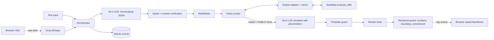

# Debt Settlement Agent: implementation plan (MVP first)

## 0. Review of the spec: what changes and why

The spec is strong on goals. Its architecture and metrics have gaps a senior reviewer would flag.

- **An LLM tool-calling agent with an after-the-fact number guard is the weak design.** The guard catches bad numbers only after generation, retries cost latency, and it can still miss paraphrases. **Replacement:** code-based policy plus the LLM used for understanding (NLU) and phrasing (NLG). The LLM writes text with placeholders like `{offer_total}`, and code fills in the numbers. A made-up figure is then structurally impossible. The guard stays as a second layer.
- **Leak prevention by construction.** The phrasing LLM never sees client-private data. Every figure is a typed `Fact` with `visibility=PUBLIC|PRIVATE`, and the policy hands only PUBLIC facts to the NLG prompt. The deterministic blocklist stays as a backstop. The per-sentence LLM "decider" moves off the hot path, which saves about 300 ms per sentence.
- **Negotiation leak in the spec.** The spec's fallback line, "the client can afford up to X%", reveals our walk-away price. The replacement is a concession ladder that climbs toward `max_affordable_pct` and never announces it.
- **The simulator has no walk-away price.** Without a hidden `opening_ask` and `floor`, there is nothing to negotiate. The creditor sim gets both, and its decisions are made in code (LLM creditors cave or drift unpredictably). The LLM only phrases the sim's lines in the persona's style.
- **`regret_pct` is defined backwards.** Agreeing at the client's maximum is the worst outcome, not the ideal. The replacement is `surplus_captured = (true_max - agreed) / (true_max - floor)` when a deal zone exists.
- **Asking about all 8 creditor rules is unrealistic on a call.** Ask about 4 core fields. Fill the rest with explicit ASSUMED defaults, then run a **schedule read-back** before wrap-up so the rep catches any violated rule.
- **LLM self-reported confidence is uncalibrated.** A term is marked TENTATIVE when (a) the extractor flags hedging, or (b) the value cannot be verified in the verbatim quote by a deterministic number parser.
- **9 SQLite tables is over-engineering.** Use one append-only `events` table, with UPDATE/DELETE blocked by triggers.
- **Measured facts:** a 100-point settlement scan takes 17–261 ms on the existing cases, so run it in `asyncio.to_thread` and cache it. Feasibility is **non-monotonic** (case 3: `0000111100001111...`), and low percentages fail on payment floors. Counters must be chosen from **feasible grid points only**.
- **Free-tier budget:** no single free provider covers a 30-scenario eval (about 1,100 calls and about 1.3M tokens). Use a **multi-provider pool** with per-role routing, failover, and a response cache (section 7a). Keep prompts short and make the eval resumable. The MVP eval uses 12 scenarios.

## 1. Architecture



In one turn, the rep's text goes to the NLU. The NLU output is verified and applied to the belief state. The policy picks an `Action`. The NLG writes a template, the guards check it, the facts are rendered, and the result is spoken. Action side effects (such as "counter was offered") are committed **only when the browser confirms the sentences were spoken**.

## 2. Repo and setup

- New repo: [Debt-Settlement-Agent](https://github.com/strike0702/Debt-Settlement-Agent). Use `uv venv --python 3.12` (the system Python is 3.14, which risks wheel gaps).
- `pyproject.toml` dependencies:
  - `fastapi`, `uvicorn[standard]`: server and WebSocket.
  - `pydantic>=2`, `pydantic-settings`: models and env config.
  - `openai`: OpenAI-compatible client, also used for Groq Whisper.
  - `pyyaml`: thresholds file.
  - dev: `pytest`, `pytest-asyncio`, `httpx`, `ruff`.
- Vendor `feasibility/` from [retape_ai_takehome/feasibility](/Users/shbagchi/projects/retape_ai_takehome/feasibility) as a **top-level package** (its imports are `feasibility.x`). Copy [tests/test_units.py](/Users/shbagchi/projects/retape_ai_takehome/tests/test_units.py) and [tests/test_rescue.py](/Users/shbagchi/projects/retape_ai_takehome/tests/test_rescue.py) into `tests/engine/`. Drop or re-point any test that loads `cases/` so it uses our own `fixtures/`. Do **not** copy `ASSIGNMENT.md` or `cases/`.
- `.cursor/rules/debt-settlement-agent.mdc`: spec section 2 ground rules, plus: "the LLM never produces digits; numbers only come from `Fact.render()`", and "`sim/` must not import `app.agent`".

Layout:

```
Debt-Settlement-Agent/
  feasibility/                  # vendored, read-only
  app/
    config.py                   # Settings (pydantic-settings)
    llm/client.py               # the only place that calls the LLM or STT
    llm/prompts.py
    domain/money.py             # cents/bp/date render + parse helpers
    domain/fields.py            # FieldSpec registry
    domain/facts.py             # Fact, FactSet
    domain/belief.py            # TermStatus, TermBelief, BeliefState
    domain/scenario.py          # CallScenario loader (client, offer, firm)
    adapter/engine_adapter.py   # build_rules, evaluate, max_affordable
    adapter/validator.py        # independent schedule checker
    agent/numbers.py            # token extraction and words-to-digits
    agent/nlu.py
    agent/policy.py
    agent/nlg.py                # intents, templates, LLM phrasing
    agent/guards.py
    agent/session.py            # CallSession state
    agent/orchestrator.py
    voice/stt.py, voice/ws.py
    store/audit.py
    main.py, cli.py
    static/index.html, static/app.js
  sim/creditor.py, sim/personas.py, sim/scenarios.py
  eval/run_eval.py, eval/metrics.py, eval/thresholds.yaml, eval/results/
  tests/engine, tests/unit, tests/e2e
  fixtures/demo/{client,offer,firm}.json, fixtures/demo/rep_card.md
```

## 3. Config (`app/config.py`)

`Settings(BaseSettings)` fields and defaults:

- LLM and STT:
  - Providers and models live in `config/providers.yaml` (section 7a). Env holds only the keys: `GROQ_API_KEY`, `MISTRAL_API_KEY`, `GEMINI_API_KEY`, `OPENROUTER_API_KEY`, `CEREBRAS_API_KEY`. A provider whose key is unset is skipped.
  - `LLM_PROFILE="demo"` (or `eval`, `local`, `offline`) selects the routing table.
  - `LLM_CACHE=true`, `LLM_CACHE_PATH="llm_cache.db"`
  - `NLG_MODE="llm"` (or `template`), `NLU_MODE="llm"` (or `oracle`, used only by tests)
- Storage: `DB_PATH="debt_settlement_agent.db"`
- Policy knobs: `HOSTILITY_THRESHOLD=0.8`, `MAX_TURNS=24`, `ANCHOR_RATIO=0.7`, `CONCESSION_FACTOR=0.5`, `MAX_COUNTERS=4`
- Opening: `FIRM_NAME="Synthetic Debt Relief"`, `OPENING_DISCLOSURE` text

## 4. Domain

### 4.1 Units (`domain/money.py`)
- Money is `int` cents. Settlement percentages are `int` basis points (4500 = 45%). Convert to the engine with `Decimal(bp) / Decimal(10000)`; this is already verified to work with `round_half_up`.
- `render_money(cents)`: `"$2,500"` if whole dollars, else `"$2,500.50"`.
- `render_pct(bp)`: `"45%"` or `"45.5%"`.
- `render_date(d, ref)`: `"January 31"`, with `", 2027"` added when the year differs from `ref.year`.
- `render_count(n)`: `"6"`.
- Also provide the inverse parsers used by the guards.

### 4.2 Fields (`domain/fields.py`)
`FieldSpec(name, kind, ask_text, readback_text, required: bool, default_factory | None, prior_range)`.

Creditor-rule fields in the belief state:
- `max_payments`: int, 1..60. Sets both engine `max_payments` and `max_terms` (the assignment notes they are redundant). Required.
- `min_payment_cents`: int, 1000..100000. Required.
- `payment_structure`: enum `even|balloon|flexible`, mapped to `even_pays` / `is_ballooning_allowed`. Required.
- `first_payment_date`: date. Default is `default_first_payment_date(client)`, status ASSUMED.
- `max_segments`: int, default 2, ASSUMED.
- `max_token_pays`: int, default `max_payments` (no limit), ASSUMED.
- `min_payment_tiers`: list of `(from_payment, min_cents)`, default `[]`, ASSUMED.

Firm-known values (`program_fee_pct`, `bank_fee_cents`) come from `firm.json` and are never asked. The settlement ask is **not** a belief field; it lives in `NegotiationState` (changes there are normal bargaining, not contradictions).

### 4.3 Facts (`domain/facts.py`)

```python
class Fact(BaseModel):
    id: str                      # placeholder name, e.g. "offer_total"
    kind: Literal["money", "pct", "count", "date"]
    value: int | date
    visibility: Literal["PUBLIC", "PRIVATE"]
    source: Literal["engine", "creditor", "config"]
    def render(self, ref: date) -> str: ...
```

- **PRIVATE:** `draft_amount`, `sda_balance`, every ledger amount, every schedule `balance_cents`, `program_fee` total and installments, rescue lump and increment amounts, `max_affordable_bp`.
- **PUBLIC:** creditor-stated values, the offer total, payment amounts, payment count, payment dates, and our counter percentage once the policy chooses to say it.

### 4.4 Belief state (`domain/belief.py`)
- `TermStatus`: `UNKNOWN`, `TENTATIVE`, `KNOWN`, `CONTRADICTED`, `ASSUMED`.
- `TermBelief`: `field`, `value`, `status`, `evidence: list[Evidence(turn, quote)]`, `history: list`.
- `observe(field, value, quote, turn, verified: bool, hedged: bool) -> BeliefChange`:
  - `strong = verified and not hedged`
  - Status `UNKNOWN` or `ASSUMED`: set the value; status becomes `KNOWN` if strong, else `TENTATIVE`.
  - Same value as now: if `TENTATIVE` and strong, promote to `KNOWN`. Otherwise just append the evidence.
  - `TENTATIVE` with a different value: replace it (a self-correction).
  - `KNOWN` with a different value: push the old value to history and set `CONTRADICTED`.
  - `CONTRADICTED` with any value (the rep is answering our clarifying question): set the value, `KNOWN` if strong, else `TENTATIVE`.
- `confirm_readback(field, yes)`: on a `TENTATIVE` term, yes promotes it to `KNOWN`; no resets it to `UNKNOWN` with no value.
- `usable_for_engine(field)` is true only for `KNOWN` or `ASSUMED`.
- Every change returns a `BeliefChange`, which the orchestrator writes to the audit log.

## 5. Engine adapter and validator

`adapter/engine_adapter.py`:
- `build_rules(belief, firm) -> CreditorRules`. Raises `NeedsInfo(fields)` if any required field is not usable.
- `evaluate(scenario, rules, bp, first_payment_date) -> EvalSummary`. Builds `Offer` with Decimal bp, calls `evaluate_offer`, and returns:
  - `feasible`, `shape`, `rows`, `additional_funds`, `assumed_fields`
  - `facts: FactSet` with visibility already assigned: count, first date, the distinct payment levels, the total, and the last payment are PUBLIC; balances and fees are PRIVATE
- `affordability(scenario, rules, fpd) -> Affordability(max_bp: int | None, feasible_bps: list[int], curve)`:
  - Scan `range(100, 10001, 100)` with no monotonicity assumption.
  - Wrap it in an `lru_cache` keyed by `(rules_tuple, fpd, scenario_id)`.
  - Call it with `asyncio.to_thread`.
- `adapter/validator.py` is **independent of engine internals**. `validate(schedule_rows, client, offer_total, program_fee, rules, first_payment_date) -> list[Violation]` checks all 10 binding rules:
  - consecutive cadence dates, exact sum, non-decreasing, floors (its own floor computation), token count
  - even means an exact even vector
  - balloon exemption: balloon allowed, k >= 2, and the last payment is larger than the previous one; otherwise at most `max_segments` distinct levels
  - bank fee only on payment dates, no fee before the first payment, fee total equals F, everything on or before the horizon
  - its own day-by-day ledger replay with credits before debits and balance >= 0
  - the `balance_cents` in each row matches the replay

  The validator is reused in three places: an assertion before any schedule is spoken, the eval's `agreement_valid` check under the true rules, and the later engine-oracle tests.

## 6. Agent

### 6.1 NLU (`agent/nlu.py`)
One JSON-mode call per rep turn replaces the spec's separate per-turn decider.

```python
class ExtractedTerm(BaseModel):
    field: Literal["max_payments", "min_payment_cents", "payment_structure", "first_payment_date",
                   "max_segments", "max_token_pays", "min_payment_tier"]
    value: int | str | dict
    quote: str                   # verbatim span from the utterance
    hedged: bool

class TurnAnalysis(BaseModel):
    terms: list[ExtractedTerm] = []
    settlement_ask_pct: float | None = None
    ask_quote: str | None = None
    stance: Literal["offer", "counter", "accept", "reject", "stall", "info", "question", "other"]
    readback_response: Literal["confirm", "deny"] | None = None
    asks_client_private_info: bool = False
    demands_commitment: bool = False
    hostility: float = 0.0
    wants_to_end: bool = False
```

- **Prompt:** field definitions with units ("dollars converted to integer cents: $250 is 25000"), the agent's last spoken line (for context), and the rep's utterance.
- **Validation:** check with Pydantic. On failure, retry once with the error message. If it fails again, return an empty `TurnAnalysis(stance="other")`.
- **Post-verification (deterministic):**
  - `quote` must be a normalized substring of the utterance (lowercase, collapsed whitespace, punctuation stripped). If not, drop the term and log `nlu_rejected_quote`.
  - Numeric values must match a number parsed from the quote by `numbers.parse_numbers`, which includes words-to-digits ("two hundred fifty", "twenty-five hundred"). A mismatch gives `verified=False`, so the term becomes TENTATIVE and gets a read-back.
  - Out-of-prior-range values are rejected and logged.
- `NLU_MODE=oracle` is for tests only: it accepts a `TurnAnalysis` passed alongside the text by the sim.

### 6.2 Policy (`agent/policy.py`): pure, synchronous, fully unit-tested

The states are `OPENING`, `DISCOVERY`, `NEGOTIATE`, `CONFIRM`, `WRAP`, `ESCALATE`, `END`. `decide(session, analysis, afford) -> Action`, with rules checked in this order:

1. Turn number > `MAX_TURNS` gives `NO_DEAL_WRAP`.
2. `hostility >= HOSTILITY_THRESHOLD` gives `ESCALATE(hostile)`.
3. `asks_client_private_info`: `REFUSE_PRIVATE` the first time, `ESCALATE(sensitive_request)` on a repeat.
4. `demands_commitment`: `REFUSE_COMMIT` ("we can propose this to the client") the first time, `ESCALATE(commitment_demand)` on a repeat.
5. Any `CONTRADICTED` field gives `CLARIFY(field, old, new)`. Both values came from the rep, so they are PUBLIC.
6. Any `TENTATIVE` field gives `READ_BACK(field)` and sets `pending_readback`.
7. A missing required field (in registry order) gives `ASK(field)`.
8. Settlement ask still unknown gives `ASK_SETTLEMENT`.
9. Compute `afford`:
   - `max_bp is None` (nothing feasible): check rescue at the ask. If lump or increment is `within_guardrail`, `ESCALATE(out_of_guardrail, "needs client approval for extra funds")`. Otherwise `NO_DEAL_WRAP`. The rescue amount is never spoken.
   - `ask <= max_bp` and ask is in `feasible_bps`, or the rep accepted our last counter: `CONFIRM_SCHEDULE(bp)`. Say count, first date, payment amounts (for even: "{num_payments} payments of {payment}"; otherwise "starting at {first_payment} and rising to {last_payment}"), and the total.
   - Otherwise `COUNTER(next_counter())`.
10. In `CONFIRM`: rep confirms gives `PROPOSE_WRAP` plus a draft agreement. Rep denies with new terms goes back through rules 5–9.

`next_counter()`:
- `target = min(ask_bp, max_bp)`
- `anchor = largest feasible bp <= ANCHOR_RATIO * target`; if none, the smallest feasible bp
- `c_next = c_prev + ceil((target - c_prev) * CONCESSION_FACTOR)`, snapped **down** to a feasible bp and never below `c_prev`
- Never counter at or above the rep's ask. After `MAX_COUNTERS` rejections at `max_bp`, `NO_DEAL_WRAP`.
- The counter is recorded as "offered" only on the speech ack.

`Action(intent, facts: dict[str, Fact], required: set[str], effects: list[Effect], next_phase)`. `draft_agreement` builds `Agreement(creditor, bp, offer_total, rows, assumed_fields, status="pending_client_approval")` and writes it to the audit log. It never makes a commitment.

### 6.3 NLG (`agent/nlg.py`)
- Each intent has a **deterministic template** (used as the fallback and by `NLG_MODE=template`). Example: `COUNTER: "We can propose {counter_pct} of the balance, which is {offer_total}. Would that work?"`.
- **LLM mode:**
  - System prompt: polite, spoken style, 1–2 sentences under 25 words; never write digits, number words, `$`, or `%`; numbers only via the listed placeholders; never say agree, commit, or deal.
  - User prompt: the rep's last line, the intent instruction, and the placeholder list with meanings (not values).
  - Temperature 0.3, `max_tokens=80`. No streaming in the MVP: the output is short and whole-template validation is simpler.
- **Pipeline:** LLM template, then `template_guard`. On failure, retry once, then fall back to the deterministic template. Then `render()`, then `rendered_guard`. If that fails, use `SAFE_FALLBACK` ("Let me check that figure and come back to it.") and log `blocked`.

### 6.4 Guards (`agent/guards.py`, `agent/numbers.py`)
- **`template_guard(text, allowed_ids, required_ids)`:**
  - No `\d`, `$`, or `%`.
  - No number words from `NUMBER_WORDS`: zero..twenty, thirty..ninety, hundred, thousand, million, first..twelfth, half, quarter, dozen, couple. "one" is allowed only in the phrases `no one`, `one moment`, `one more`, `one second`.
  - Placeholders (`\{([a-z_]+)\}`) must be a subset of the allowed ids and a superset of the required ids.
- **`rendered_guard(text, public_facts, creditor_numbers, private_blocklist)`:**
  1. Extract tokens in this order, masking spans once matched: money `\$\s?\d{1,3}(?:,\d{3})*(?:\.\d{2})?|\$\s?\d+(?:\.\d{2})?`; percentages `\d+(?:\.\d+)?\s?(?:%|percent)`; dates (month name + day + optional ordinal and year, ISO, `m/d(/y)`); ordinals `\d+(?:st|nd|rd|th)`; bare numbers; number words.
  2. Normalize each token to `(kind, value)`. It must match a PUBLIC fact or a number the rep said this call, else `unverified_number`.
  3. Any token equal to a PRIVATE blocklist value in any rendering gives `boundary`. The exception is when it also equals a PUBLIC fact chosen for this action; that is logged as `collision_allowed`.
  4. Commitment regex, e.g. `\b(we|i|my client|the client)\s+(agree|accept|commit|guarantee|promise)`, `\bit'?s a deal\b`, `\bagreed\b`, `\bwe have an agreement\b`, gives `commitment`.
- Every block is written as an audit event `blocked` with the reason. `guard_blocks` is a health metric; `unverified_figures_spoken` counts sentences that were actually emitted and still fail an independent re-scan (target 0).

### 6.5 Session and orchestrator
- `CallSession`: call_id, scenario, belief, `NegotiationState` (ask_bp, ask history, counters offered, rejects, private_ask_count, commit_demand_count), phase, `history: list[Turn(role, text, spoken: bool)]`, `pending: Action | None`, `turn_idx`.
- `async start() -> Utterance` produces the `OPENING` intent (firm, client reference id, authorization, disclosure).
- `async on_creditor_text(text, timings) -> Utterance`:
  1. Run NLU.
  2. Verify.
  3. Apply to the belief state and the readback / ask state.
  4. Compute affordability (in a thread, cached) when the rules are buildable.
  5. `policy.decide`.
  6. NLG and guards.
  7. Return the sentences with ids; `pending = action`.
  8. Audit every step.
- `on_sentence_done(ids)`: when all sentences of `pending` are acked, apply its effects and mark the history spoken.
- `on_barge_in(spoken_ids)`: mark unspoken sentences `spoken=False`, **drop** the pending effects, keep belief changes. The next turn naturally re-asks.
- Concurrency: one `asyncio.Lock` per session. If new rep text arrives while NLU is in flight, cancel the task and rerun on the concatenated text. If it arrives after NLU, queue it.
- Text mode (CLI and eval) auto-acks every sentence.

## 7. LLM client (`app/llm/client.py`)
- Callers ask for a **role**, never a model: `async chat_json(role, messages, schema: type[BaseModel])`, `async chat_text(role, messages, max_tokens)`, `async transcribe(wav_bytes, prompt)`. Roles are `nlu`, `nlg`, `sim`, `stt`.
- One `AsyncOpenAI(base_url, api_key, max_retries=0)` per provider. Every provider in the pool is OpenAI-compatible, so no other SDK is needed.
- **Per-provider limiter:** an async token bucket built from the `rpm` value in `providers.yaml`, plus an optional `min_interval_s` (Mistral's free plan allows 1 request per second).
- **Routing with failover:** each role has an ordered list of `provider/model` pairs. Try them in order:
  - 429 with `retry-after <= 20s`: wait, then retry the same target.
  - 429 with a longer `retry-after`, or daily-quota exhaustion: mark the target `exhausted_until` (next reset time) and move to the next target.
  - 5xx: exponential backoff 1, 2, 4 s with jitter, then move to the next target.
  - **Gemini quirk:** its OpenAI-compatible endpoint reports quota errors as `400 INVALID_ARGUMENT`. Treat a 400 from the `gemini` provider whose body contains `RESOURCE_EXHAUSTED` or `quota` as a 429.
  - All targets exhausted: raise `LLMUnavailable`. The orchestrator falls back to template NLG and `SAFE_FALLBACK`, and the eval stops the scenario and records it as `skipped_quota` (resume picks it up later).
- **JSON mode:** send `response_format={"type": "json_object"}` only to targets with `json_mode: true`. For the others, instruct "reply with JSON only" and strip code fences before Pydantic validation.
- **Response cache** (`LLM_CACHE`): a SQLite table keyed by `sha256(provider, model, messages, temperature, max_tokens)`. Used only when `temperature == 0` (NLU at temperature 0; sim and NLG are cached in eval runs by forcing temperature 0 when `LLM_PROFILE=eval`). Reruns of the same eval seed cost zero quota.
- Every call records `{role, provider, model, latency_ms, prompt_tokens, completion_tokens, cache_hit, failover_from}` through the `on_call` hook. Every eval `run.json` reports the **share of calls served by each model**, so a failover mid-run is visible, not silent.
- `FakeLLM` for tests: a queue of scripted responses per role.
- Whisper call: `language="en"`, `temperature=0`, `prompt="settlement, minimum payment, balloon, monthly payments, percent"`.

## 7a. Free-tier provider pool (`config/providers.yaml`)

Limits as published or measured around September 2026. They change often, so the client reads them from YAML, and the README tells you to check each console before a run.

- **Groq** (`https://api.groq.com/openai/v1`). No card needed. The fastest option, so it is the **demo** default. Current documented free limits: `openai/gpt-oss-120b` and `gpt-oss-20b` at 30 RPM, 1K RPD, 8K TPM, 200K TPD. Whisper turbo at 20 RPM, 2K RPD, 28,800 audio seconds per day, with each request billed as at least 10 s (so about 2,880 utterances a day). Check in the console whether the Llama models are still listed.
- **Mistral** (`https://api.mistral.ai/v1`), Experiment plan. No card; needs phone verification. 1 request per second per key, and a large token-per-month allowance. The best **bulk** option for eval NLU (`mistral-small-latest`). Caveat: Experiment-plan data may be used for training. That is fine because all data is synthetic.
- **Google Gemini** (`https://generativelanguage.googleapis.com/v1beta/openai/`). No card. Only the Flash-Lite models are usable: `gemini-3.1-flash-lite` at about 15–30 RPM and 500–1,500 RPD. Full Flash is about 20 RPD, which is useless here. Needs a restricted API key (enforced since June 2026). Good for sim phrasing and NLG in eval.
- **OpenRouter** (`https://openrouter.ai/api/v1`), pinned `:free` models such as `openai/gpt-oss-120b:free`. Only **50 RPD** on a fresh account, and **1,000 RPD after a one-time $10 credit purchase**. Do not use the `openrouter/free` auto-router: it picks a random model per call, which breaks reproducibility. Last-resort fallback.
- **Cerebras** (`https://api.cerebras.ai/v1`). Not a standing free tier: $5 of credits that expire after 30 days, card required, 5 RPM and 1M TPD. Useful only as a one-week burst for the final 30-scenario eval.
- **Ollama (local)** (`http://localhost:11434/v1`, `api_key: "ollama"`), on a 16 GB M5 MacBook Air. No quota, and the fastest way to run an eval with no network spend. Too slow for live NLU (about 100 JSON tokens at about 12–20 tokens/s is 5–10 s), so it is used for **eval only**, never in the `demo` profile.
  - Models: `qwen3.5:9b` (Q4, about 6 GB) for NLU; `gemma4:e4b` for NLG and sim phrasing. Keep total model memory at or below about 8 GB. Do not use `gpt-oss-20b` (swaps).
  - Disable thinking mode for these calls, and verify how the OpenAI-compatible endpoint accepts that flag on the installed Ollama version. Send `response_format` json_object for NLU.
  - Set `OLLAMA_KEEP_ALIVE=30m` so the model stays loaded between calls. Leave `OLLAMA_NUM_PARALLEL` at 1, because the eval is sequential.
  - Before routing to it, the client health-checks `GET /api/tags`. If Ollama is down or the model has not been pulled, skip it like a provider without a key.
  - The fanless Air throttles on long runs, so report latency from local runs separately and never mix it into the latency table.
- **Skipped:** GitHub Models (8K input-token cap per request and 50–150 RPD), Cloudflare Workers AI (10K neurons a day, too small), NVIDIA NIM (credit-based, credits expire).
- **STT:** Groq Whisper only (the quota is ample). Deepgram's $200 one-time credit is the later option if streaming STT is added.

Routing profiles:

```yaml
profiles:
  demo:      # latency first; everything on Groq
    nlu: [groq/openai/gpt-oss-120b, mistral/mistral-small-latest]
    nlg: [groq/openai/gpt-oss-20b, gemini/gemini-3.1-flash-lite]
    stt: [groq/whisper-large-v3-turbo]
  eval:      # quota first; spread load, keep Groq for fallback
    nlu: [mistral/mistral-small-latest, groq/openai/gpt-oss-120b, openrouter/openai/gpt-oss-120b:free]
    nlg: [gemini/gemini-3.1-flash-lite, groq/openai/gpt-oss-20b]
    sim: [gemini/gemini-3.1-flash-lite, mistral/mistral-small-latest, groq/openai/gpt-oss-20b]
  local:     # unlimited eval on the laptop; cloud only as fallback
    nlu: [ollama/qwen3.5:9b, mistral/mistral-small-latest]
    nlg: [ollama/gemma4:e4b, gemini/gemini-3.1-flash-lite]
    sim: [ollama/gemma4:e4b, gemini/gemini-3.1-flash-lite]
  offline:   # CI; no network
    all: [fake]
providers:
  groq:       {base_url: ..., key_env: GROQ_API_KEY, rpm: 25, json_mode: true}
  mistral:    {base_url: ..., key_env: MISTRAL_API_KEY, rpm: 50, min_interval_s: 1.1, json_mode: true}
  gemini:     {base_url: ..., key_env: GEMINI_API_KEY, rpm: 12, json_mode: true, quota_as_400: true}
  openrouter: {base_url: ..., key_env: OPENROUTER_API_KEY, rpm: 18, json_mode: false}
  cerebras:   {base_url: ..., key_env: CEREBRAS_API_KEY, rpm: 4, json_mode: true}
  ollama:     {base_url: "http://localhost:11434/v1", api_key: "ollama", rpm: 0, json_mode: true, local: true, health: "/api/tags"}   # rpm 0 = no limiter
```

Budget check for the 12-scenario MVP eval: about 12 turns times 3 roles is about 430 calls, split roughly 145 NLU on Mistral and about 290 NLG and sim calls on Gemini Flash-Lite. That fits in one day on free tiers, with Groq untouched for the demo. Also add `run_eval --nlg template --sim-phrasing template`: a nearly free run in which only the NLU calls hit an LLM.

## 8. Voice (MVP)
- **Browser (`static/app.js`):**
  - `getUserMedia({audio: {echoCancellation: true, noiseSuppression: true}})`.
  - VAD: `@ricky0123/vad-web` (Silero) from a CDN. On `onSpeechEnd(Float32Array 16k)`, encode a 16-bit WAV in JS (44-byte header) and send it as binary.
  - `onSpeechStart` while TTS is playing: `speechSynthesis.cancel()` and send `barge_in` with the acked ids.
  - A barge-in on/off toggle, and a note in the README to use headphones (browser TTS is not in the echo-cancellation reference).
- **WS `/ws/call/{call_id}`:**
  - Client to server: `start{scenario}`, binary wav, `text`, `sentence_done{id}`, `barge_in{spoken_ids}`, `timing{turn, vad_end_to_first_audio_ms}`.
  - Server to client: `transcript`, `say{id, text}`, `belief`, `eval`, `blocked`, `escalate`, `latency{turn, stt_ms, nlu_ms, policy_ms, nlg_ms, server_total_ms}`, `audit`.
- **UI:** synthetic-data banner; controls (start, mic, barge-in toggle, text input); transcript (blocked sentences struck through); terms table with status chips and quote tooltips; engine verdict (feasible, shape, schedule, `max_affordable` with a PRIVATE badge, since this is the operator view); per-turn latency numbers; audit tail.
- `GET /metrics/summary` returns p50/p95 per stage, computed from `timing` events.
- `fixtures/demo/rep_card.md` gives the human playing the rep their hidden rules, opening ask, and floor.

## 9. Audit (`store/audit.py`)
- One table `events(id INTEGER PK, ts TEXT, call_id TEXT, actor TEXT, type TEXT, payload JSON)`.
- WAL mode.
- Triggers `BEFORE UPDATE` and `BEFORE DELETE` do `SELECT RAISE(ABORT, 'append-only')`.
- `AuditLog.append(...)` and `AuditLog.for_call(call_id)`.

## 10. Simulator and eval (MVP)
- `sim/scenarios.py`: `generate(n, seed) -> list[Scenario]`.
  - Random ranges: draft $150–600/mo, horizon 6–18 months, SDA balance $0–2,000, optional fixed ledger debits, creditor balance $1,000–8,000, original = 1.1–1.3 times that, fee 15–25%, bank fee $5–15.
  - Hidden rules sampled from the priors; hidden `opening_ask_bp` 55–85% and `floor_bp` 30–60%, with opening > floor.
  - Persona.
  - Ground truth: `true_max_bp` from the adapter under the true rules, and `zopa = floor_bp <= true_max_bp` with the floor in `feasible_bps`.
  - Resample until the strata are balanced: deal zone exists; no deal zone but rescue within guardrail (`should_escalate=True`); no fix at all.
  - `should_escalate` is also true for `pressuring`.
  - Stored with dates in a fixed future window.
- `sim/creditor.py` has a code-based `CreditorPolicy` and an LLM phraser:
  - It receives the agent's `Action` (intent and PUBLIC facts only; it never sees private data) plus the text.
  - It reveals a rule when asked. `CONFIRM_SCHEDULE` is checked with `validator` under the true rules, and any violation is revealed ("our minimum is actually $300").
  - Concessions: move the ask down 5 points per counter until reaching the floor; accept any counter at or above the floor.
  - The phraser LLM (role `sim`) writes the line in the persona's style; `template` mode is for CI.
  - It also emits the ground-truth `TurnAnalysis` for `NLU_MODE=oracle`.
- MVP personas:
  - `flexible`
  - `contradictory`: changes `max_payments` or `min_payment` once after revealing it
  - `pressuring`: asks for the client's income on turn 3 and demands commitment on turn 5
  - Later: `firm`, `evasive`, `low_confidence_speech`
- `eval/run_eval.py --scenarios 12 --seed 7 [--resume RUN_ID] [--nlg llm|template]`:
  - Runs sequentially through the shared limiter.
  - Writes `eval/results/<run_id>/<scenario_id>.json` as each scenario finishes; resume skips existing files.
  - `run.json` holds models, seed, git sha, and settings.
- `eval/metrics.py` aggregates to `summary.json` and `summary.md`:
  - `agreement_valid` (validator under the true rules)
  - `deal_rate_given_zopa`, `no_deal_correct`, `escalation_correct`
  - `unverified_figures_spoken`, `sensitive_leaks` (independent re-scan of all spoken text against the private values), `guard_blocks`
  - `rule_extraction_accuracy`, `false_known_rate`, `readback_count`, `turns_to_proposal`, `surplus_captured`
  - latency p50/p95 per stage
- `eval/thresholds.yaml`: `unverified_figures_spoken: 0`, `sensitive_leaks: 0`, `agreement_valid: 1.0`, `escalation_correct: ">=0.9"`. `run_eval` exits non-zero on failure.

## 11. Tests (MVP)
- `tests/engine`: the vendored engine tests, green.
- `tests/unit`:
  - money render/parse round-trips
  - `numbers` (currency formats, `%`/percent, dates, ordinals, words-to-digits)
  - facts visibility
  - belief transitions (a table covering every row in 4.4)
  - `build_rules` NeedsInfo
  - `affordability` on a fixture with a non-monotonic curve
  - validator: each of the 10 rules has a failing case, and engine output passes on the fixtures
  - policy: table-driven, one test per rule in 6.2, plus the ladder never exceeds the ask and snaps to feasible points
  - NLG fallback on a bad template
  - audit triggers reject UPDATE/DELETE
- `tests/unit/test_guard_regression.py` + `guard_adversarial.jsonl`, written **before** the guards. It must block:
  - spelled-out numbers ("twenty-five hundred")
  - hidden figures ("about 2.5k")
  - private values in every format
  - commitment phrasings
  - `$` or `%` in templates

  It must pass clean rendered facts.
- `tests/e2e/test_text_call.py`: `FakeLLM` + `NLU_MODE=oracle` + template NLG + template sim, running full calls for the 3 personas with no network. Asserts the final state, the agreement is valid, zero leaks, and escalation for `pressuring`.

## 12. Build order and acceptance checks
1. **Scaffold:** repo, uv, vendored engine, engine tests green, ruff clean.
2. **Deterministic core:** money, numbers, facts, fields, belief, adapter, validator, policy, guards, templates, audit, all with unit tests. *Acceptance:* `pytest tests/unit tests/engine` green with no network.
3. **Text agent:** LLM client, NLU, NLG, orchestrator, `python -m app.cli fixtures/demo` (you type as the rep). *Acceptance:* a full typed call reaches `PROPOSE_WRAP` on the demo fixture; blocks and belief changes are visible in the audit log.
4. **Simulator + e2e:** scenarios, creditor policy and phraser, oracle-mode e2e test. *Acceptance:* the e2e tests pass offline.
5. **Eval:** `run_eval` with resume and metrics; run 12 scenarios with `LLM_PROFILE=eval`. *Acceptance:* thresholds pass, `summary.md` is generated, and `run.json` shows the share of calls served by each model.
6. **Voice + UI:** FastAPI, WS, STT, VAD, TTS, barge-in, panels, `/metrics/summary`. *Acceptance:* a spoken call end to end; barge-in stops speech and drops the unspoken counter; latency is shown per turn.
7. **README:** architecture diagram, eval table with models and seed, latency table, limitations (the engine's structured candidate set, oracle NLU in CI, sim phrasing only as good as the LLM, browser TTS echo), synthetic-data and unaffiliated notes.

## 13. Later phases (not in MVP)
- Personas `firm`, `evasive`, `low_confidence_speech`; eval at 30+ scenarios.
- Engine oracle: brute-force enumeration of all legal vectors on tiny instances plus Hypothesis. The feasibility-existence oracle puts the entire fee on the last cadence date. Assert the engine never says infeasible when the oracle finds a feasible schedule. Given the README's limitation ("structured, not exhaustive"), document discrepancies as findings.
- Sensitivity pruning: evaluate the current proposal at prior extremes for each ASSUMED or unasked field, and skip questions that cannot change the outcome.
- Streaming NLG with per-sentence template validation.
- An LLM judge for paraphrased leaks, run as an eval-time metric (not in the hot path); a `Decider` interface; Jev and the decider bench if access is confirmed.
- Latency waterfall chart, GitHub Actions CI running the offline tests and threshold checks, paid TTS behind a `Speaker` interface.
