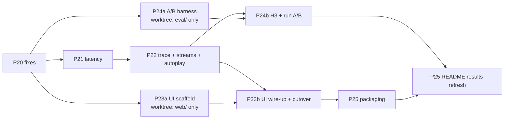

# Review and plan: portfolio pass (phases 20–25)

Review date 2026-10-06/07, HEAD `7a45733`. This document continues `docs/ROADMAP.md` (phases 12–19). ROADMAP phases 16, 17, and 18 were never built. They are folded in here: 16 → P24a, 17 → P21, 18 task 1 → P20.

**How to use this file:** §5 has one ready-made prompt per phase. Open a **fresh session** for each phase and paste its prompt verbatim. §4 says which phases run in sequence and which can run in parallel in git worktrees.

---

## 0. How this review was done (firsthand)

- `uv run pytest -q -m "not slow"`: **500 passed, 1 skipped, 81 s**. `uv run ruff check .`: clean.
- Ran the app locally (demo profile, live Groq). Played a text call in Chrome and screenshotted the rep and operator views.
- Timed live free-tier calls. Each row is 3 calls unless noted.

| Call | Latency | Completion tokens |
|---|---|---|
| NLU, Groq `gpt-oss-120b`, default reasoning effort | 1413–2343 ms | 427–**763** (cap is 800) |
| NLU, Groq `gpt-oss-120b`, `reasoning_effort=low` | 689–1177 ms | 238–371 |
| NLU, Cerebras `gpt-oss-120b`, default / low | 467–678 / 458–613 ms | |
| NLG, Groq `gpt-oss-20b`, default / low (2 calls each) | 619–649 / 426–624 ms | 193 / 64 |
| STT, Groq `whisper-large-v3-turbo`, 4 s clip | 218–348 ms | |

- Live UI text turn, from the audit log: `nlu 2279 ms · policy 0.5 ms · nlg 905 ms · server_total 3207 ms`.
- Engine, cold, on 3 scenarios:
  - `affordability()` takes 6–24 ms.
  - The full `find_next_term_alt` search takes 18–42 ms.
  - The engine is never the bottleneck.
- `_TokenBucket(25)` (the Groq rpm in `providers.yaml`): three back-to-back acquires return at **0.00 s, 2.40 s, 4.80 s**.

---

## 1. Findings (fixes)

Severity: **High** means it hurts correctness, robustness, or the recruiter's first impression. **Med** means a real defect or false claim. **Low** means polish or hygiene. The "Phase" column says which phase fixes it.

| # | Issue | Location | Severity | Phase |
|---|---|---|---|---|
| F1 | The token bucket has capacity 1 per provider (`max(1, rpm/60)`), so Groq calls are forced **2.4 s apart**. A voice turn runs STT → NLU → NLG, all on Groq, which puts about 2.1 s + 0–1 s of artificial waiting into every turn. Groq's limits are per model; the bucket is per provider. | `app/llm/client.py:123-125`, `:414` | **High** | P21 |
| F2 | No request timeout. `AsyncOpenAI(...)` uses the SDK default of 600 s with `max_retries=0`. A hung provider stalls the turn for up to 10 minutes, and failover never fires. | `app/llm/client.py:406-413`, `:725-818` | **High** | P20 |
| F3 | `demo.gif` is **29 MB** and was recorded 2026-10-02. That is before the counter ladder, tiers, scenario brief, and the Mock removal. It loads slowly on GitHub and shows an old UI. | `docs/assets/demo.gif`, `README.md:13` | **High** | P25 |
| F4 | README says "Cancel-and-merge if you talk while NLU is still running". The WS loop awaits each event in turn, so no second message is read while a turn runs, and barge-in during NLU is impossible live. The orchestrator docstring admits these paths are tests-only. | `README.md:98`; `app/voice/ws.py:306-343`; `app/agent/orchestrator.py:450-454` | Med | P20 (wording), P21 (fix) |
| F5 | LLM calls are not audited. This breaks a CLAUDE.md ground rule ("every … LLM call is appended to the audit log"). `on_call` is never wired to `AuditLog`. | `app/main.py` lifespan; `app/llm/client.py:470-474` | Med | P20 |
| F6 | `_NLU_MAX_TOKENS = 800`, but a default-effort NLU used 763 tokens. One more step of reasoning truncates the JSON, which triggers a retry (2× latency) or an empty analysis. | `app/agent/nlu.py:31` | Med | P20 |
| F7 | The rep socket receives PRIVATE data and the UI only hides it. `eval` events carry `max_bp`, fees, balances, and rescue amounts, and the audit tail streams everything. README:20 ("The representative never sees this panel") is true on screen, not on the wire. | `app/voice/ws.py:117-138`, `:154-179` | Med | P22 |
| F8 | The eval saturates. Every policy rate is 1.0 under oracle NLU with the same-author template sim, so it cannot tell agent variants apart. | `docs/eval/policy_eval_20261006/summary.md` | Med | P24 |
| F9 | The hosted demo is a Render free instance with about 32 s cold start, and a live call needs keys and quota. The first click often stalls. | `render.yaml`, `README.md:11` | Med | P22 (autoplay), P25 (keep-warm) |
| F10 | The UI prints a raw `[]` for empty payment tiers, and `JSON.stringify` for non-empty ones. | `app/static/app.js:534` | Low | P20 |
| F11 | `money()` uses `toLocaleString(undefined, …)`, so panels show "US$612.50" while speech says "$612.50". | `app/static/app.js:187-193` | Low | P20 |
| F12 | The rep view shows internals: "Intent COUNTER", "Last agent intent: COUNTER", and KNOWN/ASSUMED chips. | `app/static/app.js` `renderHero` (~430), `renderTerms` | Low | P20 |
| F13 | The opening template says "Good morning, thank you for calling {firm}" at any hour, as if the agent were receiving the call. | `app/agent/nlg.py:42` | Low | P20 |
| F14 | `vad_end_to_first_audio_ms` is stamped when the utterance is queued, not on `onstart`. It also excludes the about 1.5 s VAD hangover (`redemptionFrames: 16` × 96 ms). | `app/static/app.js:1076-1084`, `:1434` | Low | P21 |
| F15 | `policy_ms` excludes `_engine_context`, so engine time is not counted in any stage. The limiter wait is also invisible. | `app/agent/orchestrator.py:682-696` | Low | P21 |
| F16 | Dead or duplicate code: <ul><li>`keep_kinds` duplicates `_BOOKKEEPING_EFFECT_KINDS` (`orchestrator.py:834-840` vs `:308-316`)</li><li>`_owned_http` is never populated (`client.py:337,823`)</li><li>the transcribe retry is copy-pasted (`client.py:770-808`)</li><li>`_maybe_draft_agreement` has empty `pass` branches (`orchestrator.py:1274-1279`)</li><li>production NLU uses `chat_text`, so JSON mode is never sent for NLU</li></ul> | as listed | Low | P20 |
| F17 | Broad `except Exception` hides bugs: <ul><li>NLG swallows `LLMUnavailable`, so the orchestrator's fallback branch is unreachable for NLG (`nlg.py:289`, `orchestrator.py:1004`).</li><li>`_chat` fails over on any exception, including programming errors (`client.py:611`).</li></ul> | as listed | Low | P20 |
| F18 | Three "fast" tests take **64 s of the 81 s** suite: `test_tiers.py::test_sim_generates_valid_nonempty_tiers` (22 s), `test_tiers_e2e.py::test_tiered_scenarios_end_to_end` (22 s), `test_policy_invariants.py::test_regression_s0007_000_tiers_readback_after_accept` (20 s). | `tests/unit/test_tiers.py`, `tests/e2e/*` | Low | P20 |
| F19 | Stale docs: <ul><li>PROGRESS Phase 14 says "CI and plain `pytest -q` run 100" invariant seeds, but CI uses `-m "not slow"` (`PROGRESS.md:704`).</li><li>ROADMAP §0 is a stale snapshot (389 tests, "no CI").</li><li>The PROGRESS "Open issues" list is dated.</li><li>The `ws.py` docstring omits the `agreement`/`error` events.</li><li>Leftover `.gitkeep` files sit in non-empty dirs.</li></ul> | as listed | Low | P20, P25 |

Verified true, no change needed:
- The validator does not import engine internals.
- Every README eval number matches `summary.md` (0.689 surplus, 5.12 turns, n and CIs).
- STT falls back to browser recognition on `stt_error`.

---

## 2. Decisions on the three concerns

### (a) UI: why it looks amateur, and the redesign

**Evidence from the screenshots:**
1. **It looks like an admin template.**
   - Body text is 12–14 px, and every header is a 10–12 px uppercase gray micro-label on near-black.
   - All panels have the same weight, so nothing reads as primary.
   - The layout is capped at 1500 px, leaving dead space, and the chat column is mostly empty.
2. **The main story is not visible.** The product's point is "code decides, the LLM phrases".
   - In the operator view, the only explanation of a move is an audit row saying `COUNTER because bp=4900`.
   - The transcript sits below a roughly 700 px scenario brief, off the first screen.
3. **Debug leaks into the rep view:** intent enums, belief statuses, `[]`, and "US$" (F10–F12).
4. **There is no guidance on an empty screen.** A visitor lands on a blank chat with a small "Start chat" button and no idea what to say.
5. **Latency is a text line** ("nlu 2279ms · pol 0ms"), not a picture.
6. **Two views behind a toggle.** The value is seeing both sides at once.
7. **Voice:** the default robotic browser voice, and no clear listening/thinking/speaking state.
8. **Code:** one 2,113-line `app.js` with a hand-rolled store, plus 500 lines of inline CSS.

**Decision: a single "call console" screen. Rebuild the frontend in Vite + React + TypeScript + Tailwind (shadcn/ui primitives) + Recharts, in a new `web/` directory.**

Why this stack:
- React and TS are what reviewers expect to see.
- Components replace the 2,100-line file.
- WS event types are generated from Pydantic models through JSON Schema, so the protocol is typed end to end.

Keep vad-web. FastAPI serves the built `web/dist`. Render's build adds `npm ci && npm run build`.

Layout at ≥1280 px, with three columns:
- **Left: Conversation.**
  - Chat bubbles.
  - Mic with clear listening/thinking/speaking states.
  - **Suggested rep replies** drawn from the scenario's rep card, so a visitor can run a full call by clicking.
- **Center: Decision trace (the hero).** One card per turn:
  1. rep line with the verified quotes highlighted;
  2. NLU (stance and terms, dropped hallucinations struck through);
  3. belief changes;
  4. engine (**feasibility curve sparkline 1–100%**, with the ask, the counter, and a dashed PRIVATE ceiling);
  5. policy (intent plus the reason in plain English, e.g. "Counter at 49%: first offer anchors at 70% of the ask");
  6. NLG template with `{placeholders}` and the guard verdict;
  7. the final spoken line.
- **Right: State.**
  - Negotiation ladder chart (ask vs counters over turns, ceiling line).
  - Schedule.
  - Belief table.
  - **Per-turn latency waterfall** (STT / queue / NLU / engine / policy / NLG / TTS onset).
  - Collapsible audit log.

Other behavior:
- **"Creditor's eye" lens.** One toggle switches to a server-filtered stream (fixes F7). Private panels are replaced by a lock state rather than a second page.
- **Autoplay.** "Watch a call" runs the existing `sim.creditor.CreditorPolicy` with template phrasing and template NLG server-side. It needs no keys, has no quota, and finishes in seconds, so the hosted demo always works.
- **Scenario picker as cards**, showing title, description, and the expected outcome.
- Light and dark themes; 16 px base text; tabular numbers; one accent color; PRIVATE marked by a consistent lock icon.

### (b) Latency: where the time goes, and the budget

Voice turn today, demo profile, for an intent that uses the LLM for NLG (COUNTER/CONFIRM/READ_BACK):

| Stage | Today | Source | Target | Change |
|---|---|---|---|---|
| VAD end-of-speech hangover | ~1540 ms | config (16×96 ms) | ~770 ms | `redemptionFrames` 16→8, made safe by real cancel-and-merge (concurrent WS) |
| WAV encode + upload | ~100 ms | est. | ~100 ms | — |
| STT (Groq Whisper turbo) | 220–350 ms | measured | ~250 ms | — |
| Limiter wait before NLU | ~2050–2180 ms | measured bucket | **0** | F1: burst capacity + per-model buckets |
| NLU (Groq 120b) | 1400–2300 ms | measured | 600–900 ms | `reasoning_effort: low` per route, gated on the NLU corpus; token headroom (F6) |
| Engine + policy | <50 ms | measured | <50 ms | — |
| Limiter wait before NLG | 0–1000 ms | derived | **0** | F1 |
| NLG (Groq 20b) | 600–900 ms (2× on retry) | measured | **~0 ms** | Guard-validated **template bank** |
| WS emit + audit | ~10 ms | est. | ~10 ms | — |
| TTS onset (browser) | ~100–300 ms | est. | ~200 ms | — |
| **End of speech → first audio** | **~6–8 s** | | **~1.9–2.3 s** | |
| Text turn, server_total | 3.2 s (measured) | | ~0.7–1.0 s | |

Changes in order of payoff per hour:
1. **Fix the limiter (F1).** −2.1 to −3 s per voice turn.
   - Burst capacity `min(rpm, 5)` with steady refill.
   - Bucket key `(provider, model)`.
   - `queue_ms` in `on_call` meta and in the turn timings.
2. **Timeouts (F2).** Per-role timeouts: NLU 6 s, NLG 4 s, STT 8 s. A timeout counts as a target failure, so failover fires. This bounds p95.
3. **`reasoning_effort: low` for the gpt-oss routes.** −0.7 to −1.2 s. Add optional per-route `params:` to `providers.yaml`. Accept only if the NLU corpus drops no more than 2 points on any flag.
4. **NLG template bank.** −0.6 to −1.5 s, and it removes NLG fallbacks.
   - An offline script asks the NLG LLM for 8 templates per (intent, placeholder set).
   - Each template runs through `template_guard`, and the bank is committed as `config/nlg_bank.json`.
   - At runtime one is picked, seeded by `call_id` and turn.
   - Live LLM NLG stays behind `NLG_MODE=llm`.
5. **Concurrent WS loop.** Split the receive loop from turn processing, so `text`, `barge_in`, and `sentence_done` arrive while NLU runs. This makes cancel-and-merge real (F4) and makes the shorter VAD hangover safe.
6. **Perceived latency.**
   - If no `say` arrives within 1.2 s of VAD end, the client plays a short number-free backchannel ("One moment.").
   - Pick the best available voice from a preference list.
   - Stamp first audio on `onstart` (F14).
7. **Measure it.** `scripts/latency_probe.py` runs 20 scripted WS turns before and after, with p50/p95 per stage including `queue_ms` and `engine_ms` (F15). Results go to `docs/eval/latency_<date>.md`.

Out of scope: token streaming (guards need the whole template), paid streaming TTS, telephony.

### (c) ReAct / tool-calling agent: decision

**Decision: keep code-owned policy for every move. Do not adopt ReAct or "LLM picks among approved moves" in `app/`. Ship a conversational-NLG upgrade (H3) instead, and prove the choice with a three-arm A/B in which the ReAct agent is a real, fairly built competitor.**

**What ReAct would gain:**
- answering off-script questions;
- combining an acknowledgement with a move;
- handling multi-intent turns;
- recovering from NLU misses;
- more varied phrasing.

**What it would risk, on this codebase:**
- **Numbers.** The LLM composes figures. Either the guards fire more often, giving more "Let me check that figure" fallbacks, or the guards are loosened and the core claim is lost.
- **Privacy.** A ReAct agent must see the private ceiling to negotiate. Today the NLG never does. That is a structural guarantee traded for a prompt instruction.
- **Latency.** Reason → tool → reason → answer is 2–4 sequential LLM calls per turn. At the measured 0.5–2 s each, that adds 1.5–5 s, directly against (b).
- **Eval and CI.** The keyless CI eval needs deterministic moves, and a ReAct agent's results vary run to run.
- **Auditability.** Reason codes like `rep_firm` or `max_counters` become prose. "Why 58%?" no longer has a testable answer.

**Hybrids considered:**
- **H1: LLM picks among policy-approved moves.** Move choice is already where the policy scores 1.0, with 0.689 surplus. Smoothness problems come from *phrasing and one-act turns*. Low gain, and determinism lost. Rejected.
- **H2: LLM-driven dialogue with policy as a guarded tool.** The most natural option, but it carries every risk above. Kept as an **eval-only** arm.
- **H3: policy decides, the LLM composes a richer reply. Chosen.**
  - `decide()` stays authoritative.
  - Actions gain an optional **acknowledgement act** that echoes verified creditor terms, built from PUBLIC creditor facts.
  - A small `ANSWER` intent with policy-supplied, number-free talking points handles off-script questions.
  - NLG sees the last 3 public turns instead of 1.
  - Same placeholders and guards, at most 1 NLG call (0 with the bank).
  - **No CLAUDE.md rule is broken.**

**How we prove it (A/B on the existing harness):**
- Arms on identical seeds:
  - **A**, today: policy + template NLG.
  - **B**: policy + H3.
  - **C**: ReAct tool-calling agent. Its tools map one-to-one onto `Action` (`evaluate_offer`, `propose_counter`, `propose_terms`, `confirm_schedule`, `refuse_private`, `escalate`, `end_no_deal`), so `CreditorPolicy.respond` works unchanged. It is given the private ceiling.
  - Optionally **D**, a pure LLM-only baseline.
- **Explicit rule break, eval-only:** arms C and D let an LLM choose moves and write numbers. That is what is being measured. They live under `eval/agents/` and are never imported by `app/`.
- **Harder conditions** (fixes F8): live NLU, `--sim-phrasing llm`, no oracle overlay, n=48.
- **Metrics:**
  - existing hard metrics: leaks, unverified figures, agreement validity, deal/no-deal/escalation rates, counters, surplus, turns;
  - new: **LLM calls per turn** and **server_total p50/p95**;
  - **naturalness:** blind pairwise LLM-judge win-rate, plus 20 transcripts rated by the user to check the judge.
  - This deliberately reverses ROADMAP §6's "no LLM-as-judge", for this secondary metric only, never as a gate.
- **Pre-registered adoption rule** for any arm over A:
  - zero leaks and zero unverified figures;
  - `agreement_valid` = 1;
  - outcome rates within A's 95% CI;
  - p50 latency ≤ A + 0.5 s;
  - naturalness win-rate ≥ 60%.

---

## 3. Phases at a glance

| Phase | Name | Priority | Effort | Touches | Recruiter-facing change |
|---|---|---|---|---|---|
| P20 | Correctness and honesty fixes | P0 | ~3 h | `app/llm/client.py`, `app/main.py`, `app/agent/{nlu,nlg,orchestrator}.py`, `app/voice/ws.py` (docstring), `app/static/app.js` (F10–F12 only), README, PROGRESS, tests | "Every LLM call is audited" becomes true; suite under 25 s |
| P21 | Latency: measure, then cut | P0 | ~5 h | `app/llm/client.py`, `config/providers.yaml`, `app/agent/{orchestrator,nlg}.py`, `app/voice/ws.py`, `app/static/app.js` (voice only), `scripts/`, `config/nlg_bank.json`, `docs/eval/latency_*` | "7 s → 2 s" table with a per-stage waterfall |
| P22 | Decision trace, role-scoped streams, autoplay | P1 | ~3 h | `app/voice/ws.py`, `app/schemas/events.py` (new), `app/agent/reasons.py` (new), `app/main.py`, `app/autoplay.py` (new), tests | The rep socket provably gets no private data; the demo works with no keys |
| P23a | New UI: scaffold and components (no backend wiring) | P1 | ~6 h | `web/` only | — (lands with P23b) |
| P23b | New UI: wire-up and cutover | P1 | ~4 h | `web/`, `app/main.py` (static mount), `render.yaml`, `.github/workflows/ci.yml`, remove `app/static/*`, tests | The first screenshot shows the architecture working |
| P24a | A/B harness + ReAct and LLM-only arms | P1 | ~4 h | `eval/agents/*` (new), `eval/run_eval.py`, `eval/judge_naturalness.py` (new), tests | — (lands with P24b) |
| P24b | H3 conversational NLG + run the A/B | P1 | ~5 h + runs | `app/domain/actions.py`, `app/agent/{policy,nlg}.py`, `app/llm/prompts.py`, `config/nlg_bank.json`, `docs/eval/ab_*` | "We built the ReAct agent too; here is why we did not ship it" |
| P25 | Recruiter packaging | P0 once P21–P23 land | ~3 h | README, `docs/DESIGN.md`, `docs/assets/`, `.github/workflows/keepwarm.yml`, `app/main.py` (`/healthz`), `docs/history/` | The whole pitch fits above the fold |

### Standout additions, ranked by impact per hour

| Rank | Addition | Phase | Effort |
|---|---|---|---|
| 1 | Limiter + reasoning-effort fixes, with a before/after latency table | P21 | ~2 h of the phase |
| 2 | Keyless autoplay + keep-warm hosted demo | P22 + P25 | ~3 h |
| 3 | New ≤5 MB demo video/GIF of the decision trace | P25 | ~1 h |
| 4 | `docs/DESIGN.md` ADRs + an annotated turn sequence diagram | P25 | ~2 h |
| 5 | Three-arm A/B (policy vs H3 vs ReAct) | P24a/b | ~9 h |
| 6 | Decision-trace UI | P22 + P23 | ~13 h |
| 7 | LLM-call audit + `app.replay` timeline CLI | P20 (+ optional) | ~2 h |

Not recommended: a separate eval dashboard site, OpenTelemetry/Grafana (the in-app trace is the observability), Docker/K8s.

---

## 4. Execution strategy

### Dependency graph



### Waves

| Wave | Main window (branch `main`) | Worktree window 2 | Worktree window 3 |
|---|---|---|---|
| 1 | **P20** | — | — |
| 2 | **P21** | **P23a** (`../dsa-p23a`, branch `phase-23a`) | **P24a** (`../dsa-p24a`, branch `phase-24a`) |
| 3 | **P22** (after P21 is committed) | P23a continues if needed | P24a continues if needed |
| 4 | Merge `phase-23a` → **P23b** | Merge `phase-24a` (after P22) → **P24b** in `../dsa-p24b` | — |
| 5 | Merge `phase-24b` → **P25** (write the A/B ADR with real numbers) | You: 20 voice turns in the browser for the latency report | — |

### Why this order
- **P20 first, alone.** It touches `client.py`, `orchestrator.py`, `nlg.py`, and `ws.py`, which nearly every later phase also edits. Landing it first avoids merge conflicts on the hottest files.
- **P21 and P22 run in sequence.** Both edit `app/voice/ws.py` (P21 makes the loop concurrent; P22 adds events and filtering on top), and both edit `orchestrator.py` timings.
- **P23a runs in parallel** because it only creates `web/`. It builds against a recorded event fixture (`web/src/fixtures/call_easy_deal.json`) and a hand-written TS event type file that P23b replaces with types generated from the P22 schema.
- **P24a runs in parallel** because it only touches `eval/` plus one CLI flag in `eval/run_eval.py`. Nothing else edits `eval/run_eval.py` before P24b.
- **P24b waits for P21 and P22.** It edits `nlg.py` and the template bank (P21) and `policy.py` and the reason map (P22).
- **P23b and P24b can run at the same time** (wave 4). Their files do not overlap (`web/`, `main.py`, CI, `render.yaml` vs `actions.py`, `policy.py`, `nlg.py`, `prompts.py`, `eval/`). Merge P23b first, then rebase P24b.
- **P25 goes last**, because the GIF needs the new UI and the ADR needs A/B numbers. If the A/B is delayed by quota, ship P25 with the latency story and an "A/B in progress" line, then refresh the README when P24b lands.

### Worktree commands

```bash
git worktree add ../dsa-p23a -b phase-23a
git worktree add ../dsa-p24a -b phase-24a
# after the phase is committed in the worktree, from the main checkout:
git merge --no-ff phase-23a   # then run pytest, ruff, and the oracle eval
git worktree remove ../dsa-p23a
```

After every merge, on `main`: `uv run pytest -q`, `uv run ruff check .`, `uv run python -m eval.run_eval --nlu oracle --nlg template --sim-phrasing template --scenarios 100 --seed 7`.

### Cut order if time runs short
Cut from the end of this list first, so the latency win and the corrections always ship:

P24b naturalness judge → P24a arm D (LLM-only) → P23b mobile layout → P22 autoplay → P21 template bank (keep the limiter, timeouts, and effort fixes) → P25 keep-warm.

---

## 5. Phase prompts (paste one into a fresh session)

Every prompt assumes the session reads `CLAUDE.md` automatically. Each phase ends per CLAUDE.md: the acceptance check, `uv run pytest -q`, `uv run ruff check .`, a `docs/PROGRESS.md` handoff, and commit `phase N: <summary>`.

Hygiene rule for every phase (same as ROADMAP §3):
- Fix dead code or stale comments only in files the phase touches, each with a test.
- Record anything observed elsewhere as "Observed, not fixed".
- Never move an eval threshold to get green.

### Phase 20: correctness and honesty fixes

```
You are implementing Phase 20 of docs/REVIEW_PLAN.md for Debt-Settlement-Agent.
Read docs/PROGRESS.md, then only §1 (findings) and the Phase 20 prompt of
docs/REVIEW_PLAN.md. Stay in scope; do not start Phase 21 (do NOT touch the token
bucket, providers.yaml, VAD, or the WS loop structure).

Tasks, tests first:
1. F2 timeouts: app/llm/client.py — per-role request timeouts from Settings
   (llm_timeout_nlu_s=6, llm_timeout_nlg_s=4, llm_timeout_stt_s=8). A timeout is a
   target failure that fails over to the next route. Unit test with httpx
   MockTransport: a provider that hangs fails over within the timeout.
2. F5 audit every LLM call: wire LLMClient.on_call (and FakeLLM.on_call) to
   AuditLog in app/main.py lifespan, eval/run_eval.py, and app/cli.py. The call_id
   comes from a contextvars.ContextVar set by Orchestrator around each turn (not a
   process global). Record role, provider, model, latency_ms, prompt/completion
   tokens, cache_hit, failover_from, and failures too. Test: a FakeLLM NLU call
   inside an orchestrator turn lands in AuditLog.for_call(call_id).
3. F6: raise _NLU_MAX_TOKENS to 1200 (app/agent/nlu.py) with a comment citing the
   763-token observation.
4. F17: speak_action must not swallow LLMUnavailable (let the orchestrator fallback
   handle it and audit it); client._chat should fail over on provider/HTTP/timeout
   errors only, not on arbitrary exceptions. Tests for both.
5. F16 dead code: orchestrator keep_kinds → reuse _BOOKKEEPING_EFFECT_KINDS;
   _maybe_draft_agreement empty pass branches; client _owned_http; dedupe the
   transcribe retry block into one helper. Behaviour unchanged (existing tests).
6. F13: opening template — time-neutral, and the agent is the caller
   ("Hello, this is an automated agent calling on behalf of {firm_name}. …").
   Update tests and any sim matching on the old copy.
7. F10–F12 in app/static/app.js only: tiers render as human text (reuse the same
   wording the agent speaks: "No special tiers" / "$75 from the 4th payment");
   money() uses "en-US"; the rep view shows no intent enum and no belief status
   chips (operator keeps them). Keep tests/unit/test_app_js_contracts.py green.
8. F18: make the three ~20 s tests fast (smaller n / a single seed) or mark them
   @pytest.mark.slow if shrinking would weaken them; justify each in PROGRESS.
   Target: `pytest -q -m "not slow"` under 25 s.
9. F4 (wording only) + F19: README must not claim live cancel-and-merge (say it is
   implemented in the orchestrator and wired live in Phase 21); README audit
   section now says LLM calls are audited; fix the PROGRESS Phase 14 CI sentence;
   ws.py docstring lists every server event; mark ROADMAP §0 as a dated snapshot.

Acceptance: new tests pass; fast suite < 25 s; oracle eval
(python -m eval.run_eval --nlu oracle --nlg template --sim-phrasing template
--scenarios 100 --seed 7) still PASS with unchanged rates; no README sentence
contradicts code; pytest -q + ruff check . green; PROGRESS Phase 20 handoff (files,
new Settings fields, the ContextVar name, deviations); commit `phase 20: <summary>`.
```

### Phase 21: latency, measure then cut

```
You are implementing Phase 21 of docs/REVIEW_PLAN.md for Debt-Settlement-Agent.
Read docs/PROGRESS.md, then only §2(b) and the Phase 21 prompt of
docs/REVIEW_PLAN.md. Phase 20 is done. Do not touch policy.py or the UI layout.

Tasks in order (measure BEFORE changing anything):
1. scripts/latency_probe.py: drives N scripted WS text turns (default 20) against a
   running local server (--url, --scenario easy_deal), and optionally voice turns by
   sending a WAV made with macOS `say` (--wav). Reports p50/p95 per stage from the
   server `latency` events. Run it on the demo profile and save the BEFORE table.
2. Timings: add engine_ms (time in _engine_context) and queue_ms (summed limiter
   wait reported by the client via on_call meta) to the turn timings, the
   `latency` WS event, metrics_buf, and /metrics/summary (F15). Tests for shape.
3. F1 limiter: buckets keyed by (provider, model); burst capacity
   min(rpm, 5) with steady refill rpm/60. Unit test: 3 acquires on a fresh rpm=25
   bucket complete within 0.1 s; sustained rate still respects rpm.
4. Per-route params: providers.yaml routes may carry params (e.g.
   `{target: groq/openai/gpt-oss-120b, params: {reasoning_effort: low}}`), with the
   plain-string form still valid. Exclude params that change output from nothing:
   include params in the response-cache key. Run
   `python -m eval.nlu_corpus --label LOW_EFFORT` on the demo profile with low
   effort for nlu. Switch demo nlu to low only if every flag's precision and
   recall are within 2 points of AFTER; record both rows either way in
   docs/eval/nlu_corpus.md.
5. NLG template bank: scripts/build_template_bank.py asks the nlg role for 8
   templates per (intent, sorted placeholder ids) for every intent that is not
   in TEMPLATE_ONLY_INTENTS; keep only those passing template_guard with the
   action's allowed/required ids; write config/nlg_bank.json. speak_action gains
   NLG_MODE=bank: pick deterministically by hash(call_id, turn); fall back to
   TEMPLATES when no bank entry matches. Make bank the demo default in
   .env.example and render.yaml; keep `llm` available. Test: every bank entry passes
   template_guard; bank mode makes zero LLM calls.
6. F4 concurrent WS: in app/voice/ws.py split receiving from processing (a reader
   task feeding an asyncio.Queue; turn handlers run as tasks) so `text`,
   `barge_in`, and `sentence_done` are handled while NLU awaits — the orchestrator's
   cancel-and-merge then works live. Test with a FakeLLM that delays NLU: a second
   `text` during NLU produces one merged turn; a `barge_in` during NLU is applied.
   Restore the README cancel-and-merge sentence.
7. Voice client (app/static/app.js, voice code only): redemptionFrames 16→8;
   stamp first audio on utter.onstart (F14); if no `say` arrives within 1.2 s of
   VAD end, speak a number-free backchannel ("One moment.") that is not sent to the
   server; prefer natural voices from a list (Google US English, Samantha, Microsoft
   Aria …). Keep test_app_js_contracts.py green.
8. Re-run the probe AFTER; write docs/eval/latency_<date>.md with BEFORE/AFTER
   p50/p95 per stage (text turns; voice if --wav ran) and the exact commands.

Acceptance: bucket and concurrent-WS tests pass; bank entries guard-clean; corpus
gate recorded; latency report committed showing per-stage BEFORE/AFTER; oracle eval
PASS; pytest -q + ruff check . green; PROGRESS Phase 21 handoff (new Settings, new
timing keys, the providers.yaml route schema, NLG_MODE=bank); commit
`phase 21: <summary>`.
```

### Phase 22: decision trace, role-scoped streams, autoplay

```
You are implementing Phase 22 of docs/REVIEW_PLAN.md for Debt-Settlement-Agent.
Read docs/PROGRESS.md, then only §2(a) and the Phase 22 prompt of
docs/REVIEW_PLAN.md. Phases 20 and 21 are done. Do not change policy decisions,
reason codes, or the cascade order. Do not build UI (Phase 23).

Tasks, tests first:
1. app/schemas/events.py: Pydantic models for every WS server event (existing ones
   plus the new turn_trace) and a script/CLI `python -m app.schemas.events
   --out web/src/types/events.schema.json` that exports JSON Schema. CI step:
   regenerate and fail on diff.
2. turn_trace event, emitted once per turn: creditor text; verified terms with
   quotes and hedged/verified flags; dropped terms with reason (from post_verify
   audit); belief changes; affordability {max_bp, curve} (operator only);
   decide {intent, reason, reason_text}; NLG {mode, template, guard results,
   fallback used}; spoken sentences; timings. Assemble it from data the
   orchestrator already has; add an Utterance.trace field rather than re-reading
   the audit log.
3. app/agent/reasons.py: REASON_TEXT mapping every reason code `decide()` can emit
   to one plain-English sentence with {placeholders} for public values only.
   Test: every reason code reachable in the 100-seed oracle eval has an entry.
4. Role-scoped streams (F7): /ws/call/{id}?view=rep|operator (default operator for
   back-compat). The rep stream drops affordability, max_bp, fees, balances, rescue
   data, and private audit rows. Test: run a full offline call on the rep view and
   assert no value from session.private_blocklist (and no scenario private amount)
   appears anywhere in any frame.
5. Autoplay: app/autoplay.py + WS start option {"autoplay": true} that drives the
   call with sim.creditor.CreditorPolicy (template phrasing, oracle analysis,
   template/bank NLG) over the same events with a configurable pause between
   turns. Works with LLM_PROFILE=offline and no keys. sim/ must still not import
   app.agent. Test: autoplay easy_deal reaches WRAP with a valid agreement;
   no_space ends NO_DEAL; rescue_escalate escalates.
6. GET /healthz (for Phase 25 keep-warm).

Acceptance: schema export in CI; rep-stream privacy test; autoplay tests for 3
scenarios offline; oracle eval PASS; pytest -q + ruff check . green; PROGRESS
Phase 22 handoff (event names and fields, view param, autoplay start payload);
commit `phase 22: <summary>`.
```

### Phase 23a: new UI, scaffold and components (parallel worktree)

```
You are implementing Phase 23a of docs/REVIEW_PLAN.md for Debt-Settlement-Agent,
in a git worktree on branch phase-23a. Read docs/PROGRESS.md, then only §2(a) and
the Phase 23a prompt of docs/REVIEW_PLAN.md. Touch ONLY the new web/ directory.
Do not edit app/, tests/, CI, or render.yaml. Do not merge.

Stack: Vite + React 18 + TypeScript (strict) + Tailwind + shadcn/ui primitives +
Recharts + Vitest. Add each dependency with a one-line justification in the commit
message (CLAUDE.md rule).

Tasks:
1. Scaffold web/ (npm scripts: dev, build, typecheck, test, lint). Vite dev
   server proxies /ws, /scenarios, /calls, /metrics to http://127.0.0.1:8000.
2. web/src/types/events.ts: hand-written types for the WS protocol described in
   app/voice/ws.py today plus the planned turn_trace event (§2a, Phase 22 task 2).
   Mark the file "replaced by generated types in 23b".
3. web/src/fixtures/call_easy_deal.json: a recorded event stream (write it by hand
   from the protocol, synthetic values) so every component renders without a
   backend. A `?fixture=1` mode replays it with timing.
4. Components, per §2a: AppShell (header, scenario cards, lens toggle,
   theme toggle); Conversation (bubbles, suggested replies, mic state machine
   UI only); DecisionTrace (turn cards: quotes, NLU, belief diff, curve sparkline
   with ask/counter/dashed private ceiling, policy reason, template with
   highlighted placeholders, guard verdict, spoken line); StatePanel (ladder chart,
   schedule, belief table, latency waterfall, collapsible audit). Lock state for
   private panels in the creditor lens.
5. Design tokens: 16 px base, light + dark, one accent, tabular numerals, money
   formatted with en-US. Responsive: 3 columns ≥1280, 2 at ≥900, stacked below.
6. Vitest: component tests for DecisionTrace and the creditor lens (no private
   values rendered from the fixture).

Acceptance: `npm run build && npm run typecheck && npm test` green in web/;
fixture mode renders a full call; screenshots at 1440 and 390 widths saved to
web/README.md; commit `phase 23a: <summary>`. Record handoff notes in
web/README.md (PROGRESS is updated in 23b to avoid merge conflicts).
```

### Phase 23b: new UI, wire-up and cutover

```
You are implementing Phase 23b of docs/REVIEW_PLAN.md for Debt-Settlement-Agent on
main. Read docs/PROGRESS.md, web/README.md, then only §2(a) and the Phase 23b
prompt of docs/REVIEW_PLAN.md. Phases 22 and 23a are done; merge branch
phase-23a first (git merge --no-ff phase-23a) and run the full checks.

Tasks:
1. Replace web/src/types/events.ts with types generated from
   web/src/types/events.schema.json (json-schema-to-typescript or equivalent; npm
   script `gen:types`). Fix type errors against the real protocol.
2. Live wiring: a useCall hook over /ws/call/{id}?view=… ; autoplay button sends
   the Phase 22 autoplay start; live text works; scenario cards from /scenarios;
   scenario brief from /scenarios/{id} (operator lens only).
3. Port voice from app/static/app.js into a useVoice hook: vad-web (same pinned
   versions and settings from Phase 21), WAV encode, server/browser STT modes,
   TTS with sentence_done acks, barge-in with spokenIds, echo guard, backchannel.
   Port the assertions of tests/unit/test_app_js_contracts.py to Vitest tests on
   the hook, then delete that Python test.
4. app/main.py serves web/dist at / (SPA fallback, Cache-Control no-cache on
   index.html, hashed assets cacheable). Remove app/static/index.html and app.js.
5. render.yaml build: install Node, `npm ci && npm run build` in web/, then uv sync.
   CI: add a web job (npm ci, gen:types diff check, typecheck, test, build).
6. Manual check in Chrome: autoplay on every scenario, one live text call, one
   voice call; rep lens shows no private values (also check WS frames in DevTools).
   Lighthouse accessibility ≥ 90.

Acceptance: CI green (python + web jobs); the manual checks above recorded in
PROGRESS with 2 screenshots committed to docs/assets/ (≤ 300 KB each);
pytest -q + ruff check . green; oracle eval PASS; PROGRESS Phase 23 handoff;
commit `phase 23b: <summary>`.
```

### Phase 24a: A/B harness, ReAct and LLM-only arms (parallel worktree)

```
You are implementing Phase 24a of docs/REVIEW_PLAN.md for Debt-Settlement-Agent,
in a git worktree on branch phase-24a. Read docs/PROGRESS.md, then only §2(c) and
the Phase 24a prompt of docs/REVIEW_PLAN.md. Touch ONLY eval/ and tests/ (new
files) plus the --agent flag in eval/run_eval.py. Do not edit app/ or sim/. Do not
merge.

Explicit, approved exception: the ReAct and LLM-only arms let an LLM choose moves
and write numbers, breaking two CLAUDE.md ground rules ON PURPOSE because that is
what the experiment measures. They live under eval/agents/, are never imported by
app/, and each module docstring says so.

Tasks:
1. eval/agents/protocol.py: an AgentUnderTest protocol (start, on_creditor_text,
   on_sentence_done → app.agent.orchestrator.Utterance-compatible object with
   .action, .sentences, .timings, .agreement). A PolicyAgent adapter wraps the
   existing Orchestrator unchanged.
2. eval/agents/react_agent.py: tool-calling loop through app/llm/client.py by role
   (add role "agent" to the eval profile routes in a way that does not change
   existing roles; if that requires editing app/llm/client.py, stop and record it
   for 24b instead — use role "nlu" routing meanwhile). Tools: get_rules(),
   evaluate_offer(bp) → feasible + PUBLIC facts (via app.adapter.engine_adapter),
   propose_counter(bp), propose_terms(field, value), confirm_schedule(bp),
   refuse_private(), refuse_commit(), escalate(reason), end_no_deal(reason), say(text).
   Every terminal tool maps to an app.domain.actions.Action so
   sim.creditor.CreditorPolicy.respond works unchanged. The agent sees client
   financials and the private max_bp (as a real ReAct agent would) and a strong,
   documented prompt (in the module docstring). Cap 4 tool steps per turn. Count
   LLM calls per turn.
3. eval/agents/llm_only_agent.py: single LLM call per turn, no tools, given the
   same context; emits text plus a JSON move that maps to an Action.
4. eval/run_eval.py: --agent policy|react|llm_only (default policy, so CI is
   unchanged). Per-call results add llm_calls_per_turn and per-turn latency; the
   same leak scan, validator, and metrics apply to every arm.
5. eval/judge_naturalness.py: blind pairwise comparison of two run dirs on the same
   scenario ids, order-swapped, via role "sim" routing; outputs win-rate with a
   Wilson CI. Not a gate. Also writes a CSV of 20 random pairs for human rating.
6. Tests with FakeLLM: react agent runs one offline scenario end to end; tool →
   Action mapping; llm_calls_per_turn counted; --agent policy output identical to
   before (CI path).

Acceptance: oracle CI eval byte-identical in metrics for --agent policy; new
tests pass; a 2-scenario smoke run of each arm on the eval profile succeeds;
pytest -q + ruff check . green; handoff notes in eval/agents/README.md;
commit `phase 24a: <summary>`.
```

### Phase 24b: H3 conversational NLG, then run the A/B

```
You are implementing Phase 24b of docs/REVIEW_PLAN.md for Debt-Settlement-Agent,
in a worktree ../dsa-p24b on branch phase-24b from main. Read docs/PROGRESS.md,
eval/agents/README.md, then only §2(c) and the Phase 24b prompt of
docs/REVIEW_PLAN.md. Phases 21, 22 and 24a are done; merge phase-24a into this
branch first. Policy still decides every move; do not change the cascade order or
any existing reason code.

Tasks, tests first:
1. Acknowledgement act: Action gains optional `ack` (PUBLIC creditor-sourced
   facts of the terms verified this turn). NLG renders it as a short leading
   sentence ("Got it, {ack_max_payments} payments at a {ack_min_payment}
   minimum."). Guards unchanged; facts come only from creditor numbers already
   allowed by rendered_guard.
2. ANSWER intent for off-script questions the NLU flags (add `asks_question:
   bool` + `question_topic` enum: why_not_higher, next_steps, who_approves,
   timeline, other). Policy-supplied, number-free talking points per topic. ANSWER
   can attach to the primary move (multi-act turn) without replacing it. Private
   info asks still go to REFUSE_PRIVATE first.
3. NLG context: last 3 public turns instead of 1 (prompts.py), never PRIVATE.
   Regenerate config/nlg_bank.json entries for ack/answer variants.
4. Run the A/B on the eval profile with identical seeds, n=48 (fall back to 24 if
   quota stalls; use --resume): arms policy (A, template NLG), policy_h3 (B), react
   (C), llm_only (D, optional). Conditions: --nlu llm --sim-phrasing llm
   --no-oracle-overlay. Then judge_naturalness.py B vs A, C vs A, C vs B.
5. docs/eval/ab_<date>/summary.md: one table, rows = arms, columns = leaks,
   unverified figures, agreement_valid, deal/no-deal/escalation rates (n, CI),
   surplus, turns, LLM calls/turn, server_total p50/p95, naturalness win-rate.
   Two transcripts per arm (one representative, one worst). Apply the
   pre-registered adoption rule from §2(c) and write the decision in one paragraph.
6. If B passes the rule, make it the demo default; otherwise leave A and record
   why.

Acceptance: A/B summary committed with the decision; oracle CI eval PASS for the
default agent; pytest -q + ruff check . green; PROGRESS Phase 24 handoff (Action
fields, new intent, NLU fields, A/B commands); commit `phase 24b: <summary>`.
```

### Phase 25: recruiter packaging

```
You are implementing Phase 25 of docs/REVIEW_PLAN.md for Debt-Settlement-Agent on
main. Read docs/PROGRESS.md, docs/eval/*, then only §3 (standout additions) and
the Phase 25 prompt of docs/REVIEW_PLAN.md. Check PROGRESS for which of phases
20–24b merged; never invent a number for a phase that did not run.

Tasks:
1. Demo media (F3): record a 20–30 s autoplay run of the new UI (easy_deal or
   counter_ladder, operator lens showing the decision trace). Commit
   docs/assets/demo.mp4 and a ≤ 5 MB demo.gif (ffmpeg palette, 12 fps, 1200 px
   wide). Remove the old 29 MB GIF from HEAD.
2. README, results first: hero media; a "Results" block with the policy eval,
   the latency BEFORE/AFTER table (P21), the A/B table (P24b, if it ran), and NLU
   corpus rows. Every number links to its docs/eval/ file and names its command.
   "Verify in 60 s": pytest -q; the oracle eval; autoplay locally.
3. docs/DESIGN.md: 5 short ADRs (context / decision / consequences, ≤ 200 words
   each): code-owned policy vs ReAct (cite the A/B); placeholders not digits;
   PUBLIC/PRIVATE facts + role-scoped streams; commit effects on speech ack;
   non-monotonic feasibility, so scan the curve. Add a mermaid sequenceDiagram
   of one voice turn annotated with the P21 per-stage p50s.
4. Hosted demo (F9): .github/workflows/keepwarm.yml pinging the Render /healthz
   every 10 minutes; README notes autoplay works without keys.
5. Docs cleanup (F19): move PLAN.md, PHASES.md, ROADMAP.md into docs/history/ and
   fix links; delete stray .gitkeep files in non-empty dirs; PROGRESS status
   table covers 20–25.

Acceptance: README media ≤ 5 MB total; every README number traceable; links
checked; the hosted demo responds within 3 s warm and autoplay completes there;
pytest -q + ruff check . green; PROGRESS Phase 25 handoff; commit
`phase 25: <summary>`; push.
```

---

## 6. Risks, and what we deliberately will not do

**Risks:**
- **Template bank feels canned.** Mitigation: 8 variants per intent, plus H3 ack/answer acts; the A/B naturalness score keeps it honest.
- **Low reasoning effort hurts NLU flags.** Gated on the corpus. If it fails, keep default effort and take only the limiter and bank wins.
- **Shorter VAD hangover cuts speakers off mid-sentence.** Ship it only together with the concurrent WS merge, and check it in the 20-turn voice run.
- **The React rewrite stalls at partial parity.** P23a is isolated in `web/`. The old UI stays until P23b's acceptance passes, and voice is ported first in 23b.
- **Free-tier quota during the A/B.** Use `--resume`, fall back from n=48 to 24, and never switch to paid without asking.
- **An LLM judge is biased toward verbose replies.** Use blind order swap and 20 user-rated checks. It is never a gate.
- **Keep-warm vs Render free hours.** One service fits in 750 h/month; drop it if Render objects.

**Deliberately not doing:**
- ReAct or LLM move selection in `app/`.
- LangGraph / an FSM rewrite of `decide()`.
- Token streaming.
- Telephony.
- Paid TTS by default.
- Auth on the demo (previously declined; role-scoped streams cover the honesty gap).
- Moving eval thresholds.
- Repo-wide `ruff format`.
- The Ollama profile.
- New negotiation features before the A/B.
