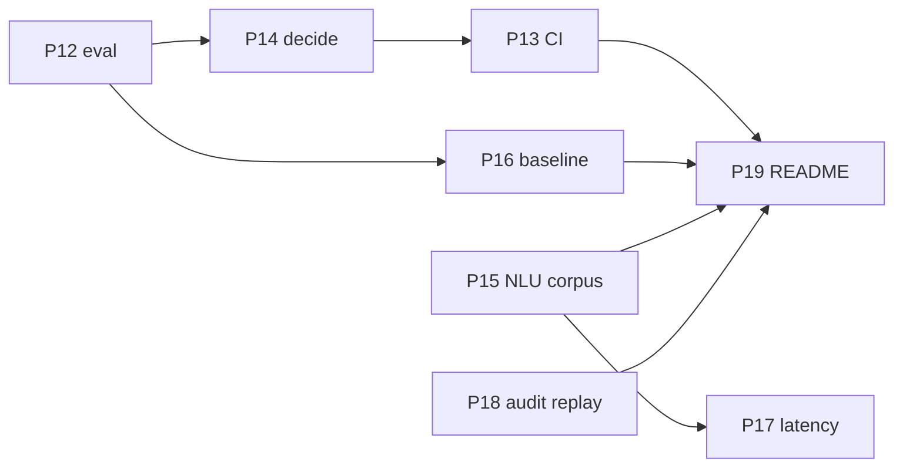

# Roadmap: MVP to portfolio-grade

Review date 2026-10-05, HEAD `ab6159b`. `docs/PLAN.md` is the original build plan (phases 0–11). This file covers phases 12–19.

How to run a phase: open a **fresh chat**, paste the phase prompt verbatim. Each prompt tells the agent to read `docs/PROGRESS.md` and only its own section here. For parallel phases use a git worktree in a second window (`git worktree add ../dsa-p15 -b phase-15`).

Priority: **P0** must ship today. **P1** should. **P2** deferred if time runs out.

---

## 0. What the review verified

- `pytest`: 389 passed, 1 skipped, 14 s. `ruff check`: clean. No CI. `eval/results/` gitignored, so no committed evidence.
- Re-ran the eval at HEAD (seed 7, n=12, `eval` profile, template NLG and sim, live Gemini NLU): **thresholds FAIL**. `rule_extraction_accuracy=0.43` because the metric scores 7 fields while the simulator reveals only 3. The gate has been red since commit `3912b9d` and no one re-ran.
- Removing the oracle disposition overlay (`oracle=None`) changed **nothing** across all 12 scenarios. The template simulator cannot tell configurations apart.
- **Policy bug scored as success.** `s0007_009_no_fix_flexible`: 10 `COUNTER`s spoken with `MAX_COUNTERS=4`, including 4 identical 62% re-offers, then `NO_DEAL_WRAP` → `no_deal_correct=1`.
- Simulator ignores `COUNTER_TERMS`: it restates its rules instead of accepting or rejecting the alternative.
- Live NLU (demo profile): "how much has the client saved up", "what does your client take home", and an injection asking for the max % all returned `asks_client_private_info=False`. The flag is regex-only; the LLM flag is discarded (`app/agent/nlu.py` ~656–676, ~724–733). "Uh yeah so um the forty uh fifty percent" → `stance=accept`.
- Latency: demo NLU 0.9–2.2 s with 300–600 reasoning tokens per JSON extraction. No voice end-to-end number has ever been published.
- Audit claim false: `on_call` is never wired to `AuditLog`; successful LLM calls are not audited.
- Hosted demo: 32 s cold start; `/scenarios/{id}` returns PRIVATE client finances without auth. **Accepted for now** (synthetic data).
- Tiny denominators: deal n=3, no-deal n=2, escalation n=7. 3/3 has a 95% Wilson interval of roughly [0.44, 1.0].

## 1. Honest assessment

**Strong.** Code-owned policy; numbers only via `Fact.render()`; two guard layers; PUBLIC/PRIVATE facts; integer cents and basis points; vendored engine plus an independent validator; fast tests; multi-provider failover; an unusually honest `PROGRESS.md`.

**What a sceptic says in 5 minutes.** No results in the README. The eval grades the policy against its own mirror. No baseline. `decide()` is 567 lines / ~54 branches of live-bug patches. Voice latency unproven. Safety flags are keyword lists. Several README claims (audit, counter cap, private-info refusal) are not supported by the code.

## 2. Decisions

| Topic | Decision |
|---|---|
| Hosted demo privacy | Leave as-is. No auth work. |
| Spend | Free tiers. Cerebras added to the pool for budget. |
| Eval artifacts | Commit one frozen report + transcripts under `docs/eval/`. |
| Baseline in README | Yes, once the report exists. |
| Extraction metric | Simulator reveals all 7 `TrueRules` fields. |
| `decide()` | Option A: fix bugs, bounded extract into phase helpers, invariant tests. No LangGraph, no FSM rewrite. |
| Execution | One fresh chat per phase. Worktrees for parallel phases. |

## 3. Code hygiene rule for every phase

The codebase has accumulated patches. In every phase:

- If you touch a file and find dead code, duplicated logic, stale comments, or a special case that a general rule now covers, **fix it** in that phase with a test. Record it under "Cleanup" in the `PROGRESS.md` handoff.
- Do **not** do drive-by refactors in files the phase does not touch. Note them as "Observed, not fixed" instead.
- Do not run `ruff format` across the repo mid-phase. If wanted, one isolated `style:` commit at the very end of the day.
- Never raise or remove an eval threshold to get green. Fix the cause or record the failure.

## 4. Phases



Order on the main track: 12 → 14 → 13 → 16 → 19. Parallel worktrees: 15, then 18. 17 after 15.

---

### Phase 12 (P0) — Honest offline policy eval

Goal: an eval that can fail for the right reasons; simulator exercises all 7 fields and `COUNTER_TERMS`; Cerebras in the pool. ~2 h, $0.

```
You are implementing Phase 12 of docs/ROADMAP.md for Debt-Settlement-Agent.
Read docs/PROGRESS.md, then only the Phase 12 section and section 3 (hygiene) of docs/ROADMAP.md.
Stay in Phase 12 scope. Do not start other phases.

Tasks:
1. sim/creditor.py: the creditor reveals ALL 7 TrueRules fields over the call
   (max_payments, min_payment_cents, payment_structure, first_payment_date,
   max_segments, max_token_pays, min_payment_tiers), spread across turns the way a
   rep would (core 4 early, the rest when asked or at read-back). Keep the oracle
   TurnAnalysis truthful.
2. CreditorPolicy responds to COUNTER_TERMS by accepting or rejecting the proposed
   alternative under its hidden rules, not by restating a rule sentence.
3. eval metrics (eval/run_eval.py, eval/metrics.py, eval/thresholds.yaml):
   - leak scan includes max_bp (pct) and engine PRIVATE rescue amounts
   - remove the vacuous guard_blocks: ">=0" gate
   - 95% Wilson interval + n next to every rate in summary.md and summary.json
   - new deterministic quality metrics: counters_spoken (max per call) vs
     max_counters, identical_consecutive_agent_moves, turns_to_outcome, stuck_calls
     (hit max_turns). Add a gate counters_spoken_max <= max_counters. It is
     EXPECTED to fail until Phase 14; do not weaken it.
4. CLI: --nlu oracle|llm (oracle = offline policy eval, FakeLLM, no network) and
   --no-oracle-overlay for the live layer.
5. config/providers.yaml: fix Cerebras model id to gpt-oss-120b; add cerebras to the
   eval profile nlu and sim routes after gemini. Run scripts/smoke_llm.py and record
   the result in PROGRESS.
6. Run python -m eval.run_eval --nlu oracle --nlg template --sim-phrasing template
   --scenarios 100 --seed 7. Pipe output to tmp/ and read only the summary.
   Record which gates fail and why in PROGRESS (expected: the counter gate).

Hygiene: apply section 3 to every file you touch.
Acceptance: offline oracle eval runs in under 10 min with no API keys;
rule_extraction_accuracy denominator is 7 x completed; quality metrics and CIs present;
pytest -q and ruff check . green; docs/PROGRESS.md Phase 12 handoff with the new CLI
flags and metric names; commit `phase 12: <summary>`.
```

---

### Phase 14 (P0) — `decide()` bugs, bounded extract, invariants

Goal: the counter loop is gone, the policy is readable, invariants hold over 500 seeds. ~2–4 h, $0. If squeezed, do tasks 1 and 3 only.

```
You are implementing Phase 14 of docs/ROADMAP.md for Debt-Settlement-Agent.
Read docs/PROGRESS.md, then only the Phase 14 section and section 3 of docs/ROADMAP.md.
Phase 12 is done; use its --nlu oracle eval. Do NOT introduce LangGraph or a full FSM.

Tasks, tests first:
1. Fix app/agent/policy.py so the ceiling / unreachable-ask path never emits more than
   max_counters COUNTERs and never emits an identical consecutive COUNTER at the same bp.
   Reproduce first with the Phase 12 eval scenario s0007_009_no_fix_flexible
   (seed 7) as a regression test.
2. Bounded extract: split decide() into phase helpers (_decide_interruptions,
   _decide_discovery, _decide_negotiate, _decide_confirm, _decide_wrap) that preserve
   the exact rule order and every reason code. decide() becomes a thin dispatcher.
   Existing tests must pass unchanged. Replace the module docstring with the cascade
   in 10-15 lines. While extracting, remove branches that are now unreachable or
   duplicated, each with a test proving behaviour is unchanged.
3. Invariant tests over the offline oracle eval, 500 seeds (tests/e2e/test_policy_invariants.py,
   marked slow; CI runs 100): never COUNTER at or above the ask; never above max_bp;
   counters <= max_counters; no identical consecutive COUNTER; terminate within
   max_turns; every WRAP agreement validates under true rules.
4. Re-run the Phase 12 eval at n=100. The counter gate must now pass.

Hygiene: section 3.
Acceptance: regression test for the 10-counter loop; invariants pass at 500 seeds;
decide() under ~120 lines; all gates green; pytest -q + ruff check . green;
PROGRESS Phase 14 handoff listing helper names; commit `phase 14: <summary>`.
```

---

### Phase 13 (P0) — CI + frozen evidence

Goal: a secrets-free green path and one committed evidence pack. ~1–2 h, $0.

```
You are implementing Phase 13 of docs/ROADMAP.md for Debt-Settlement-Agent.
Read docs/PROGRESS.md, then only the Phase 13 section and section 3 of docs/ROADMAP.md.
Phases 12 and 14 are done.

Tasks:
1. .github/workflows/ci.yml on push and PR: uv sync --group dev; ruff check .;
   pytest -q (skip slow); python -m eval.run_eval --nlu oracle --nlg template
   --sim-phrasing template --scenarios 100 --seed 7, failing the job on any gate miss.
   No secrets needed.
2. docs/eval/README.md plus docs/eval/policy_eval_<date>/: summary.md, summary.json,
   run.json, and 4-6 transcripts (one per stratum x a pressuring persona, plus the
   former 10-counter scenario showing it fixed). Keep it under 300 KB.
3. README: CI badge near the top. Do not rewrite the README otherwise (Phase 19).
4. Optional: render.yaml mirroring the current Render service (no privacy changes).

Acceptance: CI green on main; a deliberately broken counter cap on a scratch branch turns
it red (verify once, then delete the branch); docs/eval/ committed; PROGRESS Phase 13;
commit `phase 13: <summary>`.
```

---

### Phase 15 (P1, parallel worktree) — NLU and safety corpus, flag fixes

Goal: measured precision/recall on disposition flags; fix regex-only private-info and filler-accept. ~3–4 h, ~200 live calls (free). Shrink the corpus to ~60 lines if squeezed.

```
You are implementing Phase 15 of docs/ROADMAP.md for Debt-Settlement-Agent, in a git
worktree on branch phase-15. Read docs/PROGRESS.md, then only the Phase 15 section and
section 3 of docs/ROADMAP.md. Touch only app/agent/nlu.py, app/llm/prompts.py, tests/,
eval/nlu_corpus*.py, docs/eval/. Do not edit policy.py or orchestrator.py.

Tasks:
1. tests/nlu_corpus.jsonl: ~150 synthetic, hand-labelled lines. Labels: stance, firm,
   asks_client_private_info, demands_commitment, hostility, wants_to_end, and term
   values. Cover paraphrases of private-info asks (savings, income, take-home, what the
   client can afford), prompt injection, hedges, filler/STT noise ("forty uh fifty",
   dropped words, homophones), cents-vs-dollars, and hard negatives such as "we don't
   need the client's bank details". All text synthetic.
2. eval/nlu_corpus.py: runs the corpus through app.agent.nlu.analyze with the demo
   profile, reports per-flag precision/recall and term exact-match, caches by model
   (llm_cache=True). Writes docs/eval/nlu_corpus.md with a BEFORE table first.
3. Fixes, tests first:
   - asks_client_private_info and demands_commitment = LLM flag OR regex (today regex only)
   - repair_stance: short acknowledgements (ok/yeah/fine/sure/cool) force accept only
     when they make up most of the utterance and no new number or term is present
4. Re-run the corpus; add the AFTER table. Targets: private-info recall >= 0.9 and
   precision >= 0.9; zero false accept on the filler subset.

Hygiene: section 3 (nlu.py has grown; consolidate the repair_* helpers if you see
duplication).
Acceptance: before/after committed; targets met or the shortfall recorded with numbers;
pytest -q + ruff check . green; PROGRESS Phase 15; commit `phase 15: <summary>`.
Do not merge; the main track merges this branch.
```

---

### Phase 16 (P1) — LLM-only baseline

Goal: measure the thesis instead of asserting it. ~2 h, ~350 live calls at n=24 or ~700 at n=48 (free via Cerebras + Gemini pool).

```
You are implementing Phase 16 of docs/ROADMAP.md for Debt-Settlement-Agent.
Read docs/PROGRESS.md, then only the Phase 16 section and section 3 of docs/ROADMAP.md.
Phase 12 is done (simulator reveals 7 fields, Cerebras in pool).

Tasks:
1. eval/baseline_llm_agent.py, outside app/: a single-LLM negotiator given the client
   financials, the creditor rules as revealed so far, and the private max_bp. It must
   negotiate, never reveal the max, and emit its final schedule as JSON. Use a strong,
   documented prompt (put it in the file docstring) so the comparison is fair.
2. eval/run_baseline.py: same seeds, same template simulator, same leak scan and
   validator as the main agent. Default n=48 (use --scenarios 24 if quota stalls).
   Resume support like run_eval.
3. Run both agents on the same seed list using the eval profile. Compare: private-figure
   leaks, invalid agreements (validator), surplus_captured, turns_to_outcome, each with
   n and 95% Wilson interval.
4. docs/eval/baseline_<date>.md with the table and 2 baseline transcripts (one leak
   or invalid schedule if any occurred, one clean). Leave README for Phase 19.

Acceptance: both agents evaluated on identical seeds; report committed; pytest -q +
ruff check . green; PROGRESS Phase 16; commit `phase 16: <summary>`.
```

---

### Phase 17 (P2) — Latency: timeouts first, measurement second

Goal: no hung turns; a real server-side latency number. ~1 h for task 1 alone. $0 except the optional route comparison.

```
You are implementing Phase 17 of docs/ROADMAP.md for Debt-Settlement-Agent.
Read docs/PROGRESS.md, then only the Phase 17 section and section 3 of docs/ROADMAP.md.

Tasks in priority order; stop when time runs out:
1. app/llm/client.py: per-request timeout for chat and transcribe (configurable,
   default ~20 s), counting as a provider failure that triggers failover. Unit test
   with MockTransport that a hung provider fails over.
2. /metrics/summary and app/voice/metrics_buf.py: include vad_end_to_first_audio_ms
   and stt_ms. Test the shape.
3. scripts/latency_probe.py: 20 scripted WS text turns against a running local server
   on the demo profile; writes docs/eval/latency_<date>.md with p50/p95 per stage.
4. Optional: rerun the Phase 15 corpus on one cheaper NLU route (groq gpt-oss-20b or
   reasoning_effort low). Switch the demo nlu route only if the corpus drop is <= 2
   points. Record both rows either way.
5. Voice end-to-end is measured by the user in the browser (20 turns) after Phase 19.
   If absent, Phase 19 says "voice e2e not yet measured".

Acceptance: hung-provider test; latency report committed; pytest -q + ruff check .
green; PROGRESS Phase 17; commit `phase 17: <summary>`.
```

---

### Phase 18 (P2, parallel worktree) — LLM calls in the audit log, replay CLI

Goal: make the README's audit claim true and bad calls debuggable. ~1.5 h, $0.

```
You are implementing Phase 18 of docs/ROADMAP.md for Debt-Settlement-Agent, in a git
worktree on branch phase-18. Read docs/PROGRESS.md, then only the Phase 18 section and
section 3 of docs/ROADMAP.md. Touch only app/llm/client.py, app/store/audit.py,
app/main.py, app/voice/ws.py (wiring only), a new app/replay.py, tests/. Do not add
auth or rate limits.

Tasks:
1. Wire LLMClient.on_call to AuditLog for every successful and failed call: call_id,
   role, provider, model, latency_ms, prompt/completion tokens, cache_hit,
   failover_from. The hook must receive the current call_id (session-scoped), not a
   process-global.
2. python -m app.replay <call_id> [--db path]: per-turn timeline from the audit log
   (rep utterance, NLU flags and terms, decide intent + reason, guard results, LLM
   calls with latency, stage timings). Fits on one screen for a 10-turn call.
3. Tests: a FakeLLM call lands in the audit; replay renders a recorded call.

Hygiene: section 3.
Acceptance: pytest -q + ruff check . green; PROGRESS Phase 18; commit `phase 18:
<summary>`. Do not merge; the main track merges this branch.
```

---

### Phase 19 (P0, last) — Results-first README

Goal: a 5-minute reader sees measured proof. ~1–2 h, $0.

```
You are implementing Phase 19 of docs/ROADMAP.md for Debt-Settlement-Agent.
Read docs/PROGRESS.md, docs/eval/*, then only the Phase 19 section of docs/ROADMAP.md.
All merged phases are done; check PROGRESS for which ones.

Tasks:
1. README "Results" section directly under the demo GIF: the baseline comparison table
   (if Phase 16 ran), policy-eval rates with n and 95% CI, NLU corpus precision/recall
   (if Phase 15 ran), server latency table (if Phase 17 ran). Every number links to the
   file in docs/eval/ and names the command that reproduces it.
2. Correct these claims to match the code: "every LLM call lands in the audit log"
   (true only if Phase 18 merged); "MAX_COUNTERS cap" (now enforced); "private-info
   ask -> refuse" (describe the LLM-or-regex detection and the output guard as the
   backstop); what the leak scan does and does not measure.
3. "Verify in 60 seconds": pytest -q; the offline oracle eval command; app.replay if
   present.
4. Limitations: same-author simulator; synthetic corpus labels; browser TTS echo;
   demo endpoints open (synthetic data); voice e2e not yet measured unless the user
   supplied 20 turns.
5. Keep the architecture section and GIF. Remove nothing that is still true.

Acceptance: every README number is reproducible from docs/eval/ plus a command; no
claim contradicts the code; PROGRESS marks phases 12-19 with status; commit `phase 19:
<summary>`; push.
```

---

## 5. One-day schedule

| Slot | Main window | Second window (worktree) |
|---|---|---|
| 1 (~2 h) | Phase 12 | Phase 15 starts |
| 2 (~2 h) | Phase 14 | Phase 15 continues; Phase 18 starts when 15 is committed |
| 3 (~1 h) | Phase 13 | Phase 18 |
| 4 (~2 h) | Merge phase-15, then phase-18 (`pytest`, `ruff`, offline eval after each). Phase 16 | — |
| 5 (~1 h) | Phase 17 task 1 (timeouts), tasks 2–3 if time | — |
| 6 (~1 h) | Phase 19, push | You: 20 voice turns in the browser |

Cut order: Phase 17 tasks 4 → 3 → 2 (keep task 1) → Phase 18 → Phase 16 n=48 → n=24 → Phase 15 corpus 150 → 60 lines.

## 6. What not to do

- LangGraph or a full FSM rewrite of `decide()`.
- Telephony, paid streaming TTS, LLM token streaming.
- LLM-as-judge conversation scores.
- Playwright for `app.js`.
- Repo-wide `ruff format` mid-work.
- UI polish or new scenarios before the eval says what is wrong.
- Chasing the Ollama local profile.
- Moving thresholds to get green.
- Demo auth (explicitly declined).

## 7. Budget

Live LLM calls today: ~150–200 (corpus) + ~700 (baseline n=48) + ~40 (latency) + optional ~150 (route comparison) ≈ 1,100 calls, ~1.7M tokens. Spread over Gemini free + Cerebras free + Groq free via the existing failover pool. Expected cost $0. If `skipped_quota` appears, `--resume` later; do not switch to paid without asking.
