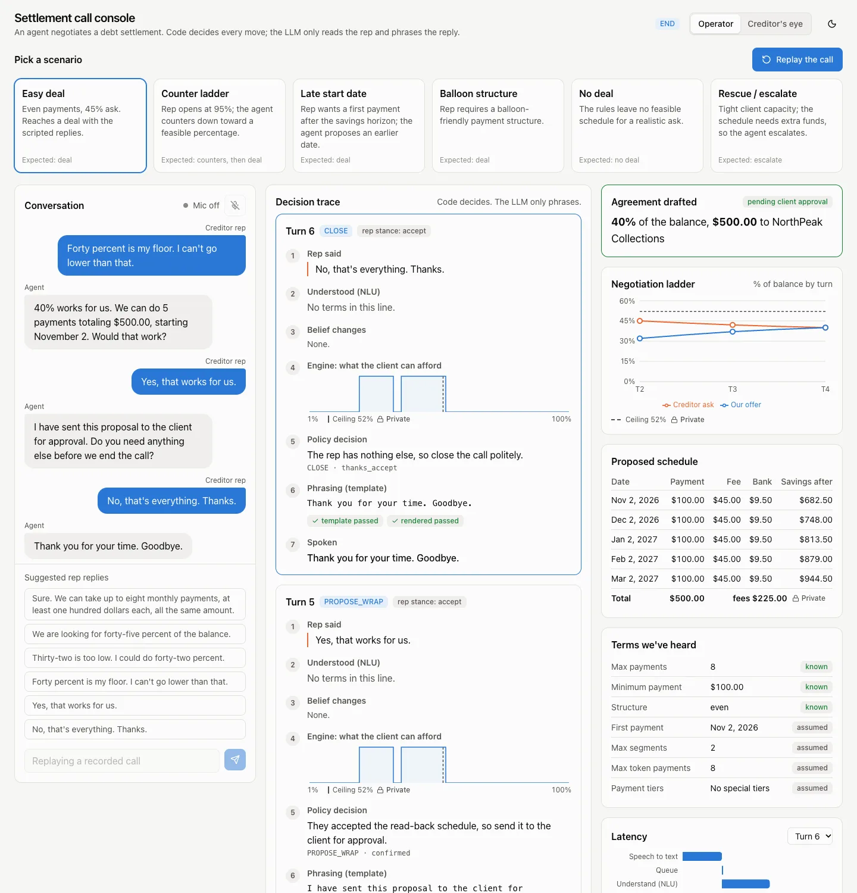
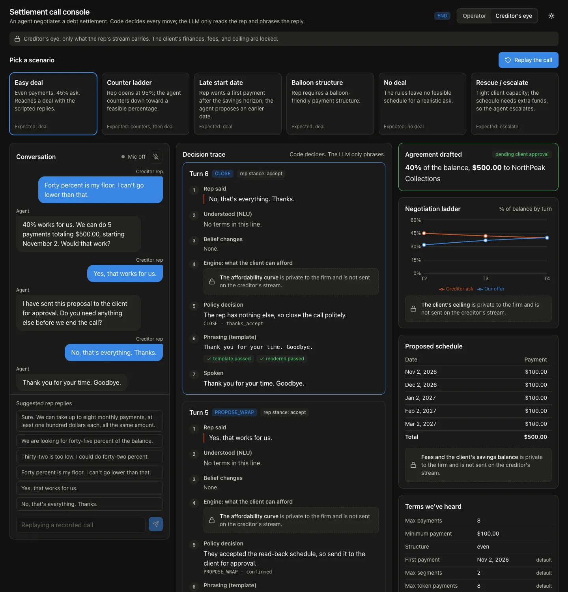

# web/: settlement call console (Phase 23a)

The new frontend for the debt settlement agent: a single "call console" screen that shows the conversation, **why** the agent made each move, and the negotiation state side by side. Built with Vite, React 18, TypeScript (strict), Tailwind v4, shadcn/ui-style primitives, Recharts, and Vitest.

Phase 23a covers the scaffold and components only. It renders from a recorded fixture and does not talk to the backend. Phase 23b wires the live socket, voice, and generated types (see [Handoff to 23b](#handoff-to-23b)).

| 1440 px, operator lens | 390 px |
|---|---|
|  |  |

Creditor's eye (rep lens), dark theme: every private panel is a lock.



## Run it

```bash
cd web
npm ci
npm run dev            # http://localhost:5173/?fixture=1  (replays the recorded call)
npm run build          # → web/dist
npm run typecheck
npm test               # vitest run
npm run lint
```

- `?fixture=1` replays `src/fixtures/call_easy_deal.json` with its recorded timing and starts on load. Add `&speed=4` to play faster. The full call is about 64 s at 1×.
- Without `?fixture=1` the page shows the empty console and a link to fixture mode, because live calls arrive in 23b.
- The dev server proxies `/ws` (WebSocket), `/scenarios`, `/calls`, and `/metrics` to `http://127.0.0.1:8000` (`uv run uvicorn app.main:app --reload`).

## Layout

| Width | Columns |
|---|---|
| ≥ 1280 px (`wide:`) | Conversation, Decision trace, State |
| ≥ 900 px (`mid:`) | Conversation and Decision trace; State spans below |
| < 900 px | Stacked; scenario cards scroll horizontally |

## Structure

```
src/
  types/events.ts          WS protocol types, hand-written (REPLACED in 23b)
  fixtures/
    call_easy_deal.json    recorded operator stream: {t, ev} frames + private_values
    index.ts               typed fixture + static scenario catalog with suggested replies
  lib/
    callState.ts           reduceCall / foldCall: events → CallState (pure, reusable by useCall)
    repView.ts             toRepView: client mirror of the Phase 22 rep-stream filter
    mic.ts                 mic state machine (off/listening/thinking/speaking)
    format.ts              cents → "$1,250.00" (en-US), bp → "45%", field labels
    highlight.ts           quote and {placeholder} splitting
    latency.ts             waterfall rows from turn_trace timings
    lens.ts                Lens ("operator" | "creditor") → server view ("operator" | "rep")
  hooks/
    useFixtureReplay.ts    timed replay of frames
    useTheme.ts            light/dark toggle (persisted; applied pre-paint in index.html)
  components/
    AppShell.tsx           header, lens + theme toggles, scenario cards, 3-column grid
    Conversation.tsx       bubbles, mic state, suggested replies, text box
    DecisionTrace.tsx      turn cards (the hero), 7 steps per turn
    CurveSparkline.tsx     feasibility curve 1–100% with ask, ours, dashed private ceiling
    StatePanel.tsx         agreement, ladder chart, schedule, belief table, latency, audit
    PrivateLock.tsx        lock panel (creditor lens) and lock tag (operator lens)
    ui/                    button, card, badge, segmented (shadcn-style)
scripts/gen-fixture.mjs    regenerates the fixture from its hand-written turn specs
docs/screenshots/          README images
```

## Design tokens (`src/index.css`)

- Base text is 16 px. Numbers in tables and charts use `.num` (tabular numerals).
- Light and dark themes are defined as separate token sets on `:root` and `:root.dark`; dark is not an automatic inversion. The theme follows the OS setting until the user toggles it.
- There is one accent (blue `#2a78d6` light, `#3987e5` dark), which is also chart series 1, "our offer". The creditor ask is series 2 (orange). The private ceiling is a dashed muted line. Both series come from the validated dataviz reference palette.
- Status colors (good, bad, warn) are used only for guard verdicts and belief status, and always appear with an icon or word.
- PRIVATE is always shown with the same lock icon: `PrivateTag` next to private values in the operator lens, and `PrivateLock` in place of a panel in the creditor lens.

## Privacy in the creditor lens

Private data is hidden at two layers:

1. **The stream.** In fixture mode, `toRepView` drops `turn_trace.affordability`, `eval.max_bp`, `eval.program_fee_cents`, and `eval.additional_funds`; removes the fee, bank-fee, and balance columns from schedule rows (on both eval and agreement); and drops audit rows marked `private`. Live, the server does this (Phase 22 `?view=rep`).
2. **The components.** In the creditor lens, components never render those fields even if they are present. `DecisionTrace` is tested with unfiltered operator traces in the creditor lens and still shows only locks.

`src/creditorLens.test.tsx` renders the whole recorded call in each lens. In the operator lens it asserts that every private string (`52%`, `$45.00`, `$9.50`, `$225.00`, and each savings balance) appears, which proves the test can detect them. In the creditor lens it asserts that none of them appear, with `<details>` sections forced open.

## Handoff to 23b

**Replace:**
- `src/types/events.ts` → generated from `events.schema.json` (`npm run gen:types`). Names that are likely to differ from the real Phase 22 models, so check these first:
  - `TurnTraceEvent`: `ask_bp`, `ask_quote`, `counter_bp`, and `stance` are fields 23a **added** for the sparkline and ladder. The REVIEW_PLAN Phase 22 list does not name them; if Phase 22 did not emit them, derive them in an adapter from `decide` and the eval, or add them server-side.
  - `nlg.guards[]` uses `{stage, ok, reason}`, and `timings` uses `queue_ms`, `engine_ms`, and `tts_onset_ms`. These are assumed from §2a's waterfall stages.
  - `AuditEvent.private` is assumed to be the marker the server uses for private rows. If the rep stream simply omits those rows, drop the field.
  - `min_payment_tiers` values are typed as `[from_payment, min_cents]` pairs, because `BeliefState` stores tuples from `coerce_tiers`. If the generated schema types them differently, update `TierValue` and `format.termValue`.
- Fixture mode can stay for tests and demos. Regenerate the JSON with `node scripts/gen-fixture.mjs src/fixtures/call_easy_deal.json` after the types change.

**Wire:**
- `useCall(scenarioId, lens)` over `/ws/call/{id}?view=${viewFor(lens)}`: feed every server event to `reduceCall` (from `lib/callState.ts`). Changing the lens means reconnecting on the other view. Fixture mode instead re-filters the stored operator events.
- `AppShell.onWatch` → send `{type: "start", scenario_id, autoplay: true}`.
- `Conversation.onSend` → send `{type: "text", text, source}`, and `onMicToggle` → `useVoice`. Both props are optional today, and their controls are disabled when the prop is absent.
- `useVoice` should drive the mic using `micReducer` events (`rep_done`, `agent_say`, `agent_done`, `barge_in`, `call_over`).
- Scenario cards: `SCENARIOS` in `fixtures/index.ts` is a static copy of the `meta.json` titles plus hand-picked suggested replies for `easy_deal`. Replace it with `/scenarios`, and take suggestions from each rep card.

**Not done in 23a (by design):** live socket, voice/VAD/TTS, the operator scenario brief (`/scenarios/{id}`), serving `web/dist` from FastAPI, and CI/render.yaml changes.

## Deviations and notes

- Tool versions are the current releases: Vite 8 (Rolldown), Tailwind v4 (`@tailwindcss/vite`, no PostCSS config), TypeScript 6, Vitest 5, ESLint 10. `@vitejs/plugin-react@6` requires Vite 8.
- The "shadcn/ui primitives" are hand-written in the shadcn style (`cva` + `cn`) instead of installed through the shadcn CLI, so there is no `components.json` and no Radix dependency yet. The lens toggle is a radio group, and the audit log uses native `<details>`.
- Recharts is a separate ~545 kB (≈160 kB gzip) chunk, so `chunkSizeWarningLimit` is 600.
- The fixture is generated by `scripts/gen-fixture.mjs` from hand-written, synthetic turn specs rather than typed as raw JSON, so frame timestamps, sentence ids, and audit ids stay consistent. None of it was recorded from a real backend.
- The README screenshots were taken with headless Chrome through puppeteer-core, run from a scratch directory. puppeteer-core is not a dependency of `web/`.
- Decision trace shows the newest turn first, and the conversation reads oldest first.
