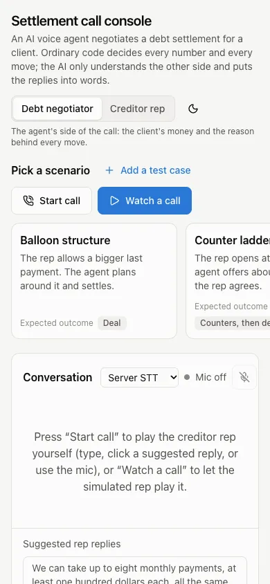
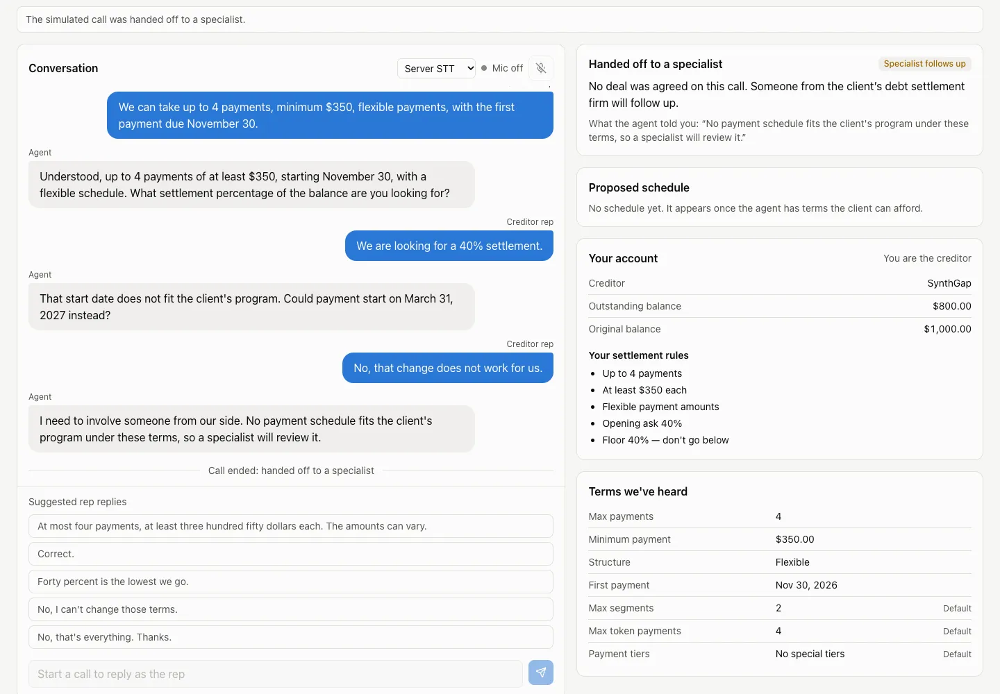

# web/: settlement call console (Phases 23a, 23b)

The new frontend for the debt settlement agent: a single "call console" screen that shows the conversation, **why** the agent made each move, and the negotiation state side by side. Built with Vite, React 18, TypeScript (strict), Tailwind v4, shadcn/ui-style primitives, Recharts, and Vitest.

23a built the scaffold and components against a recorded fixture. 23b wired it to the backend: generated WS types, the live call socket, autoplay, voice, `/scenarios` cards, the operator brief, and FastAPI serving `web/dist` at `/` (the old `app/static` UI is gone).

| 1440 px, Debt negotiator view, mid-call | 390 px |
|---|---|
|  |  |

The Creditor rep view after a simulated "No room to settle" call that ends in a handoff. The conversation closes with "Call ended: handed off to a specialist", and the card in the agreement's slot shows only what the agent told the rep, never the reason code. There is no decision trace, and the rep sees their own account and the terms the agent heard.



Screenshots retaken on 2026-10-09 (Phase 50) with headless Chrome (CDP, light theme) against a local server (`LLM_PROFILE=offline`), using **Watch a call** on "Haggling rep" (Debt negotiator view, captured right after the step) and "No room to settle" (Creditor rep view, after the call ended).

## Run it

```bash
cd web
npm ci
npm run build          # → web/dist, served by FastAPI at http://127.0.0.1:8000/
npm run dev            # http://localhost:5173 with hot reload (proxies the API to :8000)
npm run gen:types      # regenerate src/types/events.ts from events.schema.json
npm run typecheck
npm test               # vitest run
npm run lint
```

- Live (default): scenario cards come from `/scenarios`. **Watch a call** opens `/ws/call/{id}?view=…` with the Phase 22 autoplay start (`autoplay: true, autoplay_pause_ms: 1200`); the server's sim creditor plays the rep with template phrasing, so it needs no keys. **Start call** opens the same socket for you to play the rep by typing, clicking a suggested reply (from the scenario's rep card), or using the mic.
- Two views, named for people outside the industry (Phase 35): **Debt negotiator** (lens `operator`, socket `?view=operator`) and **Creditor rep** (lens `creditor`, socket `?view=rep`). A one-line subtitle under the toggle says what each shows.
- The socket's view is fixed per call. Switching to the Creditor rep view mid-call re-filters on the client (`toRepView`). Switching to the Debt negotiator view during or after a call that streams the rep view backfills the decision trace, ladder, latency, audit log and fee columns from `GET /calls/{id}/operator` (kept in server memory per call, Phase 36) and refetches on every `turn_done`.
- Custom test cases (Phase 36): **Add a test case** (next to "Pick a scenario") opens an inline JSON editor pre-filled from `GET /scenarios/template`, checked as you type by `POST /scenarios/preview` (errors listed with their field path, click to jump). Saved cases join the cards first, marked "Custom", with edit and remove (undo); they persist in `localStorage` (`dsa-custom-cases`). A call on one sends `start.scenario_payload`; autoplay is curated-only, so you play the rep. The Creditor rep view's "Your account" for a custom case comes from `POST /scenarios/preview/rep` (reads only `offer` and `rep_card`).
- Copy rule (Phase 36): sentence case for every heading, badge, status and label; protocol codes become words in one place, `src/lib/labels.ts`. `src/sentenceCase.test.tsx` scans the rendered components.
- The Debt negotiator view's state column has the scenario brief and **Client deposits and credits**: the client's dedicated-account ledger (Date, Description, Credit, Debit, Running balance) anchored at the balance on the as-of date, past rows above it and scheduled rows below. PRIVATE: it comes from the operator brief only.
- "How the agent decided" (the decision trace, Debt negotiator view only, Phase 36): one row per turn, newest first, with the move in plain words ("Countered at 31%"), its number and a few-word reason (`decide.reason_short`). Opening a row tells the turn as What they said / What we heard / Can the client pay? / Decision / What we said; "How this was worked out" holds the affordability curve, belief changes, the reply template, the safety checks (each once) and the policy code. All its wording comes from `src/lib/traceStory.ts` and the server's reason sentences (`app/agent/reasons.py`).
- The Creditor rep view shows the conversation, **Your account** and the agreed terms (agreement, public schedule, terms heard); no decision trace, ladder, latency or audit log. Its state column opens with **Your account** (`GET /scenarios/{id}/rep`): the rep's creditor name, outstanding and original balance, and their settlement rules from the rep card. It carries no client or firm data; the scenario brief and ledger stay in the Debt negotiator view.
- Outcomes (Phase 48): a call ends as a deal or a handoff. "Handed off to a specialist" takes the agreement's slot at the top of the state column; the Debt negotiator view gives the reason sentence from `app/agent/reasons.py` (via the ESCALATE turn's trace), the Creditor rep view only what the agent told the rep (`escalate.escalate_reason`). The transcript closes with "Call ended: …". All of it comes from `src/lib/outcome.ts`. The mic goes to call-over on ESCALATE as on END.
- Trace words (Phase 48): price moves are titled by their ladder step ("Made a first offer of 42%", "Held our offer at 42%", "Took a step up to 51%", "Raised our offer by half their drop, to 37%", "Made a final offer of 48%", "Accepted 50% when they repeated it", "They accepted our 52% offer"). An open rep turn carries a badge naming who read the line ("Read by Claude Haiku", "Read by Groq (fallback)", "Budget reached, using Groq", "Read by code (no AI needed)", "Simulated rep: no AI reading") from `turn_trace.reader`, and "What we heard" tells corrections, disputes, held-back amounts ("Held back $420 … because …") and dropped questions from `turn_trace.notes`. Both are built by the server from the turn's audit rows and exist only on the operator stream. Each dropped term gives its real reason (`DroppedTerm.reason`).
- URL (Phase 48): `?scenario=<id>&view=operator|rep` reflects the picked scenario and view (`src/hooks/useUrlState.ts`); a change pushes history, so back and forward work. A scenario from the URL is refused while a call runs, and an unknown id falls back to Easy deal.
- **Download log** fetches `/calls/{id}/export?view=rep|operator` for the last call (it survives the end of the call); the rep export drops private audit rows.
- `?fixture=1` replays `src/fixtures/call_easy_deal.json` with no backend (`&speed=4` to play faster).
- Node: CI and Render use Node 24 (Vitest and jsdom need ≥ 22.22 or ≥ 24.15).

## Layout

| Width | Columns |
|---|---|
| ≥ 1280 px (`wide:`) | Conversation, Decision trace, State |
| ≥ 900 px (`mid:`) | Conversation and Decision trace; State spans below |
| < 900 px | Stacked; scenario cards scroll horizontally |

## Structure

```
src/
  types/events.ts          WS protocol types, GENERATED from events.schema.json (npm run gen:types)
  types/protocol.ts        hand-written aliases (TermField, TermValue, …) and HTTP shapes (/scenarios, brief)
  fixtures/
    call_easy_deal.json    synthetic operator stream: {t, ev} frames + private_values (validated by pytest)
    index.ts               typed fixture + the one-entry catalog fixture mode shows
  lib/
    callState.ts           reduceCall / foldCall: events (+ local tts_onset) → CallState
    repView.ts             toRepView: client mirror of app/voice/views.py redact_for_view
    voice/engine.ts        VoiceEngine: TTS + sentence_done acks, barge-in, echo guard, VAD/browser STT, backchannel
    voice/vad.ts           pinned vad-web 0.0.22 + onnxruntime-web 1.14.0 (CDN) and Phase 21 VAD settings
    voice/speech.ts        speakableText, preferred voices, benign TTS errors
    voice/wav.ts           16 kHz mono 16-bit WAV encoder
    mic.ts                 mic state machine (off/listening/thinking/speaking)
    format.ts              cents → "$1,250.00" (en-US), bp → "45%", field labels
    highlight.ts           quote and {placeholder} splitting
    latency.ts             waterfall rows from turn_trace timings
    lens.ts                Lens ("operator" | "creditor") → server view ("operator" | "rep"); shown as "Debt negotiator" | "Creditor rep"
    ledger.ts              client ledger → table rows with running balance (cents)
    traceStory.ts          a turn trace in plain words: ladder-step title, what was heard, model badge, can the client pay, checks once each
    labels.ts              codes → sentence-case words (intent, belief status, guard stage, expected outcome)
    outcome.ts             deal or handoff in words for both views (handoff reason: Debt negotiator only)
    customCases.ts         custom test cases: localStorage, ScenarioSource, JSON parse errors, path → cursor
  hooks/
    useCall.ts             one call socket: start / autoplay / text / WAV / end, raw frames + subscribers
    useVoice.ts            React wrapper over VoiceEngine (mic state, notices, STT mode)
    useScenarios.ts        /scenarios catalog; brief + ledger (Debt negotiator view only) and rep account, curated or custom; template
    useOperatorDetail.ts   /calls/{id}/operator backfill for a call streamed in the Creditor rep view
    useFixtureReplay.ts    timed replay of frames
    useTheme.ts            light/dark toggle (persisted; applied pre-paint in index.html; keeps theme-color in step)
    useUrlState.ts         ?scenario=&view= in the URL, back/forward
  components/
    AppShell.tsx           header, lens + theme toggles, scenario cards (+ custom), 3-column grid
    Conversation.tsx       bubbles, mic state, suggested replies, text box
    DecisionTrace.tsx      "How the agent decided": one row per turn, open for the story and details; Debt negotiator view only
    CurveSparkline.tsx     feasibility curve 1–100% with ask, ours, dashed private ceiling
    StatePanel.tsx         agreement and schedule first, then brief/account slot, ladder, belief table, latency, audit
    PrivateLock.tsx        lock panel (Creditor rep view) and lock tag (Debt negotiator view)
    ScenarioBrief.tsx      operator brief: creditor, client finances, firm fees (PRIVATE)
    YourAccount.tsx        Creditor rep view: the rep's own account and settlement rules
    ClientLedger.tsx       Debt negotiator view: client's deposits/debits with running balance (PRIVATE)
    CaseEditor.tsx         "Add a test case" JSON editor with inline, path-named errors
    ui/                    button, card, badge, segmented (shadcn-style)
scripts/gen-fixture.mjs    regenerates the fixture from its hand-written turn specs
scripts/gen-types.mjs      events.schema.json → src/types/events.ts (json-schema-to-typescript)
docs/screenshots/          README images
```

## Design tokens (`src/index.css`)

- Base text is 16 px. Numbers in tables and charts use `.num` (tabular numerals).
- Light and dark themes are defined as separate token sets on `:root` and `:root.dark`; dark is not an automatic inversion. The theme follows the OS setting until the user toggles it.
- There is one accent (blue `#2a78d6` light, `#3987e5` dark), which is also chart series 1, "our offer". The creditor ask is series 2 (orange). The private ceiling is a dashed muted line. Both series come from the validated dataviz reference palette.
- Status colors (good, bad, warn) are used only for guard verdicts and belief status, and always appear with an icon or word.
- PRIVATE is always shown with the same lock icon: `PrivateTag` next to private values in the Debt negotiator view, and `PrivateLock` in place of a panel in the Creditor rep view.

## Privacy in the Creditor rep view

Private data is hidden at two layers:

1. **The stream.** Live, the server filters `?view=rep` (`app/voice/views.py`). In fixture mode, and when the lens flips mid-call, `toRepView` does the same: drops every `turn_trace` (the rep stream has no decision trace), `eval.max_bp`, `eval.program_fee_cents`, and `eval.additional_funds`; removes the fee, bank-fee, and balance columns from schedule rows (on both eval and agreement); drops `blocked.offending`; and drops audit rows marked `private`. The scenario brief (and so the ledger) is not fetched in the Creditor rep view.
2. **The components.** In the creditor lens, components never render those fields even if they are present. `DecisionTrace` and `ClientLedger` are tested with unfiltered operator data in the creditor lens and render only a lock.

`src/creditorLens.test.tsx` renders the whole recorded call in each lens. In the operator lens it asserts that every private string (`52%`, `$45.00`, `$9.50`, `$225.00`, and each savings balance) appears, which proves the test can detect them. In the creditor lens it asserts that none of them appear, with `<details>` sections forced open.

## Voice (ported from the old app.js in 23b)

`useVoice` wraps `VoiceEngine`, a framework-free port of the old `app/static/app.js` voice code. Its browser APIs are injected, so `useVoice.test.ts` drives it with fakes. Those tests replace `tests/unit/test_app_js_contracts.py`.

- **TTS:** one `SpeechSynthesisUtterance` per `say`, expanding `%`/`$` for speech only. Every sentence is acked with `sentence_done`, also when playback fails (F06) or when there is no `speechSynthesis`. The current utterance stays referenced, because Chrome garbage-collects it otherwise. A generation counter makes a stale `onend` after a cancel a no-op.
- **Barge-in:** speech over the agent after the 750 ms echo guard sends `barge_in{spoken_ids}`, with the acked ids plus the one in flight. That clip is marked contaminated and never transcribed, and VAD capture is reset. A typed reply while the agent is speaking barges first.
- **STT:** in server mode, vad-web sends 16 kHz WAV frames. In browser mode, `webkitSpeechRecognition` runs and is stopped for the whole agent turn, then re-armed 500 ms after it. A VAD load failure or a server `stt_error` falls back to browser STT.
- **Latency:** `timing{vad_end_to_first_audio_ms}` is sent once per reply, from `onstart`. A local "One moment." plays if no `say` arrives within 1.2 s; it is never sent or acked. The `say`→`onstart` gap becomes the waterfall's "Voice onset" stage (local `tts_onset` event).
- **Autoplay** calls are passive: no TTS and no acks, because the server auto-acks.

## Deviations and notes

- Tool versions are the current releases: Vite 8 (Rolldown), Tailwind v4 (`@tailwindcss/vite`, no PostCSS config), TypeScript 6, Vitest 5, ESLint 10. `@vitejs/plugin-react@6` requires Vite 8.
- The "shadcn/ui primitives" are hand-written in the shadcn style (`cva` + `cn`) instead of installed through the shadcn CLI, so there is no `components.json` and no Radix dependency yet. The lens toggle is a radio group, and the audit log uses native `<details>`.
- Recharts 3 is a separate ~545 kB (≈160 kB gzip) chunk, so `chunkSizeWarningLimit` is 600. Its d3/redux deps are inlined, so splitting does not get it under 500 kB. Since 23b, App lazy-loads the Decision trace and State columns, so the charts load after first paint and the main chunk is ~130 kB.
- 23b: the dark theme's `--accent-fg` is near-black, because white on `#3987e5` is 3.6:1 (Lighthouse contrast). Lighthouse accessibility scores 100.
- The fixture is generated by `scripts/gen-fixture.mjs` from hand-written, synthetic turn specs rather than typed as raw JSON, so frame timestamps, sentence ids, and audit ids stay consistent. None of it was recorded from a real backend.
- The README screenshots were taken with headless Chrome through puppeteer-core, run from a scratch directory (last retaken in Phase 25r). puppeteer-core is not a dependency of `web/`.
- Decision trace shows the newest turn first, and the conversation reads oldest first.
